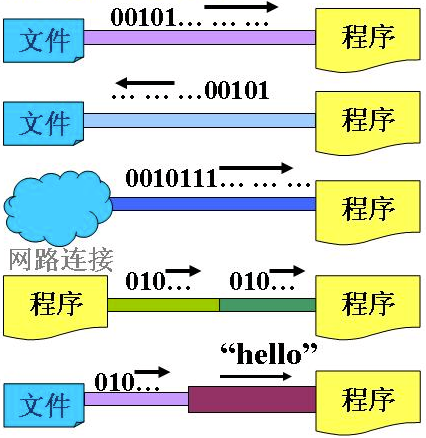
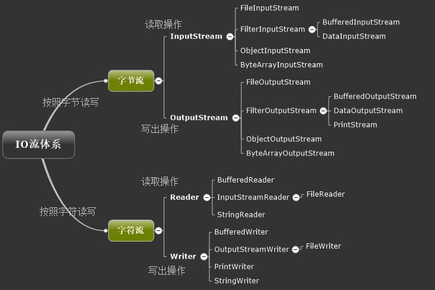

### 流的概念

流是个抽象的概念，是对输入输出设备的抽象，`Java`程序中，对于数据的输入/输出操作都是以“流”的方式进行。设备可以是文件，网络，内存等。



流具有方向性，至于是输入流还是输出流则是一个相对的概念，一般以程序为参考，如果数据的流向是程序至设备，我们成为输出流，反之我们称为输入流。

`Java IO`是采用的是**装饰模式**，即采用**处理流**来包装**节点流**的方式，来达到代码通用性。

### 流的分类

- 根据处理数据类型的不同分为：字符流和字节流
- 根据数据流向不同分为：输入流和输出流



字节流的输入流和输出流的基础是`InputStream`和`OutputStream`这两个抽象类

字符流的输入流和输出流的基础是`Reader`和`Writer`这两个抽象类

#### 输入流与输出流

使用IO流的基本步骤：

1、定义流

2、创建流

3、创建一个字节数组来存取读取的信息

4、使用一个整数len来表示读取的长度

5、循环读取数据，只要len大于0说明读取到元素，可以直接对元素进行操作

6、读取完成后使用close方法关闭流

通过文件输入流读取文件内容，并在控制台打印：

```java
    /**
     * 通过文件输入流读取文件
     *
     * @param file
     */
    public void read(File file) {
        if (file.exists()) {
            // 定义流
            FileInputStream in = null;
            try {
                // 创建流
                in = new FileInputStream(file);
                // 创建一个字节数组来存储读取的数据
                byte[] b = new byte[1024];
                // 使用一个整数len来表示读取的长度
                int len = -1;
                // 循环读取数据，只要len大于0说明读取到元素，可以直接对元素进行操作
                while((len = in.read(b)) > 0){
                    System.out.write(b,0,len);
                }
            } catch (FileNotFoundException e) {
                e.printStackTrace();
            } catch (IOException e) {
                e.printStackTrace();
            } finally {
                try {
                    //读取完成后使用close方法关闭流  
                    if(in != null)
                        in.close();
                } catch (IOException e) {
                    e.printStackTrace();
                }
            }
        }
    }
```

通过文件输出流实现实现文件的拷贝：

```java
    /**
     * @param file       需要读取的文件
     * @param sourceFile 目标文件
     */
    public void write(File file, File sourceFile) {
        if (file.exists()) {
           FileInputStream in = null;
           FileOutputStream out = null;

            try {
                in = new FileInputStream(file);
                // 创建一个文件输出流
                out = new FileOutputStream(sourceFile);
                byte[] b = new byte[1034];
                int len = -1;
                // 将数据通过输入流读取到程序中
                while((len = in.read(b)) > 0){
                    // 将数据通过输出流输出，此时是一个文件输出流，就把数据输出到文件中
                    out.write(b,0,len);
                }
            } catch (FileNotFoundException e) {
                e.printStackTrace();
            } catch (IOException e) {
                e.printStackTrace();
            } finally {
                //关闭流
                try {
                    if(out != null)
                    {
                        out.close();
                    }
                } catch (IOException e) {
                    // TODO Auto-generated catch block
                    e.printStackTrace();
                }

                try {
                    if(in != null)
                    {
                        in.close();
                    }
                } catch (IOException e) {
                    // TODO Auto-generated catch block
                    e.printStackTrace();
                }
            }
        }
    }
```

**流使用完成后应记得在finally块中关闭**

#### 字节流与字符流

 **Java中的字节流处理的最基本单位为单个字节**，它通常用来处理二进制数据。`Java`中最基本的两个字节流类是`InputStream`和`OutputStream`，它们分别代表了组基本的输入字节流和输出字节流。`InputStream`类与`OutputStream`类均为抽象类，我们在实际使用中通常使用Java类库中提供的它们的一系列子类。

在程序中一个字符等于两个字节，那么`java`提供了`Reader`、`Writer`两个专门操作字符流的类。

> 对于字符流而言：读用`BufferedReader`，写用`PrintWriter`

字符流用来读取字符数据，对于输入字符流而言，最为常用操作方法使用`BufferedReader`，因为该流有一个`readLine()`方法，该方法可以一行一行的读取数据并且返回字符串

```java
    /**
     * 字符流
     * 读使用BufferReader
     * 写使用PrinterWriter
     * @param file
     * @param sourceFile
     */
    public void write(File file,File sourceFile){
        if(file.exists()){
            BufferedReader reader = null;
            PrintWriter writer = null;

            try {
                reader = new BufferedReader(new FileReader(file));
                // 使用文件字符流写文件，加上缓冲流提高效率，写用PrintWriter
                writer = new PrintWriter(new BufferedWriter(new FileWriter(sourceFile)));
                String str = null;
                while ((str = reader.readLine()) != null){
                    writer.println(str);
                }
            } catch (IOException e) {
                e.printStackTrace();
            } finally {
                if(writer != null)
                    writer.close();
                try {
                    if(reader != null)
                        reader.close();
                } catch (IOException e) {
                    e.printStackTrace();
                }
            }
        }
    }
```

`IO`也提供将字节流转换为字符流的操作：

+ InputStreamReader
+ OutputStreamWriter

`System.in`是标准输入流，但是由于是字节流，不方便操作，所以通过情况会将其转换为字符流来处理，通过转换流转换，然后再使用：

```java
 public void readLine(){
        // 使用BufferedReader来封装
        BufferedReader reader = null;

        try {
            // 接受用户从控制台输入
            reader = new BufferedReader(new InputStreamReader(System.in));
            String str = null;
            while((str = reader.readLine()) != null) {
                if(str.equals("exit"))
                    break;
                System.out.println(str);
            }
        } catch (IOException e) {
            e.printStackTrace();
        } finally {
            try {
                if(reader != null)
                    reader.close();
            } catch (IOException e) {
                e.printStackTrace();
            }
        }
    }
```

### 常用的流

+ 文件流`File`：进行文件的读写操作
+ 缓冲流`Buffered`：用来提高读写效率
+ 对象流`Object`：对象流可以完成对对象的存储

要想使用对象流来进行对对象的存储：该对象类必须实现`Serializable`接口，可以把一些属性设置为`transient`，此时这个属性就不会被存储

```java
package com.flwcy.entity;

import java.io.Serializable;

/**
 * 如果希望把一个对象通过ObjectOutputStream写到文件中，这个对象必须实现Serializable接口
 */
public class Student implements Serializable {
    private static final long serialVersionUID = 3898449493380681871L;
    private int id;
    private String name;

    /**
     * 只要一个属性设置为transient之后，这个属性就不会被存储
     */
    private transient int age;
  
  	// 省略get/set方法
}
```

> 1、一个类若想被序列化，则需要实现`java.io.Serializable`接口，该接口中没有定义任何方法，是一个标识性接口`Marker Interface`，当一个类实现了该接口，就表示这个类的对象是可以序列化的。
>
> 2、在序列化时，`static`变量是无法序列化的；如果A包含了对B的引用，那么在序列化A的时候也会将B一并地序列化；如果此时A可以序列化，B无法序列化，那么当序列化A的时候就会发生异常，这时就需要将对B的引用设为transient，该关键字表示变量不会被序列化。

读取和存储对象可以使用`ObjectOutputStream`和`ObjectInputStream`读取，如果要从文件中读取，需要用这两个流封装一下文件流

```java
    /**
     * 将student对象保存到本地磁盘
     * @param student
     */
    public void write(Student student,String fileName){
        ObjectOutputStream out = null;
        try {
            out = new ObjectOutputStream(new FileOutputStream(fileName));
            out.writeObject(student);
        } catch (IOException e) {
            e.printStackTrace();
        } finally {
            if(out != null)
                try {
                    out.close();
                } catch (IOException e) {
                    e.printStackTrace();
                }
        }
    }

    /**
     * 从本地磁盘读取对象
     * @param fileName
     * @return
     */
    public Student read(String fileName){
        Student student = null;
        ObjectInputStream in = null;
        try {
            in = new ObjectInputStream(new FileInputStream(fileName));
            student = (Student) in.readObject();
            System.out.println(student);
        } catch (IOException e) {
            e.printStackTrace();
        }catch (ClassNotFoundException e) {
            e.printStackTrace();
        } finally {
            try {
                if(in != null)
                    in.close();
            } catch (IOException e) {
                e.printStackTrace();
            }
        }
        return student;
    }
```

```
练习：
	1. 不死神兔：有一对兔子,从出生后第三个月起每个月都生一对兔子,小兔子长到第三个月后每个月又生一对兔子,假如兔子都不死,问第二十个月的兔子对数为多少? 
	2. 递归遍历出所有文本文件
	3. 单级文件夹复制：将D:/java文件夹中所有.java复制至D:/jad中并保存为.jad格式
	4. 多级文件夹复制：D:/jad复制到D:/demo
	5. 用Reader模拟实现BufferedReader的readLine();
	6. 自定义模拟LineNumberReader的特有功能
	7. 登录注册io版
```


