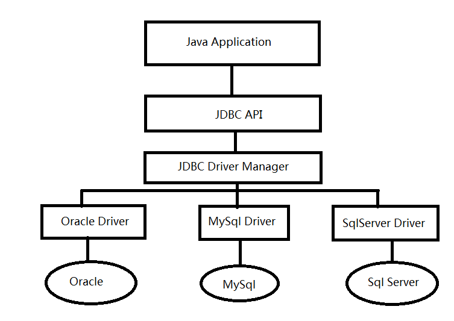
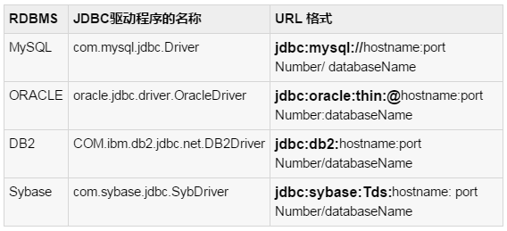

# JDBC入门

标签： JDBC
### (一) 初识JDBC
#### jdbc的概念


**什么是JDBC?**

**Java语言访问数据库的一种规范,是一套API，JDBC (Java Database Connectivity) API，即Java数据库编程接口，是一组标准的Java语言中的接口和类，使用这些接口和类，Java客户端程序可以访问各种不同类型的数据库。比如建立数据库连接、执行SQL语句进行数据的存取操作。**

	jdbc:java data base connectivity
	jdbc由一些接口和类构成的api，是javaSE的一部分，位于java.sql以及javax.sql包下。
	sun公司提供了这些连接数据库的规范，由数据库的生产厂商提供驱动程序。


#### 数据库连接的基本步骤
1、注册数据库驱动(Driver)

2、建立连接(Connection)

3、创建执行sql语句(一般是Statement及其子类)

4、执行sql语句获得结果集(ResultSet)

5、处理执行结果（在非查询语句中，该步骤可以省略）

6、关闭连接，释放资源

#### Talk is cheap.Show me the code
首先进行一些准备工作，创建表，本bolg是在mysql新建的db_jdbc库中创建了表
```sql
create table db_user(
    id int primary key auto_increment,
    user_name varchar(50) not null ,
    `password` varchar(32) not null ,
    email VARCHAR(50),
    birthday DATE
);
```
为了方便，先插入两条测试数据
```sql
insert into db_user(id,user_name,`password`,email,birthday) values(1,"flwcy" ,"flwcy56" ,"flwcy123@126.net" ,"1993-11-01" );
insert into db_user(id,user_name,`password`,email,birthday) values(2,"js123" ,"123456" ,"js123@126.net" ,"1995-11-08" )
```


查看JDBC文档，我们发现首先需要下载或者拷贝一份数据库驱动程序到本机，然后将驱动程序添加到项目中，我使用的是MySql数据库，因此去MySql官网下载驱动程序。

```
Installing a JDBC driver generally consists of copying the driver to your computer, then adding the location of it to your class path.
```
编写查询所有数据的代码
```java
    @Test
    public void test() throws SQLException {
        //1、注册驱动(Driver)
        DriverManager.registerDriver(new Driver());
        //2、建立数据库连接(Connection)
        Connection conn = DriverManager.getConnection("jdbc:mysql://localhost:3306/db_jdbc","root","123456");
        //3、创建执行sql语句(一般是Statement及其子类)
        Statement statement = conn.createStatement();
        //4、执行sql语句获得结果集(ResultSet)
        ResultSet resultSet = statement.executeQuery("select * from db_user");
        //5、处理执行结果，在非查询语句中，该步骤可以省略
        while (resultSet.next()) {
            String result = String.format("id=%s,userName=%s,passowrd=%s,email=%s,birthday=%s", resultSet.getInt("id"),
                    resultSet.getString("user_name"),resultSet.getString("password"), resultSet.getString("email")
                    ,resultSet.getDate("birthday"));
            System.out.println(result);
        }
        //6、关闭连接，释放资源
        resultSet.close();
        statement.close();
        conn.close();
    }
```
执行结果显示如下
 

#### 代码详解
##### 注册驱动的三种方式
在步骤一中我们注册了数据库的驱动，常用的注册驱动有三种方式
方式一：通过DriverManager.registerDriver(new com.mysql.jdbc.Driver());
```java
    @Test
    public void secondConn() throws SQLException {
        //该方法在编译时需要导入对应的jar包
        DriverManager.registerDriver(new com.mysql.jdbc.Driver());
        Connection conn = DriverManager.getConnection("jdbc:mysql://localhost:3306/db_jdbc","root","123456");
        Assert.assertEquals(false,conn.isClosed());
    }
```
方式二：通过Class.forName("com.mysql.jdbc.Driver")
```java
    @Test
    public void firstConn() throws ClassNotFoundException,SQLException {
        Class.forName("com.mysql.jdbc.Driver");
        Connection conn = DriverManager.getConnection("jdbc:mysql://localhost:3306/db_jdbc","root","123456");
        Assert.assertEquals(false,conn.isClosed());
    }
```
方式三：通过查看DriverManager的api文档，我们发现这么一段说明：

> As part of its initialization, the `DriverManager` class will attempt to load the driver classes referenced in the "jdbc.drivers" system property.

因此我们可以通过System.setProperty("jdbc.drivers","com.mysql.jdbc.Driver");注册驱动，该方式可以一次注册多个驱动，中间用":"隔开就可以了.比如System.setProperty("jdbc.drivers","XXXDriver:XXXDriver:XXXDriver");

```java
    @Test
    public void thridConn() throws SQLException {
        /*
        As part of its initialization, the DriverManager class will attempt to load the driver classes referenced in the "jdbc.drivers" system property.
         */
        System.setProperty("jdbc.drivers", "com.mysql.jdbc.Driver");
        Connection conn = DriverManager.getConnection("jdbc:mysql://localhost:3306/db_jdbc", "root", "123456");
        Assert.assertEquals(false, conn.isClosed());
    }
```
这点我们可以查看DriverManager源码发现：

```java
    private static void loadInitialDrivers() {
        String drivers;
        try {
            drivers = AccessController.doPrivileged(new PrivilegedAction<String>() {
                public String run() {
                    return System.getProperty("jdbc.drivers");
                }
            });
        } catch (Exception ex) {
            drivers = null;
        }
```

Drivers以":"分隔`String[] driversList = drivers.split(":");`

获取数据库连接Connection推荐使用Class.forName这种方式。
我们进行源代码分析，DriverManager自身内部维护了一个registeredDrivers集合，DriverManager决定使用哪个驱动来获取连接并不是由开发者所决定的，而是遍历所有已注册的驱动来尝试获取连接，成功就返回连接，失败就略过。

```java
for(DriverInfo aDriver : registeredDrivers) {
            // If the caller does not have permission to load the driver then
            // skip it.
            if(isDriverAllowed(aDriver.driver, callerCL)) {
                try {
                    println("    trying " + aDriver.driver.getClass().getName());
                    Connection con = aDriver.driver.connect(url, info);
                    if (con != null) {
                        // Success!
                        println("getConnection returning " + aDriver.driver.getClass().getName());
                        return (con);
                    }
                } catch (SQLException ex) {
                    if (reason == null) {
                        reason = ex;
                    }
                }

            } else {
                println("    skipping: " + aDriver.getClass().getName());
            }

        }
```
哪么registeredDrivers集合是从哪来的呢？从DriverManager类中我们发现只能通过registerDriver方法可以往registeredDrivers中注册驱动，因此应该是由驱动类自行将自己注册到registeredDrivers中，这一点可以查看com.mysql.jdbc.Driver的源代码，Class.forName将类加载到JVM时会执行静态代码块的代码
```java
public class Driver extends NonRegisteringDriver implements java.sql.Driver {
    public Driver() throws SQLException {
    }

    static {
        try {
            DriverManager.registerDriver(new Driver());
        } catch (SQLException var1) {
            throw new RuntimeException("Can\'t register driver!");
        }
    }
}
```
综上所述，我们调用方法registerDriver就相当于又向drivers列表中放了一次driver驱动，代码不够"优雅",而且会对具体的类产生了依赖。因此推荐使用Class.forName("com.mysql.jdbc.Driver")这种方式，可以通过配置文件的方式使代码更加灵活。
##### 获取数据库连接
连接数据库的过程就是通过驱动与数据库建立连接，一般我们写的应用程序与数据库并不在同一台机器上的，因此需要建立网络连接，实际上底层就是通过TCP/IP建立一个socket连接。数据库会有很多权限验证的，因此我们需要提供对应的用户名以及密码。
查看api文档，发现DriverManager中共有三种获得数据库连接的方式


```java
    @Test
    public void firstGetConn() throws ClassNotFoundException,SQLException {
        Class.forName("com.mysql.jdbc.Driver");
        Connection connection = DriverManager.getConnection("jdbc:mysql://localhost:3306/db_jdbc?user=root&password=123456");
        Assert.assertEquals(false, connection.isClosed());
    }

    @Test
    public void secondGetConn() throws ClassNotFoundException,SQLException {
        Class.forName("com.mysql.jdbc.Driver");
        Properties properties = new Properties();
        properties.setProperty("user","root");
        properties.setProperty("password","123456");
        Connection connection = DriverManager.getConnection("jdbc:mysql://localhost:3306/db_jdbc", properties);
        Assert.assertEquals(false, connection.isClosed());
    }

    @Test
    public void thirdGetConn() throws ClassNotFoundException, SQLException {
        Class.forName("com.mysql.jdbc.Driver");
        Connection conn = DriverManager.getConnection("jdbc:mysql://localhost:3306/db_jdbc", "root", "123456");
        Assert.assertEquals(false, conn.isClosed());
    }
```
其中数据库连接的url可查看对应数据库厂商提供的api文档，主流的url格式如下：


本机使用MySql数据库，查看[Mysql文档](https://dev.mysql.com/doc/connector-j/en/connector-j-reference-configuration-properties.html)


##### 代码优化
加载数据库驱动只需执行一次(放在静态代码块中)，资源的获取以及获取数据库的连接可以抽离成独立的方法。一般这些都是写在工具类中，工具类禁止继承(final),工具类只构造一个实例(单例模式/static方法)
```java
package com.rooike.util;

import java.sql.*;

/**
 * 数据库操作的工具类
 * Created by flwcy on 2015/9/29.
 */
public final class JdbcUtils {

    private static String url = "jdbc:mysql://localhost:3306/db_jdbc";

    private static String user = "root";

    private static String password = "123456";

    private JdbcUtils(){}

    static {
        try {
            //  1.加载驱动
            Class.forName("com.mysql.jdbc.Driver");
        } catch (ClassNotFoundException e) {
            throw new ExceptionInInitializerError(e);
        }
    }

    /**
     * 获取数据库连接
     * @return
     */
    public static Connection getConn() throws SQLException {
        return DriverManager.getConnection(url,user,password);
    }

    /**
     *  释放数据库资源
     * @param resultSet
     * @param statement
     * @param connection
     */
    public static void close(ResultSet resultSet, Statement statement, Connection connection){
        try {
            if(resultSet != null){
                resultSet.close();
            }
        } catch (SQLException e) {
            e.printStackTrace();
        } finally {
            try {
                if(statement != null){
                    statement.close();
                }
            } catch (SQLException e) {
                e.printStackTrace();
            } finally {
                try {
                    if(connection != null){
                        connection.close();
                    }
                } catch (SQLException e) {
                    e.printStackTrace();
                }
            }
        }
    }

}
```
关于单例模式可以查看[如何正确的写出单例模式](http://blog.csdn.net/mrjjr007/article/details/50966837)，这里我们写一个单例数据库工具类
```java
package com.rooike.util;

import java.sql.*;

/**
 * 单例（静态内部类的形式）的数据库连接工具类
 * Created by flwcy on 2015/9/29.
 */
public final class SelfDbUtils {
    private SelfDbUtils(){}

    private String url = "jdbc:mysql://localhost:3306/db_jdbc";

    private String user = "root";

    private String password = "123456";

    static{
        try {
            Class.forName("com.mysql.jdbc.Driver");
        } catch (ClassNotFoundException e) {
            throw new ExceptionInInitializerError(e);
        }
    }

    private static class SingletonHolder{
        private static SelfDbUtils INSTANCE = new SelfDbUtils();
    }

    public static SelfDbUtils newInstance(){
        return SingletonHolder.INSTANCE;
    }

    public Connection getConn() throws SQLException {
        return DriverManager.getConnection(url,user,password);
    }

    public void close(Connection connection,Statement statement,ResultSet resultSet){
        try {
            if(resultSet != null)
                resultSet.close();
        } catch (SQLException e) {
            e.printStackTrace();
        } finally {
            try {
                if(statement != null)
                    statement.close();
            } catch (SQLException e) {
                e.printStackTrace();
            } finally {
                try {
                    if(connection != null)
                        connection.close();
                } catch (SQLException e) {
                    e.printStackTrace();
                }
            }
        }
    }
}
```
数据库的连接是非常稀有的资源，因此涉及数据库的操作时，我们使用完成后，应该及时释放资源。另外程序在运行过程中可能会出现各种异常，我们的应用有义务告诉上层使用者到底出现了什么问题，因此需要保证异常链不能中断，这样就需要一个异常传递的过程。