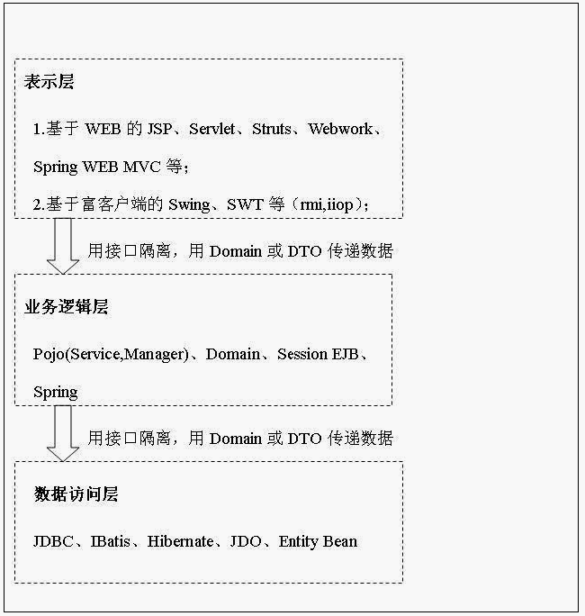
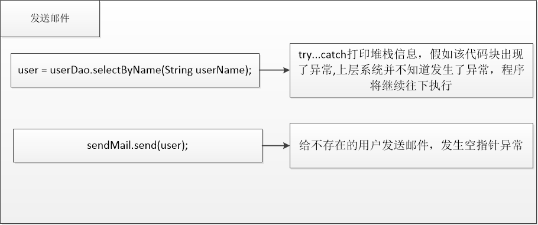

# 在实际项目中使用JDBC

标签（空格分隔）： 分层 异常处理 JDBC

---


### 基本架构
在实际项目中，我们经常会通过查询获取数据,然后将数据用于其他的用途，并非简单的打印或者展示，其次，在实际的应用中，和数据库打交道的jdbc代码会很少出现在业务逻辑中，因为这样对代码的维护以及再扩展会带来极大的开销。



使用接口隔离，这样设计的好处就是通过数据访问层的接口完全隐藏了数据层的实现细节，让业务逻辑层不需要关系具体的实现细节.例如我们将数据访问的具体实现从JDBC换成hibernate,对业务逻辑层并没有影响.

#### DAO
DAO的全称是data access object,其中非常重要的一个概念就是Domain对象，也就是说一个最常用的POJO与数据库中的一个表相对应.首先我们需要设计一个domain对象，这里我们为之前的db_user表设计对应的domain对象.
```java
package com.flwcy.entity;

import java.util.Date;

public class User {
    private Integer id;

    private String userName;

    private String password;

    private String email;

    private Date birthday;

    public Integer getId() {
        return id;
    }

    public void setId(Integer id) {
        this.id = id;
    }

    public Date getBirthday() {
        return birthday;
    }

    public void setBirthday(Date birthday) {
        this.birthday = birthday;
    }

    public String getUserName() {
        return userName;
    }

    public void setUserName(String userName) {
        this.userName = userName;
    }

    public String getPassword() {
        return password;
    }

    public void setPassword(String password) {
        this.password = password;
    }

    public String getEmail() {
        return email;
    }

    public void setEmail(String email) {
        this.email = email;
    }

    @Override
    public String toString() {
        return "User{" +
                "userName='" + userName + '\'' +
                ", password='" + password + '\'' +
                ", email='" + email + '\'' +
                ", birthday=" + birthday +
                '}';
    }
}
```
domain对象已经编写好了，domain对象中包括了数据表中所有的字段，并提供了get与set方法.接下来我们定义一个DAO接口来供业务逻辑层调用
```java
package com.flwcy.dao;

import com.flwcy.entity.User;

import java.util.List;

public interface UserDao {

    /**
     * 查询所有用户
     * @return
     */
    public List<User> selectAll();

    /**
     * 通过用户名称查询用户
     * @param name
     * @return
     */
    public User selectByName(String name);

    /**
     * 修改用户信息
     * @param user
     * @return
     */
    public int update(User user);

    /**
     * 插入一条用户记录
     * @param user
     * @return
     */
    public int insert(User user);

    /**
     * 删除用户
     * @param id
     * @return
     */
    public int delete(Integer id);
}
```
 一个简单的DAO接口的实现
```java
package com.flwcy.dao.impl;

import com.flwcy.dao.UserDao;
import com.flwcy.entity.User;
import com.flwcy.exception.DaoException;
import com.flwcy.util.DbUtils;
import com.flwcy.util.SelfDbUtils;

import java.sql.*;
import java.util.ArrayList;
import java.util.List;

/**
 * 使用PreparedStatement来防止sql注入
 * @author flwcy
 */
public class UserDaoImpl implements UserDao {

    /**
     * 查询所有用户信息
     *
     * @return
     */
    public List<User> selectAll() {
        List<User> result = new ArrayList<User>();
        Connection connection = null;
        PreparedStatement statement = null;
        ResultSet resultSet = null;
        try {
            //  2.建立数据库连接（Connection）
            connection = SelfDbUtils.getInstance().getConnection();
            // 3.创建sql语句（Statement或其子类）
            String sql = "select id,user_name,password,email,birthday from db_user";
            statement = connection.prepareStatement(sql);
            // 4.执行sql语句获取结果集（ResultSet）
            resultSet = statement.executeQuery();
            // 5.循环处理结果
            while (resultSet.next()) {
                User user = mappingUser(resultSet);

                result.add(user);
            }
        } catch (SQLException e) {
            throw new DaoException("查询所有用户出错！",e);
        } finally {
            // 6.关闭链接，释放资源
            DbUtils.close(connection, statement, resultSet);
        }
        return result;
    }

    public User selectByName(String name) {
        User user = null;
        if (name != null && !"".equals(name.trim())) {
            Connection connection = null;
            PreparedStatement statement = null;
            ResultSet resultSet = null;

            try {
                connection = SelfDbUtils.getInstance().getConnection();
                String sql = "select id,user_name,password,email,birthday from db_user where user_name = ?";
                statement = connection.prepareStatement(sql);
                // 占位符从1开始
                statement.setString(1,name);
                resultSet = statement.executeQuery();
                while (resultSet.next()) {
                    user = mappingUser(resultSet);
                }
            } catch (SQLException e) {
                throw new DaoException("查询用户出错！",e);
            } finally {
                SelfDbUtils.getInstance().close(connection, statement, resultSet);
            }
        }
        return user;
    }

    private User mappingUser(ResultSet resultSet) throws SQLException {
        User user = new User();
        user.setId(resultSet.getInt("id"));
        user.setUserName(resultSet.getString("user_name"));
        user.setPassword(resultSet.getString("password"));
        user.setEmail(resultSet.getString("email"));
        user.setBirthday(resultSet.getDate("birthday"));
        return user;
    }

    public int update(User user) {
        int result = -1;
        if(user != null) {
            Connection connection = null;
            PreparedStatement statement = null;
            ResultSet resultSet = null;

            try {
                connection = SelfDbUtils.getInstance().getConnection();
                String sql = "update db_user set user_name = ?,password = ?,email = ?,birthday = ? where id = ?;";
                statement = connection.prepareStatement(sql);
                statement.setString(1,user.getUserName());
                statement.setString(2,user.getPassword());
                statement.setString(3,user.getEmail());
                statement.setDate(4, new Date(user.getBirthday().getTime()));
                statement.setInt(5,user.getId());
                result = statement.executeUpdate();
            } catch (SQLException e) {
                throw new DaoException("更新用户出错！",e);
            } finally {
                SelfDbUtils.getInstance().close(connection,statement,resultSet);
            }
        }
        return result;
    }

    public int insert(User user) {
        int result = -1;
        if (user != null) {
            Connection connection = null;
            PreparedStatement statement = null;
            ResultSet resultSet = null;

            try {
                connection = SelfDbUtils.getInstance().getConnection();
                String sql = "insert into db_user(user_name,password,email,birthday) values(? , ?, ?, ?)";
                statement = connection.prepareStatement(sql);
                statement.setString(1,user.getUserName());
                statement.setString(2,user.getPassword());
                statement.setString(3,user.getEmail());
                statement.setDate(4, new Date(user.getBirthday().getTime()));
                result = statement.executeUpdate();
            } catch (SQLException e) {
                throw new DaoException("新增用户失败！",e);
            } finally {
                SelfDbUtils.getInstance().close(connection, statement, resultSet);
            }
        }
        return result;
    }

    public int delete(Integer id) {
        int result = -1;
        if(id != null && id >= 0){
            Connection connection = null;
            PreparedStatement statement = null;
            ResultSet resultSet = null;

            try {
                connection = SelfDbUtils.getInstance().getConnection();
                String sql = "delete from db_user where id = ?";
                statement = connection.prepareStatement(sql);
                statement.setInt(1,id);
                result = statement.executeUpdate();
            } catch (SQLException e) {
                throw new DaoException("删除用户失败！",e);
            } finally {
                SelfDbUtils.getInstance().close(connection,statement,resultSet);
            }
        }
        return result;
    }


}
```
最后我们编写junit代码对DAO接口中所有的方法进行逐个测试
```java
package com.flwcy.test;

import com.flwcy.dao.UserDao;
import com.flwcy.dao.impl.UserDaoImpl;
import com.flwcy.entity.User;
import org.junit.Test;

import java.util.Date;
import java.util.List;

public class UserDaoTest {

    private UserDao userDao = new UserDaoImpl();

    @Test
    public  void selectAll(){
        List<User> users = userDao.selectAll();
        for(User user : users){
            System.out.println(user);
        }
    }

    @Test
    public void selectByName(){
        String userName = "flwcy";
        User user = userDao.selectByName(userName);
        System.out.println(user);
    }

    @Test
    public void update(){
        User user = new User();
        user.setId(1);
        user.setUserName("test");
        user.setBirthday(new Date());
        user.setPassword("test11");
        user.setEmail("test@163.com");
        int result = userDao.update(user);
        System.out.println(result);
        System.out.println(userDao.selectByName("test"));
    }

    @Test
    public void insert(){
        User user = new User();
        // user.setId(1);
        user.setUserName("abc");
        user.setBirthday(new Date());
        user.setPassword("abc123");
        user.setEmail("abc@163.com");
        userDao.insert(user);
        System.out.println(userDao.selectByName("abc"));
    }

    @Test
    public void delete(){
        userDao.delete(userDao.selectByName("abc").getId());
        System.out.println(userDao.selectByName("abc"));
    }
}
```
我们对原有的项目进行这样更改之后，不难发现，**操作数据库的具体实现过程完全被隐藏了起来，如果我们要更改其中的细节，业务逻辑层的相关代码则无需进行更改**。如果需要增加新的接口，可以进行继承或者在原有的接口基础之上进行修改，应用照样是不需要进行替换。
### 异常处理
在之前的练习代码中，为了顺利通过编译，我们只是简单的打印了一下堆栈的信息，并没有通知上一层使用者或者展示层，来表示现在出现的错误，并且也没有想办法进行相应的容错，当然，如果sql语句出现错误，或者主键冲突，容错是非常难做的，所以一般情况下数据库执行sql语句的错误只需要通过异常的传递机制告知上一层使用者即可。



如上图所示,异常发生转移了,这样的对异常进行简单的try...catch,不便于我们进行错误定位.

>Public User selectByUserName(String userName) throws SQLException;

另一种常见的做法是直接将异常抛出,此时，我们将异常直接抛出后，必须修改接口.并且业务层必须进行try/catch或者继续抛出异常.而且这样修改后，我们无法更换数据访问层的实现(比如我们抛出SQLException[编译时异常],但是Hibernate中并没有java.sql.SQLException)，此时我们必须修改接口，而且业务逻辑层必须进行异常处理(tr/catch或者继续向上抛出)
我们采用三层架构设计的一个重要目标是让层与层之间相互独立,能够灵活更改层的具体实现细节.因此我们需要采用另外一种方式,自定义异常:
```java
package com.rooike.dao;

/**
 * Created by three on 2016/6/2.
 */
public class DaoException extends RuntimeException {
    public DaoException() {
        super();
    }

    public DaoException(String message) {
        super(message);
    }

    public DaoException(String message, Throwable cause) {
        super(message, cause);
    }

    public DaoException(Throwable cause) {
        super(cause);
    }

    protected DaoException(String message, Throwable cause, boolean enableSuppression, boolean writableStackTrace) {
        super(message, cause, enableSuppression, writableStackTrace);
    }
}
```
这样修改后，我们可以达到不污染接口的目的,也能够达到将异常通知到上一层代码的目的,这样业务逻辑层也能够进行选择，如果业务逻辑层能够处理,就进行try/catch,不能处理该异常,可以继续向上抛出.
```java
    public int insert(User user) {
        int result = -1;
        if (user != null) {
            Connection connection = null;
            PreparedStatement statement = null;
            ResultSet resultSet = null;

            try {
                connection = SelfDbUtils.getInstance().getConnection();
                String sql = "insert into db_user(user_name,password,email,birthday) values(? , ?, ?, ?)";
                statement = connection.prepareStatement(sql);
                statement.setString(1,user.getUserName());
                statement.setString(2,user.getPassword());
                statement.setString(3,user.getEmail());
                statement.setDate(4, new Date(user.getBirthday().getTime()));
                result = statement.executeUpdate();
            } catch (SQLException e) {
                throw new DaoException("新增用户失败！",e);
            } finally {
                SelfDbUtils.getInstance().close(connection, statement, resultSet);
            }
        }
        return result;
    }
```

### DAO与工厂模式的整合

虽然通过 DAO模式将数据库的操作细节隐藏起来了，业务逻辑的处理虽然也是依赖接
口但是同时也依赖了接口的实现。

为了解决依赖了接口实现这个问题，我们采用工厂模式，详细代码如下：

```java
package com.flwcy.factory;

import com.flwcy.dao.UserDao;
import com.flwcy.exception.DaoException;

import java.io.IOException;
import java.io.InputStream;
import java.util.Properties;

/**
 * 工厂模式
 */
public class SimpleDAOFactory {

    private Properties properties;

    private static class SingletonHandler{
        private static final SimpleDAOFactory INSTANCE = new SimpleDAOFactory();
    }

    private SimpleDAOFactory(){
        InputStream inputStream = null;
        try {
            properties = new Properties();
            inputStream = SimpleDAOFactory.class.getClassLoader().getResourceAsStream("dao_config.properites");
            //从输入流中读取属性列表（键和元素对）
            properties.load(inputStream);
        } catch (Exception e) {
            throw  new ExceptionInInitializerError(e);
        } finally {
            try {
                if(inputStream != null)
                    inputStream.close();
            } catch (IOException e) {
                e.printStackTrace();
            }
        }
    }

    public UserDao getUserDao(){
        UserDao userDao;
        try {
            String userDaoClassName = properties.getProperty("userDaoClass");
            Class clazz = Class.forName(userDaoClassName);
            userDao = (UserDao)clazz.newInstance();
        } catch (Exception e) {
            throw new DaoException("获取UserDao的实现类出错", e);
        }

        return userDao;
    }

    public static SimpleDAOFactory newInstance(){
        return SingletonHandler.INSTANCE;
    }
}
```

配置文件为`dao_config.properties`

```
userDaoClass=com.flwcy.dao.impl.UserDaoImpl
```

修改一下之前的业务逻辑层

```java

```

