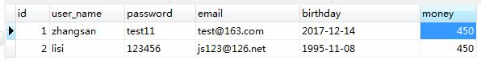
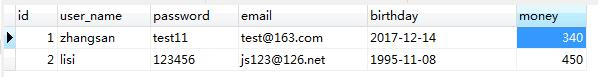

### 事务

**事务**`Transaction`是[数据库管理系统](https://zh.wikipedia.org/wiki/%E6%95%B0%E6%8D%AE%E5%BA%93%E7%AE%A1%E7%90%86%E7%B3%BB%E7%BB%9F)执行过程中的一个逻辑单位，由一个有限的[数据库](https://zh.wikipedia.org/wiki/%E6%95%B0%E6%8D%AE%E5%BA%93)操作序列构成。

数据库的事务是保证数据完整性的一种机制，简而言之，就是怎样确保数据的执行过程要么都成功，要么都失败，举例子为假设你要给银行还款，需要从你的银行卡中扣除相关的金额也需要在你的信用卡上加钱，这个流程务必是一个完整的流程，不能拆分，如果从你的银行卡中扣除了钱，但是加钱的流程是失败的，这个时候用户是吃亏的，反之银行则会亏本，所以这就涉及到了事务的机制。

#### ACID

+ **原子性Atomic**：一个事务（transaction）中的所有操作，要么全部完成，要么全部不完成，不会结束在中间某个环节。事务在执行过程中发生错误，会被回滚（Rollback）到事务开始前的状态，就像这个事务从来没有执行过一样。
+ **一致性Consistency**：事务应确保数据库的状态从一个一致状态转变为另一个一致状态。一致状态的含义是数据库中的数据应满足完整性约束。
+ **隔离性Isolation**：多个事务并发执行时，一个事务的执行不应影响其他事务的执行。
+ **持久性Durability**：事务处理结束后，对数据的修改就是永久的，即便系统故障也不会丢失。

> [如何理解数据库事务中的一致性的概念？ - 沈询的回答 - 知乎](https://www.zhihu.com/question/31346392/answer/156411587)
>
> 原子性：记录之前的版本，允许回滚
>
> 一致性：事务开始和结束之间的中间状态不会被其他事务看到
>
> 隔离性：适当的破坏一致性来提升性能与并行度  例如：最终一致~=读未提交。
>
> 持久性：每一次的事务提交后就会保证不会丢失

#### JDBC中使用事务

JDBC的一切行为包括事务是基于一个`Connection`的，在JDBC中是通过`Connection`对象进行事务管理。在JDBC中，常用的和事务相关的方法是： `setAutoCommit`、`commit`、`rollback`等。

```java
connection.setAutoCommit(false);// 打开事务

connection.commit();// 提交事务

connection.rollback();// 回滚事务
```

#### 模拟转账

我们给之前的`db_user`表新增一个字段叫做`money`

```sql
ALTER TABLE db_user ADD money FLOAT NOT NULL DEFAULT 450; #账户余额
```

假设有这样一个需求，首先用户`zhangsan`转给用户`lisi`110元，然后判断用户`lisi`的账户余额是否大于400元，如果大于400则抛出一个异常（假设此时系统出现了故障），我们来看看，`zhangsan`的钱是不是会减少，在做这样的操作之前我们先查看一下他们两个此时的信息执行 sql 语句`select * from db_user where name in('zhangsan','lisi');`



现在来编写程序测试一下，刚才我们的需求，代码示例如下：

```java
    @Test
    public void test(){
        Connection connection = null;
        PreparedStatement statement = null;
        ResultSet resultSet = null;
        float money = 0;
        try {
            connection = SelfDbUtils.getInstance().getConnection();
            // 用户zhangsan扣除110元
            String updateSql = "update db_user set money = money - 110 wHERE user_name = 'zhangsan';";
            statement = connection.prepareStatement(updateSql);
            statement.executeUpdate();

            String querySql = "select money from db_user where user_name = 'lisi'";
            resultSet = statement.executeQuery(querySql);
            while(resultSet.next()){
                money = resultSet.getFloat("money");
            }

            // 如果lisi的钱超过400元
            if(money > 400)
                throw new RuntimeException("钱已到上限，无法在增加");
            
            // 给lisi的帐号增加钱
            String updateMoney = "update user set money=money+110 where user_name = 'lisi'";
            statement.execute(updateMoney);
        } catch (SQLException e) {
            e.printStackTrace();
        } finally {
            SelfDbUtils.getInstance().close(connection,statement, resultSet);
        }
    }
```

程序像我们当初设想的那样抛出了异常，这个时候我们再来查看一下用户`zhangsan`的余额是否被减少了呢，继续执行`sql`语句



可以看到用户`zhangsan`的钱已经变为340元，这是系统的一个很严重的`BUG`，也是用户`zhangsan`不愿意看到的，上面的问题为什么会发生呢？

`Jdbc`的事务默认是打开的，也就是说执行每一步操作的话，事务都会隐式的进行提交，在抛出异常之前，我们的更改操作已经同步到了数据库中去，此时只能看到用户`zhangsan`的余额减少了，却不能看到用户`lisi`的余额增加了。

#### 事务提交与回滚

为了保证我们的程序能够正确的按照我们的意图来进行，现在修改一下代码，将代码中涉及的三个执行语句放在一个事务当中，统一进行提交或者回滚，修改后的代码如下

```java
    @Test
    public void test2(){
        Connection connection = null;
        PreparedStatement statement = null;
        ResultSet resultSet = null;
        float money = 0;
        try {
            connection = SelfDbUtils.getInstance().getConnection();
            // 关闭自动提交事务
            connection.setAutoCommit(false);

            // 用户zhangsan扣除110元
            String updateSql = "update db_user set money = money - 110 wHERE user_name = 'zhangsan';";
            statement = connection.prepareStatement(updateSql);
            statement.executeUpdate();

            String querySql = "select money from db_user where user_name = 'lisi'";
            resultSet = statement.executeQuery(querySql);
            while(resultSet.next()){
                money = resultSet.getFloat("money");
            }

            // 如果lisi的钱超过400元
            if(money > 400)
                throw new RuntimeException("钱已到上限，无法在增加");

            // 给lisi的帐号增加钱
            String updateMoney = "update user set money=money+110 where user_name = 'lisi'";
            statement.execute(updateMoney);

            // 提交事务
            connection.commit();
        } catch (SQLException e) {
            // 回滚事务

            try {
                if(connection != null)
                    connection.rollback();
            } catch (SQLException e1) {
                e1.printStackTrace();
            }

            e.printStackTrace();
        } finally {
            SelfDbUtils.getInstance().close(connection,statement, resultSet);
        }
    }
```

执行代码，让异常发生，再来看看效果


可以看到，用户`zhangsan`的`money`没有发生任何的变化，原因是我们将所有的`sql`操作放在了同一个事务之中。

#### 设置保存点

如果我们的数据操作中涉及多个数据库操作，其中当出现问题的时候，并非需要将所有的操作都进行回滚，可能其中的某些细节是没有必要回滚的，此时，单纯的用提交或者回滚未免会显得有些武断，我们还可以通过设置保存点的方式来设置我们想要将事务回滚到某个点。

我们可以通过`SavePoint API`来解决上面的问题，可以在`sql`的执行过程中来设置`SavePoint`，然后再需要回滚的地方调用`rollback`的重载方法`Conn.rollback(SavePoint point);`来进行回滚。

#### JTA事务的介绍

随着分布式系统的普及，我们的数据库也可能是集群形式的，有时候一个应用程序需要操作两个或者两个以上的数据库，这个时候数据的事务控制将会是一个更加复杂和严峻的问题，这就是通常所说的跨库事务，要求几个数据库的事务在一个应用中保持一致，` JTA`就是为了解决这个问题而诞生的，在本博客中将不再进行介绍。

#### 事务的隔离级别

在数据库操作中，为了有效保证并发读取数据的正确性，提出的事务隔离级别。在事务并发操作时，可能出现的问题有：

**脏读**：脏读就是指当一个事务正在访问数据，并且对数据进行了修改，而这种修改还没有提交到数据库中，这时，另外一个事务也访问这个数据，然后使用了这个数据。

```
        1.Mary的原工资为1000, 财务人员将Mary的工资改为了8000(但未提交事务)
        2.Mary读取自己的工资 ,发现自己的工资变为了8000，欢天喜地！
        3.而财务发现操作有误，回滚了事务,Mary的工资又变为了1000
          像这样,Mary记取的工资数8000是一个脏数据。
```

**不可重复读**：在一次事务中，当一行数据获取两遍得到不同的结果表示发生了“不可重复读”.

```
	1.在事务1中，Mary 读取了自己的工资为1000,操作并没有完成
    2.在事务2中，这时财务人员修改了Mary的工资为2000,并提交了事务.
    3.在事务1中，Mary 再次读取自己的工资时，工资变为了2000

 解决办法：如果只有在修改事务完全提交之后才可以读取数据，则可以避免该问题。
```

**幻读**：在事务执行过程中，当两个完全相同的查询语句执行得到不同的结果集。这种现象称为“幻读（phantom read）”。

```
   目前工资为1000的员工有10人。
   1.事务1,读取所有工资为1000的员工。
   2.这时事务2向employee表插入了一条员工记录，工资也为1000
   3.事务1再次读取所有工资为1000的员工 共读取到了11条记录。
 
 解决办法：如果在操作事务完成数据处理之前，任何其他事务都不可以添加新数据，则可避免该问题
```

> 很多人容易搞混不可重复读和幻读，确实这两者有些相似。但不可重复读重点在于update和delete，而幻读的重点在于insert。

事务的隔离级别从低到高有：

+ 未提交读（READ UNCOMMITTED）是最低的隔离级别。允许“脏读”（dirty reads），事务可以看到其他事务“尚未提交”的修改。
+ 提交读（READ COMMITTED）只能读取到已经提交的数据。Oracle等多数数据库默认都是该级别 (不重复读)
+ 可重复读（Repeatable read）在一个事务中，对于同一份数据的读取结果总是相同的，无论是否有其他事务对这份数据进行操作，以及这个事务是否提交。可以解决脏读、不可重复读。
+ 串行读(Serializable)：事务串行化执行，隔离级别最高，牺牲了系统的并发性。可以解决并发事务的所有问题。

| 隔离级别                   | 脏读（Dirty Read） | 不可重复读（NonRepeatable Read） | 幻读（Phantom Read） |
| ---------------------- | -------------- | ------------------------- | ---------------- |
| 未提交读（Read uncommitted） | 可能             | 可能                        | 可能               |
| 已提交读（Read committed）   | 不可能            | 可能                        | 可能               |
| 可重复读（Repeatable read）  | 不可能            | 不可能                       | 可能               |
| 可串行化（Serializable ）    | 不可能            | 不可能                       | 不可能              |

但是隔离级别越高，对数据正确性的保证会越好，但同时牺牲很多的数据库性能，并发性会越差，具体的调整需要根据自己的需要进行，建议不要设置为可串行化与读未提交这样的级别，当然各个数据库提供对隔离级别的支持是不一样的，有些数据库压根就没有实现和支持相应的隔离级别。

#### 隔离级别实验演示

##### 读未提交隔离级别

我们先将事务的隔离级别设置为`read committed`：

```
mysql> set GLOBAL transaction isolation level read uncommitted;
Query OK, 0 rows affected (0.00 sec)

mysql> select @@tx_isolation;
+------------------------+
| @@session.tx_isolation |
+------------------------+
| READ-UNCOMMITTED       |
+------------------------+
1 row in set (0.00 sec)
```

在下面我们开了两个终端分别用来模拟事务一和事务二，p.s: 操作一和操作二的意思是按照时间顺序来执行的。

**事务1**

```
mysql> start transaction; # 操作1
Query OK, 0 rows affected (0.00 sec)

mysql> select * from db_user; # 操作3
+----+-----------+----------+---------------+------------+-------+
| id | user_name | password | email         | birthday   | money |
+----+-----------+----------+---------------+------------+-------+
|  1 | zhangsan  | test11   | test@163.com  | 2017-12-14 |   600 |
|  2 | lisi      | 123456   | js123@126.net | 1995-11-08 |   500 |
+----+-----------+----------+---------------+------------+-------+
2 rows in set (0.00 sec)

mysql> update db_user set money=200 where id=1; # 操作4
Query OK, 1 row affected (0.00 sec)
Rows matched: 1  Changed: 1  Warnings: 0
```

**事务2**

```
mysql> start transaction; # 操作2
Query OK, 0 rows affected (0.00 sec)

mysql> select * from db_user; # 操作5
+----+-----------+----------+---------------+------------+-------+
| id | user_name | password | email         | birthday   | money |
+----+-----------+----------+---------------+------------+-------+
|  1 | zhangsan  | test11   | test@163.com  | 2017-12-14 |   200 |
|  2 | lisi      | 123456   | js123@126.net | 1995-11-08 |   500 |
+----+-----------+----------+---------------+------------+-------+
2 rows in set (0.00 sec)
```

从上面的执行结果可以和清晰的看出来，在`read uncommited`级别下面我们在事务一中可能会读取到事务二中没有`commit`的数据，这就是脏读。

##### 读提交隔离级别

