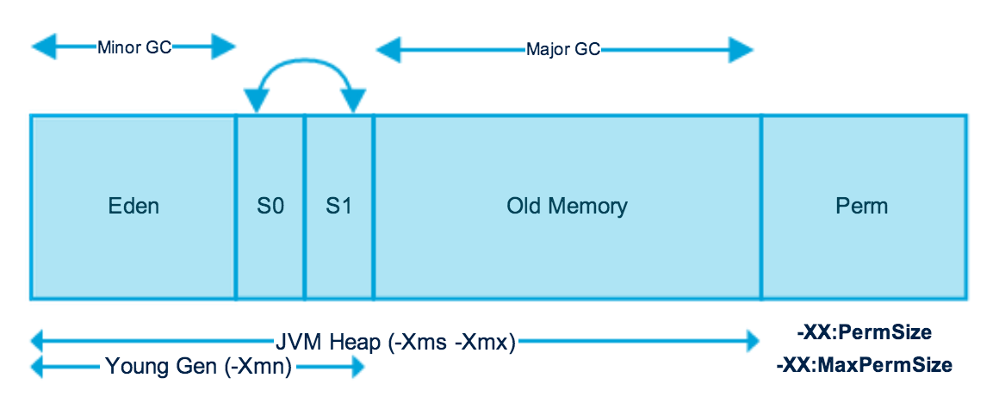

#### Java语言基础

##### 基础

关键字

标识符：

+ 英文大小写字母、数字、下划线、$
+ 不能以数字开头
+ 不能是java中的关键字
+ Java严格区分大小写

注释：

+ 单行 //
+ 多行 /*          */
+ 文档注释 /**        */

Java语言是强类型语言

基本数据类型：byte(1)、short(2)、int(4)、long(8)、float(4)、double(8)、char(2)、boolean(1)


引用数据类型：class、interface、[]

整数默认是int类型

**Java语言整型常量的四种表示形式**

- 十进制整数，如：99, -500, 0
- 八进制整数，要求以 0 开头，如：015
- 十六进制数，要求 0x 或 0X 开头，如：0x15
- 二进制数，要求0b或0B开头，如：0b01110011

> **十进制转二进制**
>
> 一般算比较小的数字的话，就先找小于并且临这个数最近的2的N次方。然后依次。
> 比如 37 
> 32 + 4 + 1
> 对应的就是 100101（32 16 8 4 2 1 有的写1，反之写0）

**浮点数使用总结**

- 默认是double类型
- 如果在数值计算中不允许有任何舍入误差，就应该使用BigDecimal类
- 避免比较中使用浮点数（0.1+0.2 == 0.3），需要比较请使用BigDecimal类

```java
// 只有构造参数为String类型时才能保证不丢失精度，因为double类型本身就是不完全精确的。
//正确的姿势：
System.out.println(new BigDecimal("0.1").add(new BigDecimal("0.2")));//输出：0.3

//错误的姿势：
System.out.println(new BigDecimal(0.1).add(new BigDecimal(0.2)));    //输出：0.3000000000000000166533453693773481063544750213623046875
```

>    这种舍入误差的主要原因是浮点数值采用二进制系统表示，而在二进制系统中无法精确地表示分数 1/10。 
>
>    就好像十进制无法精确地表示分数 1/3一样。

长整型用L或者l标记，建议使用L

单精度浮点数用F或者f标记，建议使用F

运算符

```java
int x = 3; // 把3赋值给int类型的变量;
```

**整数/浮点数运算：**
1. 如果两个操作数有一个为Long, 则结果也为long。
2. 没有long时，结果为int。即使操作数全为short，byte，结果也是int。
3. 如果两个操作数有一个为double，则结果为double。
4. 只有两个操作数都是float，则结果才为float。

--、++ 数字打头，先使用再计算。符号打头先计算再使用。

> a++是先办事（进行相关运算），后给钱（然后再将a加1）
>
> ++a是先给钱（先给a加1），后办事（然后参与运算）

> 对于整数a，b来说，取模运算或者求余运算的方法要分如下两步：
>
> 1.求整数商：c=a/b
>
> 2.计算模或者余数：r=a-(c*b)
>
> 求模运算和求余运算在第一步不同
>
> 取余运算在计算商值向0方向舍弃小数位
>
> 取模运算在计算商值向负无穷方向舍弃小数位
>
> 例如：4/(-3)约等于-1.3
>
> 在取余运算时候商值向0方向舍弃小数位为-1
>
> 在取模运算时商值向负无穷方向舍弃小数位为-2
>
> 所以
>
> 4rem(-3)= 4-(-1 * -3) =1
>
> 4mod(-3)= 4- (-2 * -3) = -2

整数相除只能得到整数，如果想得到小数，必须把数据转化为浮点数。`x * 1.0 / y`

> 面试题：
>
> short s = 1; s = s + 1;  // 编译不通过的，提示损失精度 
>
> 隐式类型转换可以从小到大自动转换，即byte→short→int→long；反过来会丢失精度，必须进行显示类型转换；
>
> s = s+1这句先执行s+1然后把结果赋给s，由于1为int类型，所以s+1的返回值是int，编译器自动进行了隐式类型转换；所以将一个int类型赋给short就会出错。
>
> short s = 1; s += 1;
>
> s += 1; // 不是等价于 s = s + 1; 而是等价于 s = (s的数据类型)(s + 1);

逻辑运算符：&&（短路与），&（与），|（或），||（短路或），!（逻辑非）

+ `&&`和`&`都是表示“与”，区别是`&&`只要第一个条件为`false`，则后面条件就不再判断。而`&`要对所有的条件都进行判断。
+ `||`（短路或）和`|`（或）都是表示“或”，区别是`||`只要第一个条件为`true`，则后面的条件不再判断 ，而`|`要对所有的条件进行判断。


三目运算符:其中"(a<b)?a:b"是一个"条件表达式",它是这样执行的:如果a<b为真,则表达式取a值,否则取b值.

> 键盘录入？
>
> import java.util.Scanner;
>
> Scanner sc = new Scanner(System.in);
>
> int x = sc.nextInt();

`if`语句、`switch`语句、`for`循环语句、`while`循环语句、`do...while`循环语句

> switch 语句中的变量类型可以是： byte、short、int 或者 char。JDK5以后可以是枚举，从 Java SE 7 开始，switch 支持字符串 String 类型了，同时 case 标签必须为字符串常量或字面量。
>
> for适合于一个范围的判断
> while适合次数不明确的
>
> do...while循环至少执行一次循环体
> for和while必须先判断条件是否是true，然后后才能决定是否执行循环体

```
练习题：
		1.在控制台输出所有水仙花数、九九乘法表
		2.小芳的妈妈每天给她2.5元钱，她都会存起来，但是，每当这一天是存钱的第5天或者5的倍数的话，她都会			  花去6元钱，请问，经过多少天，小芳才可以存到100元钱？
```

`break`：跳出当前循环，`continue`：跳出当前循环，`return`

方法：

```
修饰符 返回值类型 方法名(参数类型 参数名){
    ...
    方法体
    ...
    return 返回值;
}
```

`void`

方法重载：在同一个类中，方法名相同，参数列表（参数个数不同或者参数类型不同）不同，与返回值类型无关。

数组：用来存储固定大小的同类型元素。数组的`length`属性用于获取数组长度。

声明数组：

```
数据类型[] 数组名;   // 首选的方法
 
或
 
数据类型 数组名[];  // 效果相同，但不是首选方法
```

Java语言使用new操作符来创建数组，语法如下：

```
数组名 = new 数据类型[arraySize];
```

数组变量的声明，和创建数组可以用一条语句完成，如下所示：

```
数据类型[] 数组名 = new 数据类型[arraySize];

或

数据类型[] 数组名 = {value0, value1, ..., valuek};
```

数组的元素是通过索引访问的。数组索引从`0`开始，所以索引值从`0`到`数组名.length-1`。

```
练习题：
	打印输出杨辉三角数
			 １
　　　　　　　１　１
　　　　　　１　２　１
　　　　　１　３　３　１
　　　　１　４　６　４　１
　　　１　５　10　10　５　１
　　１　６　15　20　15　６　１
　１　７　21　35　35　21　７　１
１　８　28　56　70　56　28　８　１
```

```
练习题：
某个公司采用公用电话网络传递数据信息，数据是小于8位的整数，为了确保安全，在传递过程中需要加密，加密规则如下：首先将数据倒序，然后将每位数字都加上5，再用和除以10的余数代替该数字，最后将第一位和最后一位数字交换。（提示：使用数组存储）
```

```
练习题：
	打印当前日期的日历（LocalDate）
```

##### 面向对象

> 面向过程就是分析出解决问题所需要的步骤，然后用函数把这些步骤一步一步实现，使用的时候一个一个依次调用就可以了。面向对象是把构成问题事务分解成各个对象，建立对象的目的不是为了完成一个步骤，而是为了描叙某个事物在整个解决问题的步骤中的行为。
>
> 例如五子棋，面向过程的设计思路就是首先分析问题的步骤：
>
> 1、开始游戏，2、黑子先走，3、绘制画面，4、判断输赢，5、轮到白子，6、绘制画面，7、判断输赢，8、返回步骤2，9、输出最后结果。
>
> 把上面每个步骤用分别的函数来实现，问题就解决了。
>
> 而面向对象的设计则是从另外的思路来解决问题。整个五子棋可以分为：
>
> 1、黑白双方，这两方的行为是一模一样的，2、棋盘系统，负责绘制画面，3、规则系统，负责判定诸如犯规、输赢等。
>
> 第一类对象（玩家对象）负责接受用户输入，并告知第二类对象（棋盘对象）棋子布局的变化，棋盘对象接收到了棋子的变化就要负责在屏幕上面显示出这种变化，同时利用第三类对象（规则系统）来对棋局进行判定。

面向对象的三大特性：封装、继承、多态

类（class）是构造对象的模板或蓝图。

由类构造（construct）对象的过程称为创建类的实例（instance）。
- 对象的行为（behavior）——可以对对象施加哪些操作，或可以对对象施加哪些方法？
- 对象的状态（state）——当施加那些方法时，对象如何响应？
- 对象标识（identity）——如何辨别具有相同行为与状态的不同对象？

一个对象变量并没有实际包含一个对象，而仅仅引用一个对象。Java是按值调用的：

```
public static void swap(Employee x,Employee y) {
    Employee tmp = x;
    x = y;
    y = tmp;
}

Employee a = new Employee("flwcy",...);
Employee b = new Employee("flwang",...);
swap(a,b);
```

`static`

> 静态工厂方法（factory method）：
>
> + 无法命名构造器，构造器必须与类同名。
> + 当使用构造器时，无法改变所构造对象的类型。

`final`

+ 修饰变量时，值不可变。
+ 修饰方法时，方法不能被重写。
+ 修饰类时，类不能被继承。

###### 对象构造

> + 构造器与类同名
> + 每个类可以有一个以上的构造器
> + 构造器可以有0个、1个或者多个参数
> + 构造器没有返回值
> + 构造器总是伴随着new操作一起调用

**重载（overloading）**：同一个类中，方法名相同，参数列表不同（参数类型、参数个数）

> 要完整地描述一个方法，需要指出方法名以及参数类型。这叫做方法的签名（signature)。
>
> 返回类型不是方法签名的一部分。   

构造器也叫构造方法(constructor)，用于对象的初始化。

> 1. 通过new关键字调用!!
>
> 2. 构造器虽然有返回值，但是不能定义返回值类型(返回值的类型肯定是本类)，不能在构造器里使用return返回某个值。
>
> 3. 仅当类没有提供任何构造器的时候，编译器才会提供一个默认的无参数构造器。如果已定义则编译器不会自动添加!
>
> 4. 构造器的方法名必须和类名一致!

`this` 

###### 内存分析

Java虚拟机的内存可以分为三个区域：栈stack、堆heap、方法区method area。

**栈的特点如下：**

1. 栈描述的是方法执行的内存模型。每个方法被调用都会创建一个栈帧(存储局部变量、操作数、方法出口等)

2. JVM为每个线程创建一个栈，用于存放该线程执行方法的信息(实际参数、局部变量等)

3. 栈属于线程私有，不能实现线程间的共享!

4. 栈的存储特性是“先进后出，后进先出”

5. 栈是由系统自动分配，速度快!栈是一个连续的内存空间!

**堆的特点如下：**

1. 堆用于存储创建好的对象和数组(数组也是对象)
2. JVM只有一个堆，被所有线程共享

3. 堆是一个不连续的内存空间，分配灵活，速度慢!

**方法区(又叫静态区)特点如下：**

　　1. JVM只有一个方法区，被所有线程共享!
  　　2. 方法区实际也是堆，只是用于存储类、常量相关的信息!
  　　3. 用来存放程序中永远是不变或唯一的内容。(类信息【Class对象】、静态变量、字符串常量等)


###### 垃圾回收

垃圾回收算法：引用计数法和引用可达法(根搜索算法)



年轻代（Young Generation）、老年代（Old Generation）等。

Minor GC：用于清理年轻代区域。

Major GC：用于清理老年代区域。

###### 继承

 所有类的父类都是Object。Java中类没有多继承，接口有多继承。

`instanceof`

方法重写（**override**）：

重写指的是在Java的子类与父类中有两个名称、参数列表都相同的方法的情况。由于他们具有相同的方法签名，所以子类中的新方法将覆盖父类中原有的方法。

**重写的注意点**：

1. 必须是在继承里。
2. 方法名、形参列表相同。
3. 返回值类型和声明异常类型，子类小于等于父类。
4.  访问权限，子类大于等于父类。

###### Object

Object类是所有类的基类。

   
