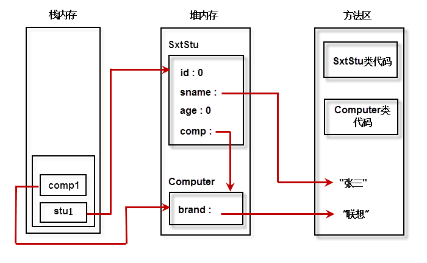

#### 面向对象

> 面向过程就是分析出解决问题所需要的步骤，然后用函数把这些步骤一步一步实现，使用的时候一个一个依次调用就可以了。面向对象是把构成问题事务分解成各个对象，建立对象的目的不是为了完成一个步骤，而是为了描叙某个事物在整个解决问题的步骤中的行为。
>
> 例如五子棋，面向过程的设计思路就是首先分析问题的步骤：
>
> 1、开始游戏，2、黑子先走，3、绘制画面，4、判断输赢，5、轮到白子，6、绘制画面，7、判断输赢，8、返回步骤2，9、输出最后结果。
>
> 把上面每个步骤用分别的函数来实现，问题就解决了。
>
> 而面向对象的设计则是从另外的思路来解决问题。整个五子棋可以分为：
>
> 1、黑白双方，这两方的行为是一模一样的，2、棋盘系统，负责绘制画面，3、规则系统，负责判定诸如犯规、输赢等。
>
> 第一类对象（玩家对象）负责接受用户输入，并告知第二类对象（棋盘对象）棋子布局的变化，棋盘对象接收到了棋子的变化就要负责在屏幕上面显示出这种变化，同时利用第三类对象（规则系统）来对棋局进行判定。

类（class）是构造对象的模板或蓝图。

由类构造（construct）对象的过程称为创建类的实例（instance）。
- 对象的行为（behavior）——可以对对象施加哪些操作，或可以对对象施加哪些方法？
- 对象的状态（state）——当施加那些方法时，对象如何响应？
- 对象标识（identity）——如何辨别具有相同行为与状态的不同对象？

##### 对象构造

构造器也叫构造方法(constructor)，用于对象的初始化。

> + 构造器与类同名
> + 每个类可以有一个以上的构造器
> + 构造器可以有0个、1个或者多个参数
> + 构造器没有返回值
> + 构造器总是伴随着new操作一起调用
> + 仅当类没有提供任何构造器的时候， 系统才会提供一个默认的无参构造器 

`this`关键字：

	1. 引用隐式参数
 	2. 调用该类的其他构造器

`super`关键字 ：

	1. 调用超类的方法
 	2. 调用超类的构造器。

一个对象变量并没有实际包含一个对象，而仅仅引用一个对象。Java是按值调用的：

```java
public static void swap(Employee x,Employee y) {
    Employee tmp = x;
    x = y;
    y = tmp;
}

Employee a = new Employee("flwcy",...);
Employee b = new Employee("flwang",...);
swap(a,b);
```

面向对象的三大特性：封装、继承、多态

`static`关键字

> 静态工厂方法（factory method）：
>
> + 无法命名构造器，构造器必须与类同名。
> + 当使用构造器时，无法改变所构造对象的类型。

`final`关键字

+ 修饰变量时，值不可变。
+ 修饰方法时，方法不能被重写。
+ 修饰类时，类不能被继承。

**重载（overloading）**：同一个类中，方法名相同，参数列表不同（参数类型、参数个数）

> 要完整地描述一个方法，需要指出方法名以及参数类型。这叫做方法的签名（signature)。
>
> 返回类型不是方法签名的一部分。   

**类初始化顺序**

1. 所有数据域被初始化默认值（0、false或null）。
2. 按照在类声明中出现的次序，依次执行所有域初始化语句和初始化块。
3. 如果构造器第一行调用了第二个构造器，则执行第二个构造器主体。
4. 执行这个构造器主体。

**类设计的技巧**

1. 一定要保证数据私有
2. 一定要对数据初始化
3. 不要在类中使用过多的基本类型（例如Address地址中的省市区）
4. 将职责过多的类进行分解
5. 类名和方法名要体现它的职责

**访问修饰符**：

1. 仅对本类可见private
2. 对本包可见—默认，不需要修饰符。
3. 对本包和所有子类可见 protected
4. 对所有类可见public

##### 内存分析

Java虚拟机的内存可以分为三个区域：栈stack、堆heap、方法区method area。

**栈的特点如下：**

1. 栈描述的是方法执行的内存模型。每个方法被调用都会创建一个栈帧(存储局部变量、操作数、方法出口等)

2. JVM为每个线程创建一个栈，用于存放该线程执行方法的信息(实际参数、局部变量等)

3. 栈属于线程私有，不能实现线程间的共享！

4. 栈的存储特性是“先进后出，后进先出”

5. 栈是由系统自动分配，速度快！栈是一个连续的内存空间！

**堆的特点如下：**

1. 堆用于存储创建好的对象和数组(数组也是对象)
2. JVM只有一个堆，被所有线程共享

3. 堆是一个不连续的内存空间，分配灵活，速度慢!

**方法区(又叫静态区)特点如下：**

　　1. JVM只有一个方法区，被所有线程共享!
  　　2. 方法区实际也是堆，只是用于存储类、常量相关的信息!
  　　3. 用来存放程序中永远是不变或唯一的内容。(类信息【Class对象】、静态变量、字符串常量等)



##### 垃圾回收

垃圾回收算法：引用计数法和引用可达法(根搜索算法)


年轻代（Young Generation）、老年代（Old Generation）等。

Minor GC：用于清理年轻代区域。

Major GC：用于清理老年代区域。

##### 继承

关键字`extends`表示继承 。

> 如果子类的构造器没有显示的调用超类的构造器，则将自动地调用超类默认（没有参数）的构造器。如果超类没有不带参数的构造器，并且在子类的构造器中又没有显式地调用超类的其他构造器，则Java编译器将报告错误。

**多态**：一个对象变量、可以指示多种实际类型的现象被称为多态（ polymorphism)。 

多态的存在要有3个必要条件：继承，方法重写，父类引用指向子类对象。

 所有类的父类都是Object。Java中类没有多继承，接口有多继承。

`instanceof`关键字

强制类型转换：

+ 只能在继承层次内进行类型转换。 
+ 在将超类转换成子类之前，应该使用`instanceof`进行检查。 

方法重写（**override**）：

重写指的是在Java的子类与父类中有两个名称、参数列表都相同的方法的情况。由于他们具有相同的方法签名，所以子类中的新方法将覆盖父类中原有的方法。

**重写的注意点**：

1. 必须是在继承里。
2. 方法名、形参列表相同。
3. 返回值类型和声明异常类型，子类小于等于父类。
4.  访问权限，子类大于等于父类。

**抽象方法**：使用`abstract`修饰的方法，没有方法体，只有声明。定义的是一种“规范”，就是告诉子类必须要给抽象方法提供具体的实现。

**抽象类**：包含抽象方法的类就是抽象类。通过abstract方法定义规范，然后要求子类必须定义具体实现。通过抽象类，我们就可以做到严格限制子类的设计，使子类之间更加通用。


##### Object

Object类是所有类的基类。

 ###### toString()方法

它用于返回表示对象值的字符串。  

```java
public String toString() {
        return getClass().getName() + "@" + Integer.toHexString(hashCode());
}
```

`Object`类的`toString()`方法返回“运行时类名@十六进制hashCode值”格式的字符串。因此很多类都重写了`Object`类的`toString()`方法，用于返回可以表述该对象信息的字符串。

> 数组打印使用Arrays.toString 
>
> 强烈建议为自定义的每一个类增加toString方法便于日志记录

###### equals()方法

equals方法用于检测一个对象是否等于另外一个对象。 许多程序员喜欢用`instanceof`进行检测：

```java
if (!(otherObject instanceof Person)) return false;
```

这样做不但没有解决`otherObject`是子类的情况，并且还有可能会招致一些麻烦。这就是建议不要使用这种处理方式的原因所在。 Java 语言规范要求 equals 方法具有下面的特性：  

1. 自反性：对于任何非空引用 x, x.equals(x)应该返回true。
2. 对称性：对于任何非空引用x和y，当且仅当y.equals(x)返回true时，x.equals(y)也应该返回true。
3. 传递性：对于任何非空引用x、y和z，如果x.equals(y)返回true，y.equals(z)返回true，x.equals(z)也应该返回true。
4. 一致性：如果x和y引用的对象没有发生变化，反复调用x.equals(y)应该返回同样的结果。
5. 对于任意非空引用x，x.equals(null)应该返回false。

这样就避免了我们判断是否相等时还要考虑是调用x.equals(y)，还是调用y.equals(x)。

然而，就对称性来说，当比较对象不属于同一个类时：

+ 如果子类能够拥有自己的相等概念，则对称性需求将强制采用getClass进行检测。
+ 如果由超类决定相等的概念，那么就可以使用instanceof进行检测，这样可以在不同子类的对象之间进行相等的比较。

下面给出编写一个完美的equals方法的建议：

1. 显示参数命名为otherObject,稍后需要将它转换成另一个叫做other的变量。
2. 检测this与otherObject是否引用同一个对象：`if(this == otherObject) return true`；
3. 检测otherObject是否为null，如果为null，返回false。`if(otherObejct == null) return false`;
4. 比较this与otherObject是否属于同一个类。如果equals的语义在每个子类中有所改变，就使用getClass检测：`if(getClass() != otherObject.getClass()) return false`; 如果所有的子类都拥有统一的语义，就使用instanceof检测：`if(!(otherObject instanceof ClassName)) return false`；
5. 将otherObject转换为相应的类类型变量：`ClassName other = (ClassName) otherObject`；
6. 现在开始对所有需要比较的域进行比较。使用==比较基本类型域，使用equals比较对象域。如果所有域都匹配，就返回true，否则返回false。`return field1 == other.field1 && Objects.equals(field2,other.field2) && ... `;

如果在子类中重新定义了equals，就要在其中包含调用super.equals(other)。

```java
    @Override
    public boolean equals(Object otherObject) {
        if(this == otherObject) {
            return true;
        }
        if(otherObject == null) {
            return false;
        }
        if(getClass() != otherObject.getClass()) {
            return false;
        }
        User other = (User) otherObject;
        return (this.id == other.id && Objects.equals(this.userName,other.userName) && Objects.equals(this.password,other.password));
    }
```

###### hashCode()方法

注意：如果重新定义 equals方法， 就必须重新定义 hashCode 方法， 以便用户可以将对象插入到散列表中 。

equals 与 hashCode的定义必须一致：如果 x.equals(y)返回 true, 那么 x.hashCode( )就必须与y.hashCode( )具有相同的值。 

##### 包装类、自动装箱与拆箱

有时，需要将int这样的基本类型转换为对象。所有的基本类型都冇一个与之对应的类（Integer、Long、Float、Double、Short、Byte、Character 、Boolean ）。 

例如将int类型加入到ArrayList<Integer>中：

```java
list.add(1);// 自动转换为list.add(Integer.valueOf(1));
```

这种变换被称为自动装箱。相反的将一个Integer对象赋给一个int值时，将会自动拆箱。

```java
int n = list.get(i); // int n = list.get(i).intValue();
```

> [Integer Cache](https://github.com/flwcy/knowledge/blob/master/JavaSe/basic/java_integer_cache.md)

```
练习题：
由玩家选择一个昵称，开始猜拳游戏
游戏过程由玩家和电脑同时出拳，并根据出拳结果进行判定并给出提示信息
出拳一次并显示完结果系统给出提示是否要继续游戏，如果选择继续游戏则双方继续轮流出拳
如果选择退出游戏，则显示最终游戏的结果，结果显示玩家的游戏总次数，获胜的次数，平的次数以及
失败的次数，胜率，并根据最终结果给出系统评价
```

