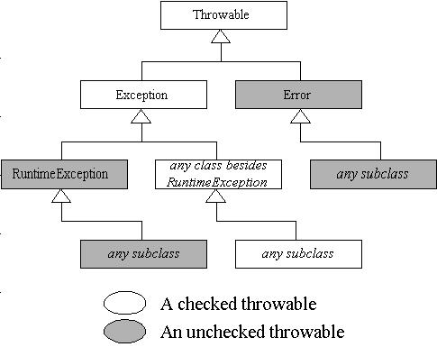

#### 异常

假设在一个Java程序运行期间出现了一个错误。这个错误可能是由于文件包含了错误信息，或者网络连接出现问题造成的，也可能是因为使用了无效的数组下标，或者试图使用一个没有被赋值的对象引用而造成的。这些问题我们称之为异常（Exception）。

##### 异常分类



在Java程序设计语言中，所有的异常都是由`Throwable`继承而来，但在下一层立即分解为两个分支：`Error`和`Exception`。

`Error`类层次结构描述类Java运行时系统的内部错误和资源耗尽错误。应用程序不应该抛出这种类型的对象。

`Exception`层次结构又分解为两个分支：一个分支派生于`RuntimeException`；另一个分支包含其他异常。划分两个分支的规则是：由于程序错误导致的异常属于`RuntimeException`；而程序本身没有问题，但由于像I/O错误这类问题导致的异常属于其他异常。

派生于`RuntimeException`的异常包含下面几种情况：

+ 错误的类型转换。
+ 数组访问越界。
+ 访问null指针。

不是派生于`RuntimeException`的异常包括：

+ 试图在文件尾部后面读取数据。
+ 试图打开一个不存在的文件。
+ 试图根据给的的字符串查找Class对象，而这个字符串表示的类并不存在。

Java语言规范将派生于`Error`类或`RuntimeException`类的所有异常称为非受查（unchecked）异常，所有其他的异常称为受查（checked）异常。

##### 声明受查异常

如果遇到无法处理的情况，那么Java的方法可以抛出一个异常。

方法应该在其首部声明所有可能抛出的异常，这样可以从首部反映出这个方法可能抛出哪类受查异常。

```java
public FileInputStream(String name) throws FileNotFoundException
```

出现以下两种情况时，则必须告诉调用这个方法的程序员有可能抛出异常。

+ 调用一个受查异常的方法，例如，FileInputStream构造器。

+ 程序运行过程中发现错误，并利用`throw`语句抛出一个受查异常。

> 如果在函数体内用throw抛出了某种异常，最好要在函数名中加throws抛异常声明，然后交给调用它的上层函数进行处理。

如果一个方法有可能抛出多个受查异常类型，那么就必须在方法的首部列出所有的异常类，每个异常类之间用逗号隔开。

```java
class MyAnimation {
    public Image loadImage(String s) throws FileNotFoundException, EoFException {
        ...
    }
}
```

一个方法必须声明所有可能抛出的**受查异常**，而非受查异常要么不可控制（Error），要么就应该避免发生（RuntimeException）。如果方法没有声明所有可能发生的受查异常，编译器就会发出一个错误信息。

##### 捕获异常

如果某个异常发生的时候没有在任何地方进行捕获，那程序就会终止。要想捕获一个异常，必须设置`try/catch`语句块。最简单的`try`语句块如下所示：

```java
try {
    code
    more code
    more code
} catch(ExceptionType e) {
    handler for this type
}
```

如果在`try`语句块中任何代码抛出了一个在`catch`子句中说明的异常类，那么：

1. 程序将跳过`try`语句块的其余代码。
2. 程序将执行`catch`子句中的处理器代码。

如果在`try`语句块中的代码没有抛出任何异常，那么程序将跳过`catch`子句。

如果方法中的任何代码抛出了一个在`catch`子句中没有声明的异常类型，那么这个方法就会立刻退出。

通常，应该捕获那些知道如何处理的异常，而将那些不知道怎样处理的异常将继续进行传递。如果想传递一个异常，就必须在方法的首部添加一个`throws`说明符，以便告知调用者这个方法可能会抛出异常。

在Java Se 7中，同一个`catch`子句可以捕获多个异常类型。

```java
try {
    code that might throw exceptions
} catch(FileNotFoundException | UnknownHostException e) {
    energency action for missing files and unknown hosts
} catch(IOException e) {
    energency action for all other I/O problems
}
```

只有当捕获的异常类型彼此之间不存在子类关系时才需要这个特性。

> 捕获多个异常时，异常变量隐含为`final`变量，例如，不能在以下子句体中为e赋不同的值：
>
> `catch(FileNotFoundException | UnknownHostException e) {...}` 

在`catch`子句中可以抛出一个异常，这样做的目的是改变异常类型。例如`ServletException`，执行`servlet`的代码可能不想知道发生错误的细节原因，但希望明确地知道`servlet`是否有问题。下面给出了抛出异常并将他再次抛出的基本方法：

```java
try {
    access the database
} catch(SQLException e) {
    throw new ServletException("database error" + e.getMessage);
}
```

不过可以使用包装技术来更好的进行处理，将原始异常设置为新异常的“原因”：

```java
try {
    access the database
} catch(SQLException e) {
	Throwable se = new ServletException("database error");
	se.initCause(e);
	throw se;
}
```

强烈建议使用这种包装技术。这样可以让用户抛出子系统中的高级异常，而不会丢失原始异常的细节。

> 如果在一个方法中发生了一个受查异常， 而不允许抛出它， 那么包装技术就十分有用。 我们可以捕获这个受查异常， 并将它包装成一个运行时异常。

##### finally子句

当代码抛出一个异常时，就会终止方法中剩余代码的处理， 并退出这个方法的执行。如果方法获得了一些本地资源， 并且只有这个方法自己知道，又如果这些资源在退出方法之前必须被回收， 那么就会产生资源回收问题。一种解决方案是捕获并重新抛出所有的异常。但是，这种解决方案比较乏味，这是因为需要在两个地方清除所分配的资源。一个在正常的代码中; 另一个在异常代码中。

Java有一种更好的解决方案， 这就是finally子句。不管是否有异常被捕获， finally 子句中的代码都被执行。

```java
// 这里， 强烈建议解耦合try/catch和try/finally语句块。这样可以提高代码的清晰度。 
InputStrean in = . . .;
try {
    try {
    	code that might throw exceptions 
    }
    finally {
    	in.close(); 
    }
} catch (IOException e) {
	show error message 
}
```

> 当finally子句包含return语句时，将会出现一种意想不到的结果，假设利用return语 句从try语句块中退出。 在方法返回前，finally子句的内容将被执行。如果finally子句中也有一个return语句，这个返回值将会覆盖原始的返回值。

有时候，在finally子句中执行资源回收的方法也有可能抛出异常，假设希望能够确保程序继续执行，代码将变得及其繁琐。

```java
InputStrean in = . . .;
try {
    try {
    	code that might throw exceptions 
    }
    finally {
    	try{
            in.close();
    	} catch(Exception e) {
            show error message
    	} 
    }
} catch (IOException e) {
	show error message 
}
```

##### 带资源的try语句

假设资源属于一个实现了`AutoCloseable`接口的类，Java Se 7为这种代码模式提供了一个很有用的快捷方式。`AutoCloseable`接口有一个方法：

```java
void close() throws Exception
```

带资源的try语句（try-with-resources）的最简形式：

```java
try (Resource res = ...) {
    work with res
}
```

`try`块正常退出时，或者存在一个异常时，都会自动调用`res.close()`方法。