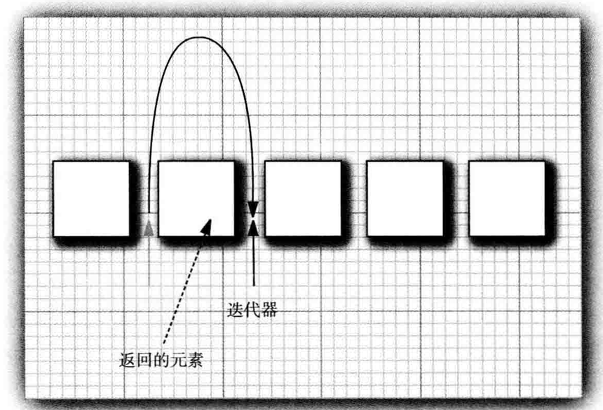
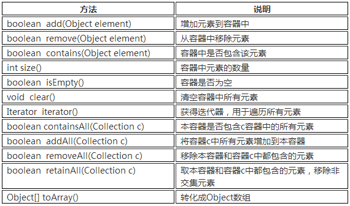
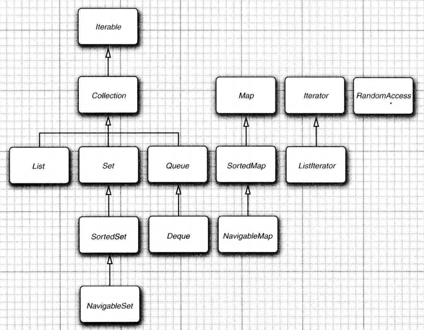
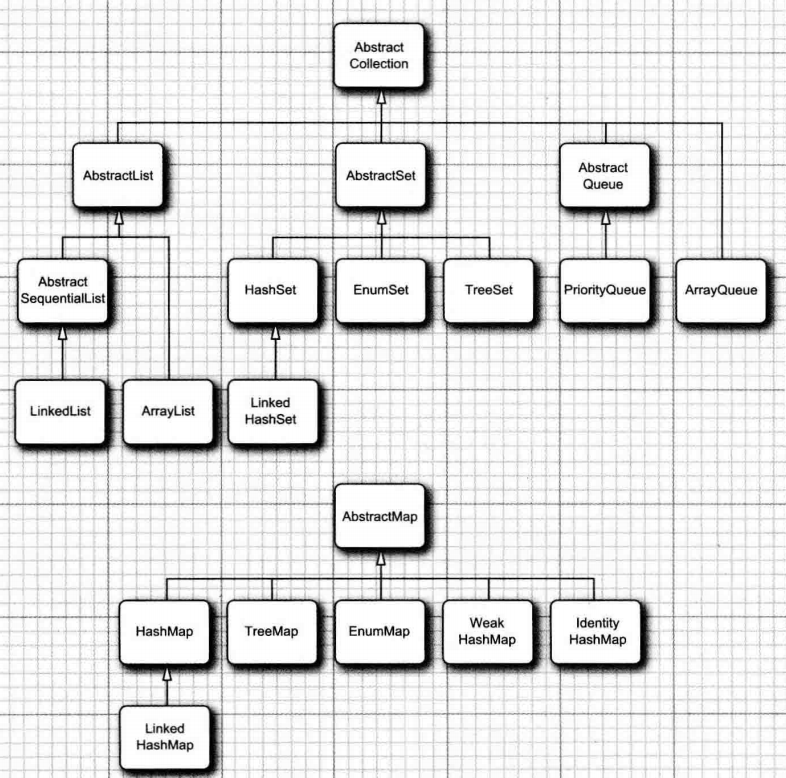
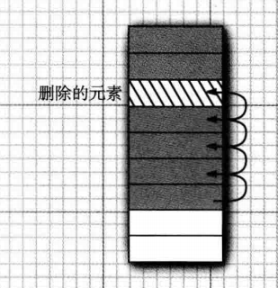
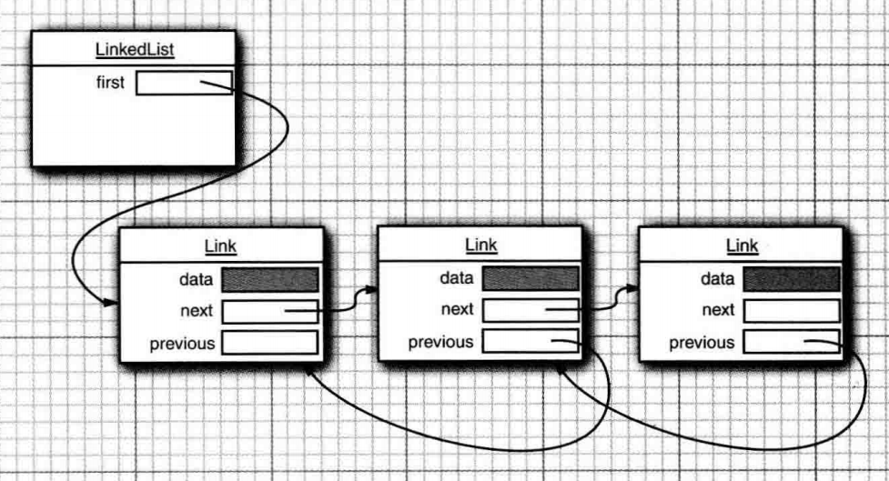
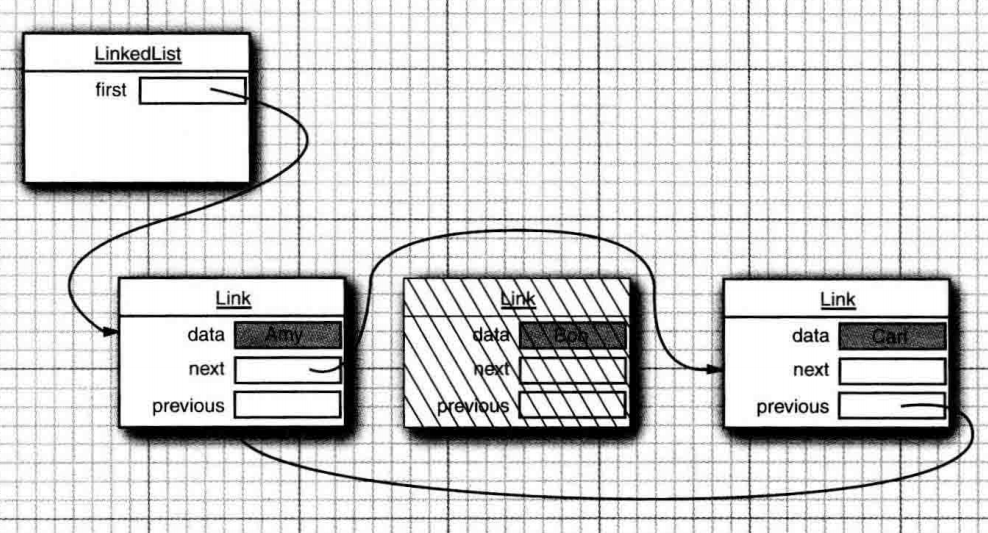
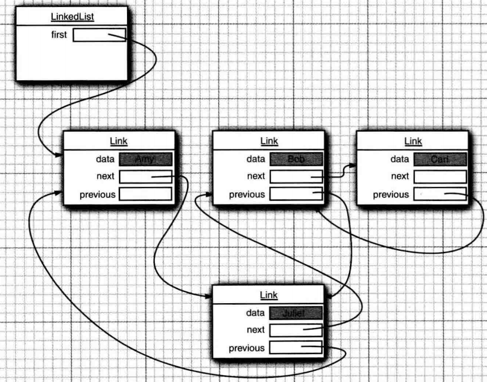

#### 集合

在我们编写代码的过程中，通常需要将一类数据集中保存，之前学习的数组是一个很好的选择，但是数组需要我们提前知道要保存对象的数量，也就是说数组初始化后，数组的长度就是不可变的，为了保存动态变化的数据，Java提供类集合类库来解决这个问题。

集合类也被称为容器类，位于`java.util`包下，并且Java集合类库将接口（interface）与实现（implementation）分离。

##### Collection接口

在Java类库中，集合类的基本接口是`Collection`接口。

```java
public interface Collection<E> {
    /**
    * 添加元素
    * @return 集合发生变化就返回true
    * 			集合未发生变化就返回false
    */
    boolean add(E element);
    
    Iterator<E> iterator();
}
```

##### 迭代器Iterator

`Iterator`接口包含四个方法：

```java
public interface Iterator<E> {
    E next();
    boolean hasNext();
    void remove();
    default void forEachRemaining(Consumer<? super E> action);
}
```

反复调用`add`方法，可以逐个访问集合中的每个元素。但是，如果到达了集合的末尾，`next`方法将抛出一个`NoSuchElementExcetption`。因此，需要再调用`next`之前调用`hasNext`方法。

```java
Collection<String> c = ...;
Iterator<String> iterator = c.iterator();
while(iterator.hasNext) {
    String element = iterator.next();
    // do something with element
}
```

当然我们可以使用更加简练的`for each`循环来实现集合的遍历。

```java
for(String element : collection) {
    // do something with element
}
```

`for each`循环可以与任何实现了`Iterable`接口的对象一起工作。

```java
public interface Iterable<E> {
    Iterator<E> iterator();
}
```

`Collection`接口扩展了`Iterable`接口，因此，对于标准类库中的任何集合都可以使用`for each`循环。

在Java 8中，也可以通过为`forEachRemaining`方法提供一个`lambda`表达式来实现。

```java
iterator.forEachRemaining(element -> do something with element);
```

迭代器位于**两个元素之间**，当调用`next`时，迭代器就越过下一个元素，并返回刚刚越过的那个元素的引用。`Iterator`接口的`remove`方法将会删除上次调用`next`时返回的元素。

```java
Iterator<String> it = c.iterator();
it.next(); // skip over the first element
it.remove(); // now remove it
```



更重要的事，对`next`方法和`remove`方法的调用具有互相依赖性。如果调用remove方法之前没有调用`next`方法将是不合法的。如果这样做，将会抛出一个`IllegalStateException`异常。如果想要删除两个相邻的元素，不能直接这样调用：

```java
iterator.remove();
iterator.remove(); // Error!
```

必须先调用`next`越过将要删除的元素。

```java
iterator.remove();
iterator.next();
iterator.remove(); // OK
```

##### 泛型实用方法

`Collection`接口声明了很多实用的方法，所有的实现类都必须提供这些方法。



如果实现`Collection`接口的每一个类都要提供如此多的例行方法将是一件很烦人的事情。为了能够让实现者更容易地实现这个接口，Java类库提供了一个类`AbstractCollection`，它将基础方法`size`和`iterator`抽象化了，但是在此提供了例行方法，例如：

```java
public abstract AbstractCollection<E> {
    public abstract Iterator<E> iterator();
    
    public boolean contains(Object o) {
        Iterator<E> it = iterator();
        if (o==null) {
            while (it.hasNext())
                if (it.next()==null)
                    return true;
        } else {
            while (it.hasNext())
                if (o.equals(it.next()))
                    return true;
        }
        return false;
    }
}
```

此时，一个具体的集合类可以扩展`AbstractCollection`类了。现在要由具体的集合类提供`iterator`方法，而`contains`方法已由`AbstractCollection`超类提供了。

##### 集合框架中的接口

Java集合框架为不同类型的集合定义了大量的接口，如下图所示：



集合有两个基本的接口：`Collection`和`Map`。Collection中添加元素方法如下：

```java
boolean add(E element);
```

`Map`包含键/值对，因此使用`put`方法添加元素：

```java
V put(K key,V value);
```

`Collection`提供迭代器来访问元素，而`Map`提供`get`方法来通过键获取对应的值：

```java
V get(K key);
```

`List`是一个有序集合（ordered collection），可以采用两种方式访问元素：使用迭代器访问，或者使用一个整数索引来访问。后一种方法称为随机访问（random access），因为这样可以按任意顺序访问元素。与之不同，使用迭代器访问时，必须顺序地访问元素。

`Set`是一个不允许出现重复元素，并且无序的集合。

##### 具体的集合



###### LinkedList

`Array`和`ArrayList`都有一个重大的缺陷，这就是从数组的中间位置删除一个元素要付出很大的代价，其原因是数组中处于被删除元素之后的所有元素都要向数组的前端移动。在数组中间位置插入一个元素也是如此。s



链表（linked list）解决了这个问题，数组在连续的存储位置上存放对象引用，但是链表将每个对象存放在独立的结点中，每个结点还存放着序列中下一个结点的引用。Java中所有的链表都是双向的（double linked）——即每个结点还存放着指向前驱结点的引用。



从链表中间删除元素很容易，只需要更新被删除元素附近的链接。



下面的代码演示了添加3个元素，然后再将第二个元素删除：

```java
List<String> staff = new LinkedList<>(); //LinkedList implements List
staff.add("Amy");
staff.add("Bob");
staff.add("Carl");
Iterator iter = staff.iterator();
String first = iter.next(); // visit first element
String second = iter.next(); // visit second element
iter.remove(); // remove last visited element
```

由于链表是一个有序的集合（ordered collection），`LinkedList.add`将对象添加到链表的末尾，但是，通常需要将元素添加到链表的中间。由于迭代器是描述集合中的位置的，所以这种依赖于位置的`add`方法将由迭代器负责。只有对自然有序的集合使用迭代器添加元素才有实际的意义。而`Set`集中的元素是完全无序的，因此在`Iterator`接口中就没有`add`方法。集合类库提供了子接口`ListIterator`，其中包含`add`方法：

```java
interface ListIterator<E> extends Iterator<E> {
    void add(E element); // 假定添加操作总会改变链表
    // 下面两个方法用于反向遍历链表
    E previous(); // 返回越过的对象
    boolean hasPrevious();
}
```

`LinkedList`类的`listIterator`返回一个实现了`ListIterator`接口的迭代器：

```java
ListIterator<String> listIterator = staff.listIterator();
```

下面的代码将越过链表中的第一个元素，并在第二个元素之前添加“Juliet“：

```
List<String> staff = new LinkedList<>(); //LinkedList implements List
staff.add("Amy");
staff.add("Bob");
staff.add("Carl");
Iterator iter = staff.listIterator();
iter.next(); // skip past firest element
iter.add("Juliet");
```



`set`方法用一个新元素取代调用`next`或`previous`方法返回的上一个元素。

```java
// 用一个新值取代链表的第一个元素
ListIterator<String> iter = staff.listIterator();
String oldValue = iter.next(); // returns first element
iter.set(newValue); // sets first element to newValue
```

如果迭代器发现它的集合被另一个迭代器修改了，或是被该集合自身的方法修改了，就会抛出一个`ConcurrentModificationException`异常。  

```

```

链表不支持快速地随机访问。如果要查看链表中第n个元素，就必须从头开始，越过n-1个元素。  

###### ArrayList

`ArrayList`底层封装了一个动态再分配的`Object`数组。通常面试会问`ArrayList`与`Vector`的区别：

1. `ArrayList`不是线程安全的，`Vector`是线程安全的。
2. `ArrayList`进行扩容时增加50%，`Vector`提供了扩容时的增量设置，但通常将容量扩大1倍。