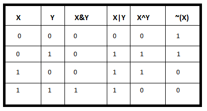

### [译]位操作的基本知识

> [Basics of Bit Manipulation](https://www.hackerearth.com/zh/practice/basic-programming/bit-manipulation/basics-of-bit-manipulation/tutorial/)

对于程序员来说，处理字节或由字节组成的数据类型（如int、float、double甚至是存储大量字节的数据结构）是很正常的。在某些情况下，程序员需要超越这一点——也就是说，在更深的层次上认识到位的重要性。

位操作通常用于**数据压缩**（通过将数据从一种表示形式转换为另一种表示形式来压缩数据，以减少空间），**异或加密**（一种以解决安全问题而加密数据的算法）。为了编码、解码或压缩文件，我们必须在位级别提取数据。位操作速度更快，更接近系统，有时会将程序优化到一个良好的水平。

我们都知道一个字节由8位组成，任何整数或字符都可以用计算机中的位表示，我们称之为二进制形式（只包含1或0）或基2形式。

例子：

1) 14 = {1110 }$_2​$
= 1 * $2^3​$ + 1 * $2^2​$ + 1 * $2^1​$ + 0 * $2^0​$
= 14.

2) 20 = {10100 }$_2$
= 1 * $2^4$ + 0 * $2^3$ + 1 * $2^2$ + 0 * $2^1$ + 0 * $2^0​$
= 20.

对于字符，我们使用ASSCII表示，它们是整数形式，也可以使用如上所述的位来表示。

**位运算符**：

在位操作中使用不同的位运算符。这些位运算符操作位模式的各个位。位运算符很快，可用于优化时间复杂度。一些常见的位运算符是：

**取反（~）**：按位取反是一个一元运算符，它翻转数字的位，即，如果第i位为0，它就会变为1，反之亦然。按位取反只不过是一个数字的补码。让我们举个例子。

N = 5 = (101)$_2$ 
~N = ~5 = ~(101)$_2$ = (010)$_2$ = 2

**按位与（&）**：按位与是一个二进制运算符，它对两个等长位模式进行操作。如果位模式的比较位置上的两位都是1，则结果位模式中的位为1，否则为0。

A = 5 = (101)$_2​$ , B = 3 = (011)$_2​$ A & B = (101)$_2​$ & (011)$_2​$= (001)$_2​$ = 1

**按位或（|）**：按位或也是一个二进制运算符，它对两个等长位模式进行操作，类似于按位与。如果位模式的比较位置上的两位都为0，则结果位模式中的位为0，否则为1。

A = 5 = (101)$_2$ , B = 3 = (011)$_2$
A | B = (101)$_2$ | (011)$_2$ = (111)$_2$ = 7

**按位异或（^）**：按位异或也接受两个等长位模式。如果位模式的比较位置上的两个位都是0或1，则结果位模式中的位为0，否则为1。

A = 5 = (101)$_2$ , B = 3 = (011)$_2$
A ^ B = (101)$_2$ ^ (011)$_2$ = (110)$_2​$ = 6

**左移（<<）**：左移操作符是一个二进制运算符，它将给定位模式中的某些位向左移动，右边的空位一律补0。左移相当于将位模式乘以$2^k$。

1 << 1 = 2 = 2$^1$
1 << 2 = 4 = 2$^2$ 1 << 3 = 8 = 2$^3$
1 << 4 = 16 = 2$^4$ 
…
1 << n = 2$^n$

**右移（>>）**：右移操作符是一个二进制运算符，它将给定的位模式右移若干位，对无符号数，高位补0，对于有符号数，高位补符号位（正数的符号位为0，负数的符号位为1）。右移相当于将位模式除以2$^k$。

4 >> 1 = 2
6 >> 1 = 3
5 >> 1 = 2
16 >> 4 = 1

位操作符有利于节省空间，有时还可以巧妙的删除依赖项。