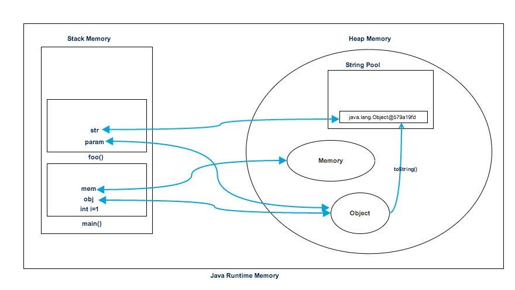

#### [译]Java堆空间 VS 栈 ——Java中的内存分配

> [Java Heap Space vs Stack – Memory Allocation in Java](https://www.journaldev.com/4098/java-heap-space-vs-stack-memory)

以前我写过几篇关于[Java垃圾回收](https://www.journaldev.com/2856/java-jvm-memory-model-memory-management-in-java)和[Java是通过值传递的](https://www.journaldev.com/3884/java-is-pass-by-value-and-not-pass-by-reference)，在那之后，我收到了许多希望我讲解**Java堆空间，栈内存，Java中的内存分配以及他们的区别是什么**的邮件。

你也许在Java，Java EE书籍和教程中看到大量对堆和栈内存的引用，但很难完整的解释什么是程序方面的堆和栈内存。

#### Java堆空间

Java堆空间用于Java运行时为对象和JRE类分配内存。无论我们何时创建任何对象，它都是在堆空间中创建的。

垃圾回收在堆内存上运行，用于释放没有任何引用的对象所使用的内存。在堆空间中创建的任何对象都具有全局访问权，可以从应用程序的任何位置引用。

##### Java栈内存

Java栈内存用于执行线程。它们包含方法的特定的值，这些值是短期的，并且引用从该方法引用的堆中的其他对象。

栈内存始终以LIFO（后进先出）的顺序引用。每当调用一个方法时，将在栈内存中开辟一个新的块，以便该方法保存局部基元值以及方法中其他对象的引用。

方法结束后，块将变成未被使用状态，并可用于下个方法。与堆内存相比，栈内存的大小要小的多。

##### Java程序中的堆和栈内存

让我们通过一个简单的程序来理解堆和栈内存的使用情况。

```java
package com.journaldev.test;

public class Memory {

	public static void main(String[] args) { // Line 1
		int i=1; // Line 2
		Object obj = new Object(); // Line 3
		Memory mem = new Memory(); // Line 4
		mem.foo(obj); // Line 5
	} // Line 9

	private void foo(Object param) { // Line 6
		String str = param.toString(); //// Line 7
		System.out.println(str);
	} // Line 8

}
```

下图显示了与上述程序相关的栈和堆内存情况，以及它们如何用于存储基元，对象和引用变量。


让我们来完成程序的执行步骤。

+ 一旦我们运行该程序，它将所有运行时的类加载到堆空间中。当在第一行找到main()方法时，Java运行时创建main()方法线程使用的栈内存。
+ 我们在第二行创建了基本局部变量，因此它被创建并存储在main()方法的栈内存中。
+ 由于我们在第三行创建了一个对象，它在堆内存中创建，而栈内存中包含了它的引用。当我们在第四行创建Memory对象时，在第4行中创建Memory对象时也会发生类似的过程。
+ 现在我们在第五行调用foo()方法，将在栈内存的顶部开辟一个块，以便foo()方法使用。由于Java是通过值传递的，在第六行一个对象的新引用将会在foo()的栈块上创建。
+ 第七行创建了一个字符串，它进入堆空间中的[字符串池](https://github.com/flwcy/knowledge/blob/master/JavaSe/basic/what_is_java_string_pool.md)，并在foo()方法的栈空间中为它创建一个引用。
+ 在第八行foo()方法终止，此时在栈中为foo()分配的内存块变为空闲。
+ 在第9行，main()方法终止，并且为main()方法创建的栈内存被销毁。程序也在此行结束，因此Java运行时释放所有内存并结束程序的执行。

#### Java堆空间和栈内存之间的差异

基于以上的理解，我们能够很容易的得出堆和栈内存之间的区别。

1. 堆内存由应用程序的所有部分使用，而栈内存仅由一个执行线程使用。
2. 无论对象何时被创建，它总是存储在堆空间中，并且在栈内存中包含一个对它的引用。栈内存仅包含局部基本变量和指向堆空间中的对象的引用变量。
3. 存储在堆中的对象是全局可访问的，而栈内存并不能被其他线程访问。
4. 栈中的内存管理以LIFO方式完成，而在堆内存中则更复杂，因为它是全局使用的。堆内存划分为年轻代，老年代等，更多细节请参考[Java垃圾回收](https://www.journaldev.com/2856/java-jvm-memory-model-memory-management-in-java)。
5. 栈内存是短暂的，而堆内存则在程序执行开始到结束都存在。
6. 我们可以使用JVM选项**-Xms**和**-Xmx**来定义堆内存的启动大小和最大大小。我们可以使用 **-Xss**来定义栈内存的大小。
7. 当栈内存已满时，Java运行时将会抛出`java.lang.StackOverFlowError`，而如果堆内存已满，它将会抛出`java.lang.OutOfMemoryError:Java Heap Space`的错误。
8. 与堆内存相比，栈内存的大小是非常小的。由于内存分配（LIFO）的简单性，与堆内存相比，栈内存非常快。

就Java应用程序而言，这就是**Java堆空间 VS 栈内存**的全部内容，我希望它能消除您在执行任何Java程序时对内存分配的疑问。

参考：

<https://en.wikipedia.org/wiki/Java_memory_model>

<https://blogs.oracle.com/jonthecollector/presenting-the-permanent-generation>


