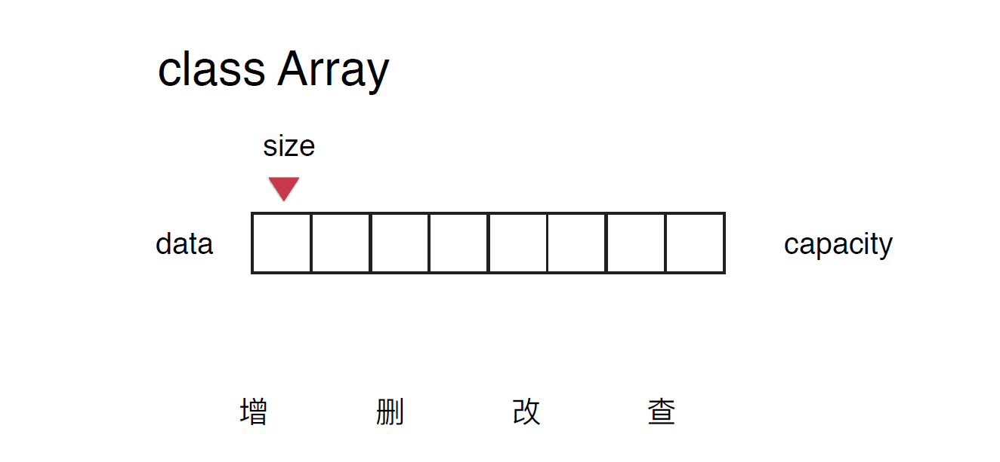
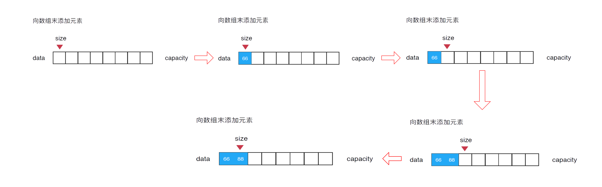
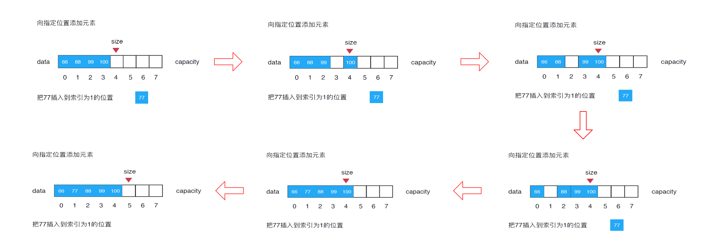
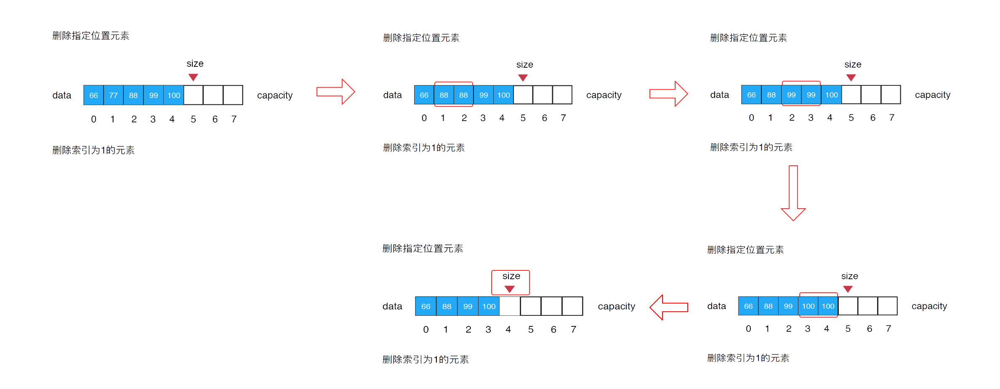
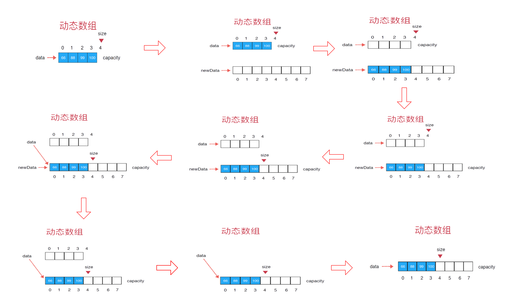

### 数据结构之数组

数组是相同类型的元素的集合。数组中的元素可以通过索引来访问，索引从0开始。

+ 数组最大的优点：快速查询
+ 数组最好应用于“索引有语义”的情况

索引可以有语义也可以没有语义。例如我们只是想存放77，66，88这三个数字，那么它们保存在索引为0，1，2的这几个地方或者其他任何地方都可以。但是如果它们变成了学号为1，2，3这几个同学对应的成绩，那么它们的索引就有了语义，索引0对应了学号为1的同学的成绩，索引1对应了学号2的同学，索引2对应了学号3的同学。但是，并非所有有语义的索引都适合数组：例如身份证号，位数较多，开辟空间过大。

+ 索引没有语义，如何表示没有元素
+ 如何添加元素？如何删除元素？

#### 封装自己的数组类

java中的数组并没有提供CRUD的操作，因此我们需要基于java的数组，二次封装属于我们自己的数组类。大体结构如下：



代码如下：

```java
package com.flwcy.array;

/**
 * 封装自定义数组
 * Created by flwcy on 2018/11/6.
 */
public class Array {
    private int[] data;

    /**
     * 实际大小
     */
    private int size;
}

```

我们需要一个成员变量来保存我们的数据，这里是`data`，然后需要一个`int类型`来存放我们的有效元素的个数，在这里我们没有必要再多定义一个表示数组容量的变量，因为这里的容量就是`data.length`；

我们需要通过构造函数初始化数组，用户知道数组的容量时，构造函数如下：

```java
    /**
     * 根据数据的容量构造数组
     * @param capacity 数组的容量
     */
    public Array(int capacity) {
        this.data = new int[capacity];
        this.size = 0;
    }
```

我们也可以为用户提供一个默认构造函数：

```java
    /**
     * 无参构造函数，默认数组的容量capacity=10
     */
    public Array() {
        this(10);
    }
```

一些通用的方法

```java
    /**
     * 获取数组实际大小
     * @return 数组实际大小
     */
    public int getSize() {
        return size;
    }

    /**
     * 获取数组容量
     * @return 容量
     */
    public int getCapacity(){
        return data.length;
    }

    /**
     * 数组是否为空
     * @return
     */
    public boolean isEmpty(){
        return size == 0;
    }
```

#### 添加元素

##### 向数组末位添加元素

涉及到添加元素时，我们需要对临界值进行判断。初始的时候，整个数组为空，此时`size=0`，现在向数组末尾添加一个新的元素，我们只要在`data[0]`这个位置放上66，同时维护一下`size++`(这个`size`表示数组中元素个数)，而`size`变量指向的是数组中首个没有元素的位置。我们向数组末尾添加元素，其实就等同于向`size`这个位置添加元素。添加下个元素时同理。

图解：



代码如下：

```java
    /**
     * 在数组末尾追加数据
     */
    public void addLast(int ele){
        if(size == data.length)
            throw new IllegalArgumentException("The array is full");
        data[size] = ele;
        size++;
    }
```

##### 向指定位置添加元素

我们需要把当前索引（比如1）为指定位置的的元素和它后面的元素，都向后挪一个位置。

- 先把最后一个元素（索引为3）挪到size（大小为4）这个位置
- 前一个元素（索引为2）诺到size-1（也就是3），如此反复……
- 最后挪完以后，索引为1就腾出来了，然后我们只要直接插入数据77就好了。
- 全部完成操作之后，需要维护一下size++，保证了它指向数组中首个没有元素的位置。

图解：



代码如下：

```java
/**
     * 在指定位置添加元素
     * @param index
     * @param ele
     */
    public void add(int index,int ele) {
        if(index < 0 || index > size)
            throw new IllegalArgumentException("Add failed. Require index >= 0 and index <= size.");
        if(size == data.length)
            throw new IllegalArgumentException("Add failed. Array is full");
        // 从最后一个元素开始向后挪动一个位置
        for(int i = size; i >= index; i--)
            data[i] = data[i - 1];
        data[index] = ele;
        size++;
    }
```

此时我们之前的`addLast`方法可以复用这个方法， 也可以造一个`addFirst`方法：

```java
    /**
     * 在数组末尾追加数据
     */
    public void addLast(int ele){
        add(size,ele);
    }

    /**
     * 在数组开始添加元素
     */
    public void addFirst(int ele) {
        add(0,ele);
    }
```

#### get/set

现在我们可以往数组中添加元素，那么也可以尝试查询数组中的元素以及修改数组中的元素。

```java
    /**
     * 获取指定索引的元素值
     * @param index
     * @return
     */
    public int get(int index) {
        if(index < 0 || index >= size)
            throw new IllegalArgumentException("Get failed. Index is illegal.");
        return data[index];
    }

    /**
     * 修改指定索引的元素值
     * @param index
     * @param ele
     */
    public void set(int index,int ele) {
        if(index < 0 || index >= size)
            throw new IllegalArgumentException("Set failed. Index is illegal.");
        data[index] = ele;
    }
```

这也解决了我们之前提出的问题：如何表示没有的元素？通过`private`隐藏`data`，通过封装的方式保证数据安全，用户永远无法访问没有使用的空间。

在很多时候，我们在数据结构中存储了一些元素，我们需要查找在这些元素中是否包含某个元素，搜索元素所在的位置。

```java
    /**
     * 判断数组中是否存在某元素
     * @param ele
     * @return
     */
    public boolean contains(int ele) {
        for(int i=0; i<size; i++) {
            if(data[i] == ele)
                return true;
        }
        return false;
    }

    /**
     * 查找数组中元素所在的索引，如果不存在，则返回-1
     * @param ele
     * @return
     */
    public int find(int ele) {
        for(int i=0; i<size; i++) {
            if(data[i] == ele)
                return i;
        }
        return -1;
    }
```

#### 删除数组中的元素

现在让我们来看一下如何从数组中删除指定位置的元素。比如说在我们的数组中有66,77,88,99,100这五个元素，指定了想删除索引为1的元素(77)。

分析：我们想要删除索引为1前，需要将这个索引后的所有元素向左移动（其实相当于把索引1的元素覆盖掉）

+ 将索引为2的元素移动到索引为1的位置上，即`data[1] = data[2]`
+ 如此反复……，直至`data[size–1] = data[size]`
+ 最后维护下`size`，进行`size–-`操作

图解：

代码入下：

```java
/**
     * 从数组中删除index位置的元素
     * @param index
     * @return  被删除的元素
     */
    public int remove(int index) {
        if(index < 0 || index >= size)
            throw new IllegalArgumentException("Remove failed.Index is illegal");
        int res = data[index];
        for(int i=index + 1; i<size; i++) {
            data[i - 1] = data[i];
        }
        size--;
        return res;
    }
```

同理，我们可以复用这个方法，构建删除指定元素`removeElement`,删除第一个元素`removeFirst`，删除最后一个元素`removeLast`：

```java
    /**
     * 删除指定元素
     * @param ele
     * @return
     */
    public int removeElement(int ele) {
        for(int i=0; i<size; i++) {
            if(data[i] == ele) {
                remove(i);
                return i;
            }
        }
        return -1;
    }

    /**
     * 删除第一个元素
     * @return
     */
    public int removeFirst() {
        return remove(0);
    }

    /**
     * 删除最后一个元素
     * @return
     */
    public int removeLast() {
        return remove(size - 1);
    }
```

#### 动态数组

目前为止所实现的数组类，有一个非常严重的局限性，由于内部使用的是一个静态数组，内部容量有限。在实际使用的时候，我们往往无法预估要在这个数组中存入多少个元素。

##### 解决方案

在这种情况下，如果容量首次开太大，可能会浪费很多空间，但容量太小，又有可能不够用。这时候，需要有一种解决方案使得这个数组的容量是**可伸缩的**，也就是所谓的**动态数组**。

##### 思路

1. 首先，原数组data，容量capacity为4，数组中元素size为4
2. 然后新开一个数组new data(原数组data)，开的空间要比原来大一些(从4–>8)
3. 遍历原数组data，赋值到new data中。此时容量capacity为8，数组中的元素size为4
4. 本身data指向4个空间的数组，现在指向8个空间的数组(new data也指向它)

图解：

总结：整个过程封装在一个函数内，对于`new data`这个变量在函数执行完便失效了，而`data`由于是类的成员变量，与整个类的生存周期一致(只要类还在使用，`data`就是有效的)。

对于原来4个空间的数组，由于没有对象指向它，所以利用java的垃圾回收机制将其回收。

##### 代码实现

修改`add`方法：

```java
    /**
     * 在指定位置添加元素
     * @param index
     * @param ele
     */
    public void add(int index,E ele) {
        if(index < 0 || index > size)
            throw new IllegalArgumentException("Add failed. Require index >= 0 and index <= size.");
        if(size == data.length)
            resize(2 * data.length);
        // 从最后一个元素开始向后挪动一个位置
        for(int i = size - 1; i >= index; i--)
            data[i + 1] = data[i];
        data[index] = ele;
        size++;
    }
```

编写`resize`方法：

```java
    /**
     * 将数组空间的容量变成newCapacity大小
     * @param newCapacity
     */
    private void resize(int newCapacity) {
        E[] newData = (E[])new Object[newCapacity];
        for(int i=0; i<size; i++) {
            newData[i] = data[i];
        }
        data = newData;
    }
```

同理可以修改`remove`方法：

```java
    /**
     * 从数组中删除index位置的元素
     * @param index
     * @return  被删除的元素
     */
    public E remove(int index) {
        if(index < 0 || index >= size)
            throw new IllegalArgumentException("Remove failed.Index is illegal");
        E res = data[index];
        for(int i=index + 1; i<size; i++) {
            data[i - 1] = data[i];
        }
        size--;
        data[size] = null; // loitering objects != memory leak

        if(size == data.length / 2)
            resize(data.length / 2);
        return res;
    }
```

#### 简单的时间复杂度分析


#### 参考阅读

[初学数据结构-数组](https://loubobooo.com/2018/07/21/初学数据结构-数组/)

https://www.jianshu.com/p/7b93b3570875