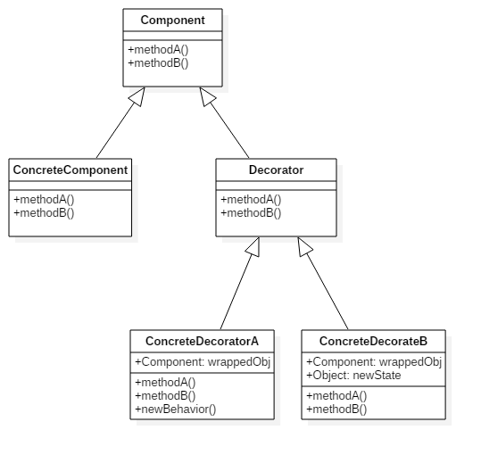

### 装饰模式

在《JAVA与模式》一书中开头是这样描述装饰（Decorator）模式的：

​	**装饰模式又称包装（Wrapper）模式。装饰模式以对客户端透明的方式扩展对象的功能，是继承关系的一个替代方案。**

`GOF`在《设计模式》一书中给出的定义为：动态地给一个对象添加一些额外的职责。换言之，客户端并不会觉得对象在装饰前和装饰后有什么不同。装饰模式可以在不使用创造更多子类的情况下，将对象的功能加以扩展。

#### 角色组成



在装饰模式中的角色有：

  + **抽象构件(Component)角色**：给出一个抽象接口，以规范准备接收附加责任的对象。

  + **具体构件(ConcreteComponent)角色**：定义一个将要接收附加责任的类。

  + **装饰(Decorator)角色**：持有一个构件(Component)对象的实例，并定义一个与抽象构件接口一致的接口。

  + **具体装饰(ConcreteDecorator)角色**：负责给构件对象“贴上”附加的责任。


#### 举例说明

我们拿《图解设计模式》中的例子来做说明，假如现在有一块蛋糕，如果只涂上奶油，那就是奶油蛋糕，如果加上草莓那就是草莓蛋糕，加上刻有名字的巧克力板就是生日蛋糕了，那么生成蛋糕制作方案时，可以通过继承来实现，但是大家也都知道排列组合，继承的类系统庞大可想而知了。

不论是蛋糕、奶油蛋糕、草莓蛋糕还是生日蛋糕，他们的核心还是蛋糕，不过经过图上奶油，加上草莓等装饰之后，蛋糕的味道变得更加甜美了，目的也变得更加明确了。

> 装饰者模式强调的是**动态**的扩展, 而继承关系是**静态的**.

下面我们写代码来实现上述的例子，首先我们需要创建一个对象的抽象，也就是饮料接口：

```java
package com.flwcy.decorator;

/**
 * 抽象构件(Component)角色
 * 装饰者和被装饰者都继承自它
 * 糕点接口
 */
public interface Pastry {

    /**
     * 制作糕点
     * @return
     */
    public String make();
}

```

实现具体构建角色，也就是蛋糕类:

```java
package com.flwcy.decorator;

/**
 * 具体组件角色(ConcreteComponent) :被装饰者
 */
public class Cake implements Pastry {

    public String make() {
        return "这是一个蛋糕";
    }
}
```

加了奶油的糕点还应该是糕点, 故而, 奶油这个装饰也实现了`Pastry`接口, 加奶油这个装饰是在糕点的基础上的, 所以我们还持有了一个Pastry对象:

```java
package com.flwcy.decorator;

/**
 * 具体装饰(ConcreteDecorator)角色
 */
public class Cream implements Pastry {

    private Pastry pastry;

    public Cream(Pastry pastry){
        this.pastry = pastry;
    }

    public String make() {
        return String.format("%s,加了%s",pastry.make(),"奶油");
    }
}
```

来实验下:

```java
package com.flwcy.app;

import com.flwcy.decorator.Cake;
import com.flwcy.decorator.Cream;
import com.flwcy.decorator.Pastry;
import com.flwcy.singleton.InternalSingleton;

/**
 * Hello world!
 *
 */
public class App 
{
    public static void main( String[] args )
    {
        // 一个蛋糕
        Pastry cake = new Cake();
        System.out.println(cake.make());
        // 一个奶油蛋糕
        Pastry creamCake = new Cream(new Cake());
        System.out.println(creamCake.make());
    }
}
```

结果:

```
这是一个蛋糕
这是一个蛋糕,加了奶油
```

蛋糕可以加了奶油、草莓、巧克力等等好多配料，为了满足开闭原则，我们可以抽象出一个配料类：

```java
package com.flwcy.decorator;

/**
 * 装饰(Decorator)角色
 * 为了满足开闭原则
 * 配料
 */
public abstract class Stuff implements Pastry {

    private Pastry pastry;

    public Stuff(Pastry pastry){
        this.pastry = pastry;
    }

    protected abstract String stuffName();

    public String make(){
        return String.format("%s%s",stuffName(),pastry.make());
    }
}
```

其中Stuff类中值得注意的两个关系:

1. 我们的Stuff(配料)也是实现了Pastry接口的, 这是为了说明加了配料(Stuff)的糕点还是糕点.
2. Stuff中还聚合了一个Pastry(pastry)实例, 是为了说明这个配料是加到糕点中的.

奶油配料改为继承Stuff:

```java
package com.flwcy.decorator;

/**
 * 具体装饰(ConcreteDecorator)角色
 */
public class Cream extends Stuff {

    public Cream(Pastry pastry) {
        super(pastry);
    }

    protected String stuffName() {
        return "奶油";
    }
}
```

#### 使用场景

在以下情况下可以使用装饰模式：

- 在不影响其他对象的情况下，以动态、透明的方式给单个对象添加职责。
- 需要动态地给一个对象增加功能，这些功能也可以动态地被撤销。
- 当不能采用继承的方式对系统进行扩充或者采用继承不利于系统扩展和维护时。不能采用继承的情况主要有两类：第一类是系统中存在大量独立的扩展，为支持每一种组合将产生大量的子类，使得子类数目呈爆炸性增长；第二类是因为类定义不能继承（如final类）.

### Read More

[设计模式（九）装饰模式（Decorator）](https://www.kancloud.cn/digest/xing-designpattern/143730)

[可乐要加冰才好喝啊---装饰模式](http://blog.lmj.wiki/2016/11/22/design-pattern/decorator/index.html)