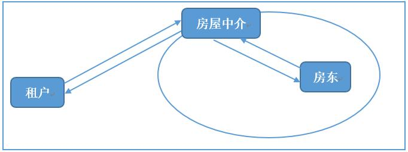
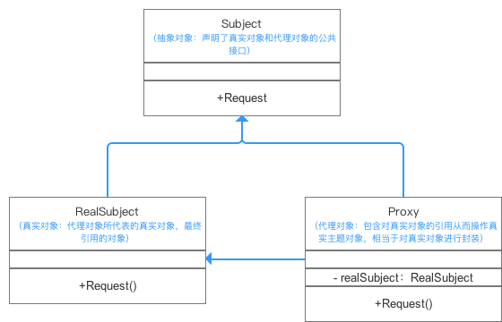

### 代理模式

代理模式的作用：为其他对象提供一种代理，以控制对这个对象的访问。

在某些情况下，一个客户不想或不能直接引用另一个对象，而代理对象可以在客户端和目标之间起到**中介**的作用。

举个简单的例子来说明代理的作用：假设我们想要租房子，那么我们并不是直接联系房东，而是联系房屋中介，中介就是一个代理，中介可以帮你完成想要完成的事（租房子），还可以增加自己想要做的事情（收取中介费）。这就是代理模式在现实中的一个例子。用图表示：

#### 一些概念

代理模式中涉及到的角色有：

+ **抽象角色**：声明真实对象和代理对象的共同接口。
+ **代理角色**：代理对象角色内部含有对真实对象的引用，从而可以操作真实对象，同时代理对象提供与真实对象相同的接口以便在任何时刻都能代替真实对象。同时，代理对象可以在执行真实对象操作时，附加其他的操作，相当于对真实对象进行封装。
+ **真实角色**：代理角色所代表的真实对象，是我们最终要引用的对象。

UML类图 & 组成：

#### 静态代理

我们写代码来模拟中介租房这个过程：

首先
