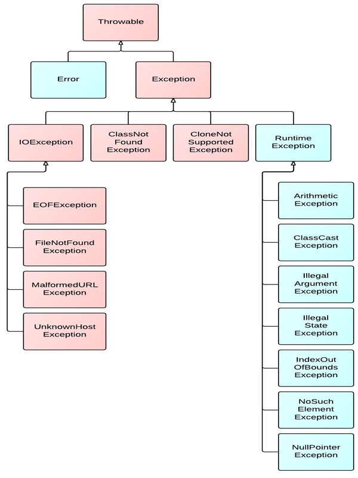
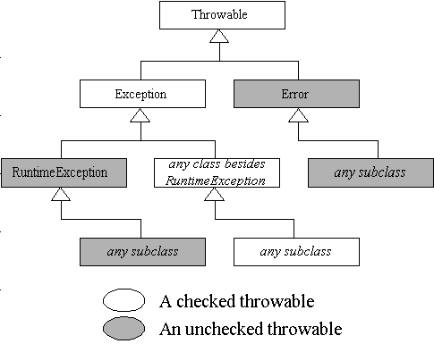
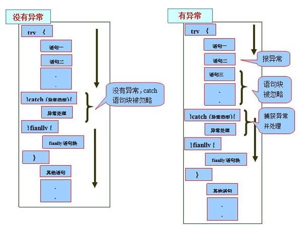

# 深入理解java异常处理机制

标签（空格分隔）： 异常 Exception Error Throwable

---

### 异常的基本概念
异常是指阻止当前方法或者作用域继续执行的问题,如文件找不到、网络连接失败、非法参数等等.在java中,java.lang.Throwable是所有异常的基类.java异常体系结构如下:
  
**Throwable**有两个重要的子类:Exception(异常)和Error(错误),二者都是java异常处理的重要子类，各自都包含了大量的子类.
**Error(错误)**:是程序无法处理的错误,表示运行应用程序中较严重的问题.合理的应用程序不应该去try/catch这种错误，绝大多数Error都是非正常的.常见的Error比如说OutOfMemoryError、StackOverflowError等等.

**Exception**:是程序本身可以处理的异常.
>**注意：异常和错误的区别：异常能被程序本身可以处理，错误是无法处理。**

通常，Java的异常(包括Exception和Error)分为可查的异常CheckedException和不可查的异常Unchecked Exception.
**CheckedException(编译器要求必须处置的异常)**:除了RuntimeException及其子类以外，其他的Exception类及其子类都属于可查异常。这种异常的特点是Java编译器会检查它，也就是说，当程序中可能出现这类异常，要么用try-catch语句捕获它，要么用throws子句声明抛出它，否则编译不会通过。

**Unchecked Exception(编译器不要求强制处置的异常)**:包括运行时异常（RuntimeException与其子类）和错误（Error）.
  
java.lang.Exception又分为两大类:运行时异常和非运行时异常(编译异常),程序中应当尽可能的去处理这些异常.

**运行时异常**:都是RuntimeException类及其子类异常，如NullPointerException(空指针异常)、IndexOutOfBoundsException(下标越界异常)等，这些异常是不检查的异常，程序中可以选择捕获处理，也可以不处理。这些异常一般是由程序逻辑错误引起的，程序应该从逻辑角度尽可能避免这类异常的发生。
运行时异常的特点是**Java编译器不会检查它**，也就是说，当程序中可能出现这类异常，即使没有用try-catch语句捕获它，也没有用throws子句声明抛出它，也会编译通过。

**非运行时异常 （编译异常）**：是RuntimeException以外的异常，类型上都属于Exception类及其子类。从程序语法角度讲是必须进行处理的异常，如果不处理，程序就不能编译通过。如IOException、SQLException等以及用户自定义的Exception异常，一般情况下不自定义检查异常。
### 异常的处理机制
在 Java 应用程序中，异常处理机制为：**抛出异常**，**捕捉异常**。对于RuntimeException、Error和CheckedException,java要求的处理方式不相同.

+ Error:应用程序不应该捕获
+ RuntimteException:允许忽略
+ CheckedException:一个异常必须被捕获或者声明抛出方法之外

总的来说,Jva规定对于CheckedException必须捕获或者声明抛出,允许忽略UncheckedException和Error.异常总是先抛出，再捕获.

- 从方法中抛出的任何异常都必须使用throws子句.
- 捕获异常通过try-catch语句或者try-catch-finally语句实现.

#### 捕获异常：try、catch 和 finally
try、catch、finally语句块的执行顺序:

1)当try没有捕获到异常时：try语句块中的语句逐一被执行，程序将跳过catch语句块，执行finally语句块和其后的语句；

2)当try捕获到异常，catch语句块里没有处理此异常的情况：当try语句块里的某条语句出现异常时，而没有处理此异常的catch语句块时，此异常将会抛给JVM处理，finally语句块里的语句还是会被执行，但finally语句块后的语句不会被执行；

3)当try捕获到异常，catch语句块里有处理此异常的情况：在try语句块中是按照顺序来执行的，当执行到某一条语句出现异常时，程序将跳到catch语句块，并与catch语句块逐一匹配，一旦某个catch捕获到匹配的异常类型,将进入异常处理代码,一经处理结束,就意味着整个try-catch语句结束,其他的catch子句不再有匹配和捕获异常类型的机会.而try语句块中，出现异常之后的语句也不会被执行，catch语句块执行完后，执行finally语句块里的语句，最后执行finally语句块后的语句；

try/catch/finally语句块的执行顺序如下图所示:
  
小结：

+ try 块：用于捕获异常。其后可接零个或多个catch块，如果没有catch块，则必须跟一个finally块。
+ catch 块：用于处理try捕获到的异常.对于有多个catch子句的异常程序而言,应该尽量将捕获底层异常类的catch子句放在前面,同时尽量将捕获相对高层的异常类的catch子句放在后面.否则,捕获底层异常类的catch子句将可能会被屏蔽.
+ finally 块：无论是否捕获或处理异常，finally块里的语句都会被执行。**当在try块或catch块中遇到return语句时，finally语句块将在方法返回之前被执行。**在以下4种特殊情况下，finally块不会被执行：
  1）在finally语句块中发生了异常。
  2）在前面的代码中用了System.exit()退出程序。
  3）程序所在的线程死亡。
  4）关闭CPU。

需要注意的是，**一旦某个catch捕获到匹配的异常类型，将进入异常处理代码。一经处理结束，就意味着整个try-catch语句结束。其他的catch子句不再有匹配和捕获异常类型的机会。**
#### 抛出异常
任何Java代码都可以抛出异常，如：自己编写的代码、来自Java开发环境包中代码或者Java运行时系统，无论是谁，都可以通过Java的throw语句抛出异常，从方法中抛出的任何异常都必须使用throws子句。
**Throws抛出异常的规则:**
+  如果是不可查异常（Unchecked Exception）,即Error、RuntimeException或它们的子类，那么可以不使用throws关键字来声明要抛出的异常，编译仍能顺利通过，但在运行时会被系统抛出。
+  **必须声明方法可抛出的任何可查异常（Checked Exception）.**即如果一个方法可能出现受可查异常，要么用try-catch语句捕获，要么用throws子句声明将它抛出，否则会导致编译不通过.
+  **当方法抛出异常时，该方法的调用者必须处理(try/catch)或者重新抛出该异常.**当方法的调用者无力处理该异常的时候，应该继续向上抛出，而不是忽视该异常。
+  调用方法必须遵循任何可查异常的处理和声明规则。若覆盖一个方法，则不能声明与覆盖方法不同的异常。声明的任何异常必须是被覆盖方法所声明异常的同类或子类。
  使用throw抛出异常:throw总是出现在函数体中，用来抛出一个Throwable类型的异常。程序会在throw语句后立即终止，它后面的语句执行不到，然后在包含它的所有try块中（可能在上层调用函数中）从里向外寻找含有与其匹配的catch子句的try块。

异常的注意事项：
+ 子类在覆盖父类方法时，父类的方法如果抛出了异常，那么子类的方法只能抛出父类的异常或者该异常的子类。
+ 如果父类抛出多个异常，那么子类只能抛出父类异常的子集。
  简单说：**子类覆盖父类，只能抛出父类的异常或者子类或者子集。**

注意：如果父类的方法没有抛出异常,那么子类覆盖时绝对不能抛,子类不能抛出比父类多的异常,就只能try/catch.
### Java常见异常
1. RuntimeException子类:
+ java.lang.ArrayIndexOutOfBoundsException
    数组索引越界异常。当对数组的索引值为负数或大于等于数组大小时抛出。
+ java.lang.ArithmeticException
    算术条件异常。譬如：整数除零等。
+ java.lang.NullPointerException
    空指针异常。当应用试图在要求使用对象的地方使用了null时，抛出该异常。譬如：调用null对象的实例方法、访问null对象的属性、计算null对象的长度、使用throw语句抛出null等等
+ java.lang.ClassNotFoundException
    找不到类异常。当应用试图根据字符串形式的类名构造类，而在遍历CLASSPAH之后找不到对应名称的class文件时，抛出该异常。
+ java.lang.NegativeArraySizeException  数组长度为负异常
+ java.lang.ArrayStoreException 数组中包含不兼容的值抛出的异常
+ java.lang.SecurityException 安全性异常
+ java.lang.IllegalArgumentException 非法参数异常
2. IOException
  +IOException：操作输入流和输出流时可能出现的异常。
+ EOFException   文件已结束异常
+ FileNotFoundException   文件未找到异常
3. 其他
+ ClassCastException    类型转换异常类
+ ArrayStoreException  数组中包含不兼容的值抛出的异常
+ SQLException   操作数据库异常类
+ NoSuchFieldException   字段未找到异常
+ NoSuchMethodException   方法未找到抛出的异常
+ NumberFormatException    字符串转换为数字抛出的异常
+ StringIndexOutOfBoundsException 字符串索引超出范围抛出的异常
+ IllegalAccessException  不允许访问某类异常
+ InstantiationException  当应用程序试图使用Class类中的newInstance()方法创建一个类的实例，而指定的类对象无法被实例化时，抛出该异常
### 异常链
异常链是一种面向对象编程技术，指将捕获的异常包装进一个新的异常中并重新抛出的异常处理方式。原异常被保存为新异常的一个属性（比如cause）.这个想法是指一个方法应该抛出定义在相同的抽象层次上的异常，但不会丢弃更低层次的信息，Java这种向上传递异常信息的处理机制，称为异常链.
