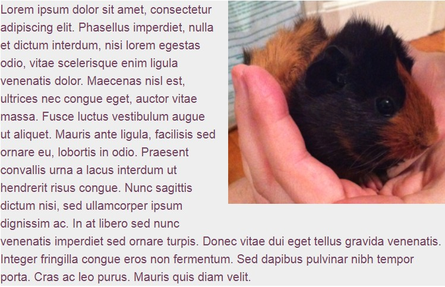
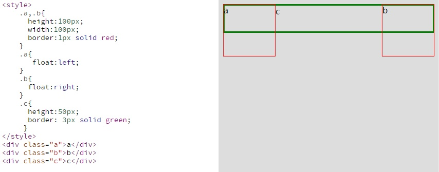
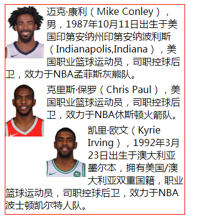

### 浮动

CSS 设计 float 属性的主要目的，是为了实现文本绕排图片的效果。

```css
/*为简明起见，省略了字体声明*/
p {margin:0; border:1px solid red;}
/*外边距防止图片紧挨文本*/
img {float:left; margin:0 4px 4px 0;}

<p>…the paragraph text…</p>
```



> 浮动非图片元素时，必须给它设定宽度，否则后果难以预料。图片无所谓，因为它本身有默认的宽度。 

浮动元素脱离了文档流，浮动的块虽然脱离的正常的文档流（normal flow），但是还会占有正常文档流的文本空间。

#### 破坏性

**float的破坏性**是指：设置了float的元素会脱离文档流，会导致父元素塌陷、元素重叠等现象。




#### 包裹性

```html
<div style="border:2px solid blue; padding: 3px;">
    Apple
</div>
<div style="border:2px solid blue; padding: 3px; float: left;">
    Phone
</div>
```


如上图，普通的div如果没有设置宽度，它会撑满整个屏幕。而如果给div增加float:left之后，它突然变得紧凑了，宽度发生了变化，把内容“Phone”包裹了——这就是包裹性。**div设置了float之后，其宽度会自动调整为包裹住内容宽度，而不是撑满整个父容器。**

#### 清浮动：父级元素

```html
<section>

<p>It's fun to float.</p>
</section>
<footer> Here is the footer element that runs across the bottom of the
page.</footer>
```

**方法一：为父元素添加 overflow:hidden**

```css
section {border:1px solid blue; margin:0 0 10px 0; overflow:hidden;}
img {float:left;}
p {border:1px solid red;}
```

**方法二：同时浮动父元素**

```css
section {border:1px solid blue; float:left; width:100%;}
img {float:left;}
footer {border:1px solid red; clear:left;}
```

浮动 section 以后，不管其子元素是否浮动，它都会紧紧地包围（也称收缩包裹）住它的子元素。因此，需要用 `width:100%`再让section与浏览器容器同宽。另外，由于section现在也浮动了，所以 footer 会努力往上挤到它旁边去。为了强制 footer依然呆在 section 下方，要给它应用`clear:left`。被清除的元素不会被提升到浮动元
素的旁边。

**方法三：添加非浮动的清除元素**

第三种强制父元素包含其浮动子元素的方法，就是给父元素的最后添加一个非浮动的子元素，然后清除该子元素。

这样的方式有两种：

第一种方式不太理想，也就是简单地在 HTML 标记中添加一个子元素，并给它应用clear属性。

```css
<section>

<p>It's fun to float.</p>
<div class="clear_me"></div>
</section>
<footer> Here is the footer element…</footer>

section {border:1px solid blue;}
img {float:left;}
.clear_me {clear:left;}
footer {border:1px solid red;}
```

第二种方式给父级section元素添加一个类clearfix

```css
<section class="clearfix">

<p>It's fun to float.</p>
</section>
<footer> Here is the footer element…</footer>

.clearfix:after {
content:".";
display:block;
height:0;
visibility:hidden;
clear:both;
}
```

> clear 属性规定元素的哪一侧不允许其他浮动元素。
>
> 对于CSS的清除浮动(clear)，一定要牢记：这个规则只能影响使用清除的元素本身，不能影响其他元素。

#### 没有父元素时如何清除

```html
    <!-- 无父元素时 -->
    <section id="noParent">
        
        <p>
            迈克·康利（Mike Conley），男，1987年10月11日出生于美国印第安纳州印第安纳波利斯（Indianapolis,Indiana），美国职业篮球运动员，司职控球后卫，效力于NBA孟菲斯灰熊队。
        </p>
        
        <p>
            克里斯·保罗（Chris Paul），美国职业篮球运动员，司职控球后卫，效力于NBA休斯顿火箭队。
        </p>
        
        <p>
            凯里·欧文（Kyrie Irving），1992年3月23日出生于澳大利亚墨尔本，拥有美国/澳大利亚双重国籍，职业篮球运动员，司职控球后卫，效力于NBA波士顿凯尔特人队。
        </p>
    </section>
```

```css
#noParent{
    border:1px solid red;
    width:300px;
}
#noParent img{
    float:left;
    margin:0 4px 4px 0;
}
#noParent p{
    margin: 0 0 5px 0;
}
```




由于第二段文字下方有空间，所以第三张图片及说明文字会上浮到第二张图片右侧，这不是我们想要的结果。

我们照样可以使用`clearfix` 规则，像这样给每个段落都加上`clearfix`类。

```css
.clearfix:after {
content:".";
display:block;
height:0;
visibility:hidden;
clear:both;
}
```

