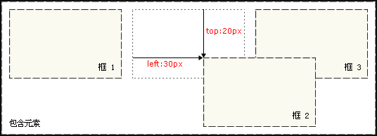
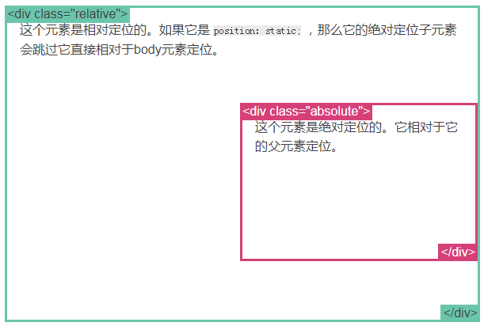

### position

CSS 布局的核心是`position`属性，对元素盒子应用这个属性，可以相对于它在常规文档流中的位置重新定位。`position`属性有 4 个值：`static`、 `relative`、 `absolute`、`fixed`，默认值为`static`。

> 任意 `position: static;` 的元素不会被特殊的定位。一个 static 元素表示它*不会被“positioned”*，一个 position 属性被设置为其他值的元素表示它*会被“positioned”*。

#### 静态定位

在静态定位的情况下，每个元素在处在常规文档流中。

```html
<p>First Paragraph</p>
<p>Second Paragraph</p>
<p id="specialpara">Third Paragraph (with ID)</p>
<p>Fourth Paragraph</p>
```

这是四个段落都采用默认静态定位的效果。它们都是块级元素，所以就会在页面中自上而下地堆叠起来。

#### 相对定位

如果想为元素设置层模型中的相对定位，需要设置`position:relative`（表示相对定位），相对的是它**原来在文档流中的位置**（或者默认位置）。接下来，可以使用`top`、 `right`、`bottom`和`left`属性来改变它的位置了。但由于`position:relative`这个属性并没有脱离文档流的，所以**元素本身所占的位置会保留**。

如果将 top 设置为20px，那么框将在原位置顶部下面 20px的地方。如果left设置为30px，那么会在元素左边创建30px的空间，也就是将元素向右移动。

```css
#box_relative {
  position: relative;
  left: 30px;
  top: 20px;
}
```

效果图：



> 注意，在使用相对定位时，无论是否进行移动，元素仍然占据原来的空间。因此，移动元素会导致它覆盖其它框。

#### 绝对定位

如果想为元素设置层模型中的绝对定位，需要设置**position:absolute**(表示绝对定位)，绝对定位的元素完全脱离了常规文档流，然后使用left、right、top、bottom属性`相对于最近的“positioned”祖先元素`进行绝对定位。如果不存在这样的包含块，则相对于body元素，即相对于**浏览器窗口**。

> 记住一个“positioned”元素是指position值不是 `static` 的元素。

这里有一个简单的例子：

```css
.relative {
  position: relative;
  width: 600px;
  height: 400px;
}
.absolute {
  position: absolute;
  top: 120px;
  right: 0;
  width: 300px;
  height: 200px;
}
```

效果如下：



#### 固定定位

`fixed`：表示固定定位，固定定位元素的定位上下文是视图本身（浏览器窗口或手持设备的屏幕），因此它不会随页面滚动而移动。和 `relative` 一样， `top` 、 `right` 、 `bottom` 和 `left` 属性都可用。以下代码可以实现相对于**浏览器视图**向右移动100px，向下移动50px。并且拖动滚动条时位置固定不变。

```css
#div1{
    width:200px;
    height:200px;
    border:2px red solid;
    position:fixed;
    left:100px;
    top:50px;
}
<p>文本文本文本文本文本文本文本文本文本文本文本文本文本文本文本文本文本文本文本文本文本文本文本文本文本文本文本文本文本文本文本文本文本文本。</p>
....
```