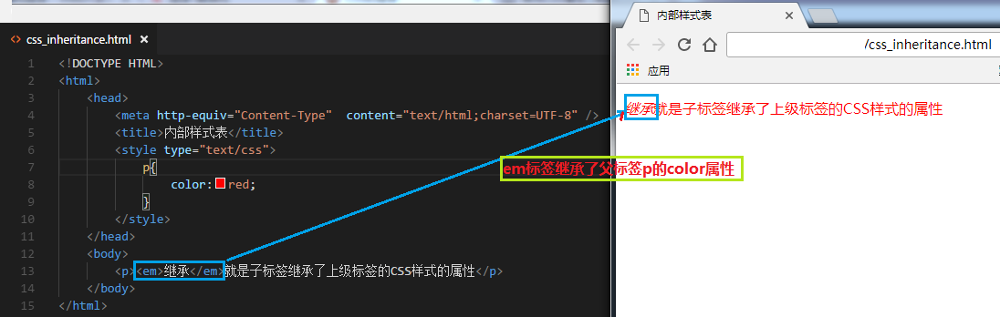

## CSS Start

### 认识CSS

`CSS`全称为“层叠样式表 (Cascading Style Sheets)”，它主要是用于定义HTML内容在浏览器内的显示样式，如文字大小、颜色、字体加粗等。

`css`样式由**选择器**和**声明**组成，而**声明**又由**属性**和**值**组成


**选择器：** 通常是您需要改变样式的 HTML 元素。

**声明：** 在英文大括号`{}`中的就是声明，属性和值之间用英文冒号`:`分隔。当有多条声明时，中间可以英文分号`;`分隔；


[属性](https://developer.mozilla.org/en-US/docs/Glossary/property/CSS)（property）是您希望设置的样式属性（style attribute）。每个属性有一个值。属性和值被`冒号`分开。

```css
selector {property: value}
```

一个CSS快速示例：

```html
<!DOCTYPE HTML>
<html>
  <head>
    <meta http-equiv="Content-Type" content="text/html; charset=utf-8">
    <title>认识CSS样式</title>
    <style type="text/css">
      p{
         font-size:20px;/*设置文字字号*/
         color:red;/*设置文字颜色*/
         font-weight:bold;/*设置字体加粗*/
      }
    </style>
  </head>
  <body>
      <p>This is my first CSS example</p>
  </body>
</html>
```

> CSS注释语句：用`/*注释语句*/`来标明（Html中使用`<!--注释语句-->` ）

在html中，引用CSS样式有3中方式：

**外部样式表：** 把CSS代码写一个单独的外部文件中，这个css样式文件以`.css`为扩展名，在`<head>`内使用`<link>`标签将CSS样式文件链接到HTML文件内，如下面代码：

```css
<link href="base.css" rel="stylesheet" type="text/css" />
```

**内部样式表：** 位于`<head> `标签内部，把css样式代码写在`<style type="text/css"></style>`标签之间。

**内联样式：** 把CSS代码直接写在现有的HTML**开始标签**中，并且CSS样式代码要写在`style=""`的双引号中，如果有多条CSS样式代码设置可以写在一起，中间用分号隔开。，如下面代码：

```html
<p style="color:red">这里文字是红色。</p>
```

### CSS是怎样工作的？

当浏览器显示文档时，它必须将文档的内容与其样式信息结合。它分两个阶段处理文档：

1. 浏览器将[HTML](https://developer.mozilla.org/en-US/docs/Glossary/HTML) 和[CSS](https://developer.mozilla.org/en-US/docs/Glossary/CSS) 转化成[DOM](https://developer.mozilla.org/en-US/docs/Glossary/DOM) （*文档对象模型*）。DOM在计算机内存中表示文档。它把文档内容和其样式结合在一起。
2. 浏览器显示 DOM 的内容。


### 选择器

每一条css样式声明（定义）由两部分组成，形式如下：

```
selector {property:value}
```

在{}之前的部分就是“选择器”，“选择器”指明了{}中的“样式”的作用对象，也就是“样式”作用于网页中的哪些元素。

#### 基本选择器

**元素（类型）选择器：** 元素选择器其实就是html代码中的标签。

```css
p{font-size:12px;}/*选择所有的 p 元素*/
```

**类选择器：** 通过设置元素的[`class`](https://developer.mozilla.org/en-US/docs/Web/HTML/Global_attributes#attr-class)属性，可以为元素指定类名。类名由开发者自己指定。 文档中的多个元素可以拥有同一个类名，在写样式表时，类选择器是以英文句号（.）开头的。

```css
.stress{color:red;}/*类前面要加入一个英文圆点,选择class="stress"的所有元素*/
```

**ID选择器：** 通过设置元素的[`id`](https://developer.mozilla.org/en-US/docs/Web/HTML/Global_attributes#id)属性为该元素制定ID。ID名由开发者指定。**每个ID在文档中必须是唯一的，ID选择器只能在文档中使用一次**。在写样式表时，ID选择器是以#开头的。

```css
#setGreen{color:green;}/*选择 id="setGreen" 的元素；*/
```

**通用选择器：** 它使用一个`*`号指定，它的作用是匹配html中所有标签元素。

```css
* {color:red;}/*设置页面中所有元素的颜色为red*/
```

**[属性选择器](https://developer.mozilla.org/zh-CN/docs/Web/CSS/Attribute_selectors)：** 通过已经存在的属性名或属性值匹配元素。

```css
/* <a> elements with a title attribute */
a[title] {
  color: purple;
}

/* <a> elements with an href matching "https://example.org" */
a[href="https://example.org"] {
  color: green;
}

/* <a> elements with an href containing "example" */
a[href*="example"] {
  font-size: 2em;
}

/* <a> elements with an href ending ".org" */
a[href$=".org"] {
  font-style: italic;
}
```

#### 组合选择器

**选择器分组：** 当你想为html中多个标签元素设置同一个样式时，可以使用分组选择符`,`。
```css
h1,span{color:red;}
/*选择页面中所有的h1元素,span元素*/
/*各选择器要用英文逗号分隔；*/
```
**后代选择器：** 即加入空格,用于选择指定标签元素下的**后辈元素。**
```css
.first span{color:red;}
/*选择class="first"里所有的span元素，包括div里面的div甚至更多层的嵌套；*/
/*要运用这条规则，那.first必须是span的祖先元素；*/
```
**子选择器：** 即加入大于符号`>`，用于选择指定标签元素的**第一代子元素。**
```css
.food>li{border:1px solid red;}/*选择class="food"里第一层的li元素，.food与li必须只能嵌套一层；*/
```

> **子选择器与后代选择器的区别：** 子选择器仅是指它的直接后代，而后代选择器是作用于所有子后代元素。

**相邻兄弟选择器：** 选择紧接在另一个元素后的元素，而且二者有相同的父元素。

```css
 .hd + .main {padding: 10px}
  /*选择紧挨着class="hd"后面的第一个class="main"的元素；*/
  /*.hd与.main必须有共同的父元素，且他俩必须是紧挨着的；*/
```

**伪类选择器：** CSS伪类（[pseudo-class](https://developer.mozilla.org/en-US/docs/Web/Guide/CSS/Pseudo-classes)）是加在选择器后面的用来指定元素状态的关键字。比如，`:hover`会在鼠标悬停在选中元素上时应用相应的样式。

```css
a:hover{color:red;}
```

>  **链接伪类**，只能运用于超链接元素上；而**动态伪类**，可以动用于所有元素；
>
>  超链接，必须有一个 `href` 属性才能称之为超链接；
>
>  要注意定义时的顺序：`link - visited - focus - hover - active`

- `:link`，链接伪类，指向所有未访问的链接

  ```css
    a:link {text-decoration: underline; color: #333}
    /*选择所有未访问的链接；*/
    /*使用的时候最好都加上a，因为某些浏览器可能会不正确地将:link解释为指向任何超链接，包括已访问和未访问的超链接；*/
  ```

- `:visited`，链接伪类，指示所有已访问的链接

  ```css
    a:visited {text-decoration: underline; color: #000}
    /*选择所有已访问的链接；同`:link`使用时最好加上a；*/
  ```

- `:focus`，动态伪类，指示获得焦点的元素样式

  ```css
    a:focus, input:focus {background-color: #efefef}
    /*选择获得焦点的a元素或获得焦点的input元素；*/
  ```

- `:hover`，动态伪类，指示鼠标移上去的元素样式

  ```css
    a:hover, input:hover {background-color: #ccc}
    /*选择鼠标移上去时的a或input；*/
  ```

- `:active`，动态伪类，指示元素被激活时的样式

  ```css
    a:active, input:active {border: 1px solid #f00}
    /*选择被激活时的a或input*/
  ```

### 层叠和继承

#### 继承

CSS的某些样式是具有继承性的，那么什么是继承呢？继承就是子标签继承了上级标签的CSS样式的属性。

比如下图：如某种颜色应用于p标签，这个颜色设置不仅应用p标签，还应用于p标签中的所有子元素文本，这里子元素为em标签。



> 注意有一些css样式是不具有继承性的。如border:1px solid red;
>
> 对继承的元素来说，子元素自身的样式优先级高于从父级继承来的样式。

#### Specificity

`Specificity`(国内常翻译为优先级)是决定不同选择器的相同样式规则对同一元素的生效情况，优先级高的将覆盖优先级低的样式规则。[W3C](https://www.w3.org/TR/CSS21/cascade.html#specificity)中对优先级计算有以下规则：

> 来源：行内样式 > 页内样式 > 外部引用样式 > 浏览器默认样式

| **选择器类型**            | **纬度（a,b,c,d）** |
| :------------------- | --------------- |
| 行内样式                 | 1,0,0,0         |
| ID选择器                | 0,1,0,0         |
| 类选择器、属性选择器、伪类选择器     | 0,0,1,0         |
| 元素（类型）选择器，伪元素（类型）选择器 | 0,0,0,1         |
| 通用元素选择器、伪类:not选择器    | 0,0,0,0         |

只有当某个标签的的某一样式被多个选择器修改时，(或者内联样式)我们才需要对其进行优先级计算，比如我有

```html
<div id="wrap">
    <p id="p1" style="color:red">
        文本
    </p>
</div>
```

对其添加样式

```css
<style>
    #p1{                        /*优先级:0,1,0,0*/
        color: black;
        background-color: green;
    }
    #wrap p{                    /*优先级:0,1,0,1*/
        background-color: blue;
    }
</style>
```

最终文本两字显示为红色，背景为蓝色，对于`color`以上分别有优先级为`[1,0,0,0]`的内联样式`style="color:red"`和优先级为`[0,1,0,0]`的`#p1`选择器，故最终显示效果为红色，而对于`background-color`由于`#wrap p`的优先级比`#p1`高，故最终显示为蓝色。

#### 层叠

**层叠**就是在html文件中对于同一个元素可以有多个css样式存在，当有相同权重的样式存在时，会根据这些css样式的**前后顺序**来决定，处于**最后面的css样式**会被应用。

```html
<!DOCTYPE HTML>
<html>
    <head>
        <meta http-equiv="Content-Type"  content="text/html;charset=UTF-8" />
        <title>层叠</title>
        <style type="text/css">
            p{
                color:red;
            }
            p{
                color:orange;
            }
        </style>
    </head>
    <body>
        <p>这里的文本到底是什么颜色？</p>
    </body>
</html>
```

**`!important`属性：** 通过在样式规则后面添加`!important`关键词，可以将该样式规则提高到最高优先级。

```css
.test{
  color: red !important;
  color: blue;
}
```

> 注意：!important要写在分号的前面;

### 背景

CSS颜色分为前景色和背景色，前景色会影响元素的内容和边框。当然，有一个前提条件，就是在使用border设定边框的样式和宽度，而没有设定边框颜色。在CSS中，可以使用以下两个属性来定义前景色和背景色：

- `color`: this property styles an element's foreground color
- `background-color`: this property styles an element's background color

```css
p{
  color: red;
  background-color: blue;
}
```

`opacity`透明度，从0到1

```css
.overlay {
  opacity: 0.5;
}
```

`background-image`背景图片

```css
.main-banner {
  background-image: url("https://www.example.com/image.jpg");
}
```

### 字体和文本

#### 字体

`font-family`字体

```css
p{font-family:"Microsoft Yahei"}
```

`font-size`字号

```css
p{font-size:20px;}
```

`font-weight`设置文字的粗细

```css
p{font-weight:bold;}
```

`font-style`设置斜体文字（font-style 的作用仅仅是通过`italic`把正体设为斜体，或者通过`normal`把斜体设为正体）

```css
p{{font-style:italic;}
```
`font`属性是一个简写形式

```css
p{font:bold normal 20px "Microsoft Yahei";}
```

> 简写遵循如下规则：
>
> 规则一：必须声明 font-size 和 font-family 的值。
> 规则二：所有值必须按如下顺序声明。 
>
> 1. font-weight、 font-style、 font-variant 不分先后；
> 2. 然后是 font-size；
> 3. 最后是 font-family。

#### 文本

`text-indent`文本缩进

```css
p{text-indent:2em;}/*为文本段设置2个空格缩进*/
```

`line-height`行间距（行高）

```css
p{line-height:1.5em;}/*设置段落行间距为1.5倍*/
```

`letter-spacing`字符间距

```css
p{letter-spacing:50px;}
```

`word-spacing`单词间距，单词间距与字符间距非常相似，区别在于它只调整单词间距，而不影响字符间距。
CSS 把任何两边有空白的字符和字符串都视作“单词” 。

```css
h1{
    word-spacing:50px;
}
```

`text-decoration:underline`下划线

```css
p {text-decoration: underline;}
```

`text-decoration:line-through`删除线

```css
p{text-decoration:line-through;}
```

`text-align`文本对齐方式

```css
p{text-align:center}
```

### 水平居中设置

我们在实际工作中常会遇到需要设置水平居中的场景，比如为了美观，文章的标题一般都是水平居中显示的。

这里我们又得分两种情况：行内元素还是 块状元素，块状元素里面又分为定宽块状元素，以及不定宽块状元素。

#### 行内元素

如果被设置元素为文本、图片等行内元素时，水平居中是通过给**父元素**设置 `text-align:center` 来实现的。

html代码：

```html
<body>
  <div class="txtCenter">我想要在父容器中水平居中显示。</div>
</body>
```

css代码：

```css
<style>
  .txtCenter{
    text-align:center;
  }
</style>
```

#### 定宽块状元素

定宽块状元素：块状元素的宽度width为固定值。满足定宽和块状两个条件的元素是可以通过设置“左右margin”值为“auto”来实现居中的。我们来看个例子就是设置 div 这个块状元素水平居中：

html代码：

```html
<body>
  <div>我是定宽块状元素，哈哈，我要水平居中显示。</div>
</body>
```

css代码：

```css
<style>
div{
    border:1px solid red;/*为了显示居中效果明显为 div 设置了边框*/
    
    width:200px;/*定宽*/
    margin:20px auto;/* margin-left 与 margin-right 设置为 auto */
}

</style>
```

也可以写成：

```css
margin-left:auto;
margin-right:auto;
```

注意：元素的“上下 margin” 是可以随意设置的。

#### 不定宽的块状元素

在实际工作中我们会遇到需要为“不定宽度的块状元素”设置居中，比如网页上的分页导航，因为分页的数量是不确定的，所以我们不能通过设置宽度来限制它的弹性。(不定宽块状元素：块状元素的宽度width不固定。)

1. 加入`table`标签
2. 第一步：为需要设置的居中的元素外面加入一个 table 标签 ( 包括 <tbody>、<tr>、<td> )。
3. 为这个 table 设置“左右 margin 居中”（这个和定宽块状元素的方法一样）。

##### 不定宽块状元素方法（一）

方法一：加入`table`标签

html代码：

```html
<div>
 <table>
  <tbody>
    <tr><td>
    <ul>
        <li>我是第一行文本</li>
        <li>我是第二行文本</li>
        <li>我是第三行文本</li>
    </ul>
    </td></tr>
  </tbody>
 </table>
</div>
```

css代码：

```
<style>
table{
    border:1px solid;
    margin:0 auto;
}
</style>
```

##### 不定宽块状元素方法（二）

父级块状元素设置`text-align:center`使内容居中，子级作为父级内容，通过`display:inline`先设置成行内元素设置为行内元素后就可以以文本的方式居中了。如下例子：

html代码：

```html
<body>
<div class="container">
    <ul>
        <li><a href="#">1</a></li>
        <li><a href="#">2</a></li>
        <li><a href="#">3</a></li>
    </ul>
</div>
</body>
```

css代码：

```css
<style>
.container{
    text-align:center;
}
.container ul{
    display:inline;
}
.container li{
    display:inline;
}
</style>
```

##### 不定宽块状元素方法（三）

方法三：通过给父元素设置`float`（利用float的包裹性），然后给父元素设置`position:relative`和 `left:50%`，子元素设置 `position:relative`和`left: -50%`来实现水平居中。

代码如下：

```html
<div class="wrap">
    <div class="wrap-center">我们来学习一下这种方法。</div>
</div>
```
CSS代码：

```css
.wrap{
    position:relative;
    float:left;  
    left:50%;  
}

.wrap-center{
    background:#ccc;
    position:relative;
    left:-50%;
}
```

### Read More

[CSS魔法堂：选择器及其优先级](http://www.cnblogs.com/fsjohnhuang/p/3940732.html)
