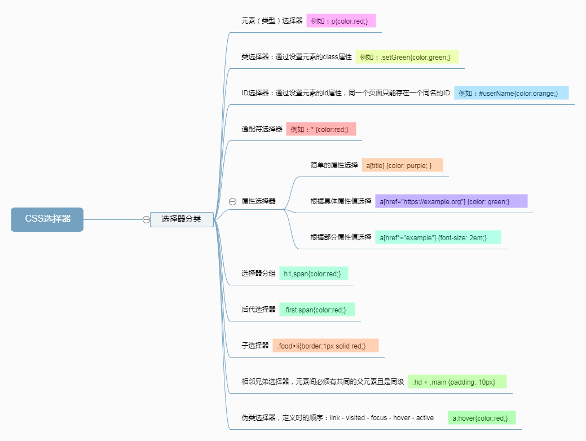

## CSS Start

### 认识CSS

`CSS`全称为“层叠样式表 (Cascading Style Sheets)”，它主要是用于定义HTML内容在浏览器内的显示样式，如文字大小、颜色、字体加粗等。

`css`样式由**选择器**和**声明**组成，而**声明**又由**属性**和**值**组成


**选择器：** 通常是您需要改变样式的 HTML 元素。

**声明：** 在英文大括号`{}`中的就是声明，属性和值之间用英文冒号`:`分隔。当有多条声明时，中间可以英文分号`;`分隔；


[属性](https://developer.mozilla.org/en-US/docs/Glossary/property/CSS)（property）是您希望设置的样式属性（style attribute）。每个属性有一个值。属性和值被`冒号`分开。

```css
selector {property: value}
```

一个CSS快速示例：

```html
<!DOCTYPE HTML>
<html>
<head>
<meta http-equiv="Content-Type" content="text/html; charset=utf-8">
<title>认识CSS样式</title>
<style type="text/css">
p{
   font-size:20px;/*设置文字字号*/
   color:red;/*设置文字颜色*/
   font-weight:bold;/*设置字体加粗*/
}
</style>
</head>
<body>
    <p>This is my first CSS example</p>
</body>
</html>
```

> CSS注释语句：用`/*注释语句*/`来标明（Html中使用`<!--注释语句-->`)

在html中，引用CSS样式有3中方式：

**外部样式表：** 把CSS代码写一个单独的外部文件中，这个css样式文件以“`.css`”为扩展名，在`<head>`内使用`<link>`标签将CSS样式文件链接到HTML文件内，如下面代码：

```css
<link href="base.css" rel="stylesheet" type="text/css" />
```

**内部样式表：** 位于 `<head> `标签内部，把css样式代码写在`<style type="text/css"></style>`标签之间。

**内联样式：** 把CSS代码直接写在现有的HTML**开始标签**中，并且CSS样式代码要写在style=""双引号中，如果有多条CSS样式代码设置可以写在一起，中间用分号隔开。，如下面代码：

```html
<p style="color:red">这里文字是红色。</p>
```

### CSS是怎样工作的？

当浏览器显示文档时，它必须将文档的内容与其样式信息结合。它分两个阶段处理文档：

1. 浏览器将[HTML](https://developer.mozilla.org/en-US/docs/Glossary/HTML) 和[CSS](https://developer.mozilla.org/en-US/docs/Glossary/CSS) 转化成[DOM](https://developer.mozilla.org/en-US/docs/Glossary/DOM) （*文档对象模型*）。DOM在计算机内存中表示文档。它把文档内容和其样式结合在一起。
2. 浏览器显示 DOM 的内容。


### 选择器

每一条css样式声明（定义）由两部分组成，形式如下：

```
selector {property:value}
```

在{}之前的部分就是“选择器”，“选择器”指明了{}中的“样式”的作用对象，也就是“样式”作用于网页中的哪些元素。



#### 基本选择器

**元素（类型）选择器：** 元素选择器其实就是html代码中的标签。

```css
p{font-size:12px;}
```

**类选择器：** 通过设置元素的[`class`](https://developer.mozilla.org/en-US/docs/Web/HTML/Global_attributes#attr-class)属性，可以为元素指定类名。类名由开发者自己指定。 文档中的多个元素可以拥有同一个类名，在写样式表时，类选择器是以英文句号（.）开头的。

```css
.stress{color:red;}/*类前面要加入一个英文圆点*/
```

**ID选择器：** 通过设置元素的[`id`](https://developer.mozilla.org/en-US/docs/Web/HTML/Global_attributes#id)属性为该元素制定ID。ID名由开发者指定。**每个ID在文档中必须是唯一的，ID选择器只能在文档中使用一次**。在写样式表时，ID选择器是以#开头的。

```css
#setGreen{color:green;}
```

**通用选择器：** 它使用一个`*`号指定，它的作用是匹配html中所有标签元素。

```css
* {color:red;}
```

**属性选择器：** 通过已经存在的属性名或属性值匹配元素。

```css
/* <a> elements with a title attribute */
a[title] {
  color: purple;
}

/* <a> elements with an href matching "https://example.org" */
a[href="https://example.org"] {
  color: green;
}

/* <a> elements with an href containing "example" */
a[href*="example"] {
  font-size: 2em;
}

/* <a> elements with an href ending ".org" */
a[href$=".org"] {
  font-style: italic;
}
```

#### 组合选择器

**选择器分组：** 当你想为html中多个标签元素设置同一个样式时，可以使用分组选择符`,`。
```css
h1,span{color:red;}
```
**后代选择器：** 即加入空格,用于选择指定标签元素下的**后辈元素。**
```css
.first span{color:red;}
```
**子选择器：** 即加入大于符号`>`，用于选择指定标签元素的**第一代子元素。**
```css
.food>li{border:1px solid red;}
```

> **子选择器与后代选择器的区别：** 子选择器仅是指它的直接后代，而后代选择器是作用于所有子后代元素。

**伪类选择器：** CSS伪类（[pseudo-class](https://developer.mozilla.org/en-US/docs/Web/Guide/CSS/Pseudo-classes)）是加在选择器后面的用来指定元素状态的关键字。比如，`:hover`会在鼠标悬停在选中元素上时应用相应的样式。

```css
a:hover{color:red;}
```


### 层叠和继承

#### 继承

CSS的某些样式是具有继承性的，那么什么是继承呢？继承就是子标签继承了上级标签的CSS样式的属性。

比如下图：如某种颜色应用于p标签，这个颜色设置不仅应用p标签，还应用于p标签中的所有子元素文本，这里子元素为em标签。


> 注意有一些css样式是不具有继承性的。如border:1px solid red;
>
> 对继承的元素来说，子元素自身的样式优先级高于从父级继承来的样式。

#### Specificity

`Specificity`(国内常翻译为优先级)是决定不同选择器的相同样式规则对同一元素的生效情况，优先级高的将覆盖优先级低的样式规则。[W3C](https://www.w3.org/TR/CSS21/cascade.html#specificity)中对优先级计算有以下规则：

> 来源：行内样式 > 页内样式 > 外部引用样式 > 浏览器默认样式

| **选择器类型**            | **纬度（a,b,c,d）** |
| :------------------- | --------------- |
| 行内样式                 | 1,0,0,0         |
| ID选择器                | 0,1,0,0         |
| 类选择器、属性选择器、伪类选择器     | 0,0,1,0         |
| 元素（类型）选择器，伪元素（类型）选择器 | 0,0,0,1         |
| 通用元素选择器、伪类:not选择器    | 0,0,0,0         |

只有当某个标签的的某一样式被多个选择器修改时，(或者内联样式)我们才需要对其进行优先级计算，比如我有

```html
<div id="wrap">
    <p id="p1" style="color:red">
        文本
    </p>
</div>
```

对其添加样式

```css
<style>
    #p1{                        优先级:0,1,0,0
        color: black;
        background-color: green;
    }
    #wrap p{                    优先级:0,1,0,1
        background-color: blue;
    }
</style>
```

最终文本两字显示为红色，背景为蓝色，对于`color`以上分别有优先级为`[1,0,0,0]`的内联样式`style="color:red"`和优先级为`[0,1,0,0]`的`#p1`选择器，故最终显示效果为红色，而对于`background-color`由于`#wrap p`的优先级比`#p1`高，故最终显示为蓝色。

#### 层叠

**层叠**就是在html文件中对于同一个元素可以有多个css样式存在，当有相同权重的样式存在时，会根据这些css样式的**前后顺序**来决定，处于**最后面的css样式**会被应用。

```html
<!DOCTYPE HTML>
<html>
    <head>
        <meta http-equiv="Content-Type"  content="text/html;charset=UTF-8" />
        <title>层叠</title>
        <style type="text/css">
            p{
                color:red;
            }
            p{
                color:orange;
            }
        </style>
    </head>
    <body>
        <p>这里的文本到底是什么颜色？</p>
    </body>
</html>
```

**`!important`属性：** 通过在样式规则后面添加`!important`关键词，可以将该样式规则提高到最高优先级。

```css
.test{
  color: red !important;
  color: blue;
}
```

> 注意：!important要写在分号的前面;

### Read More

[CSS魔法堂：选择器及其优先级](http://www.cnblogs.com/fsjohnhuang/p/3940732.html)