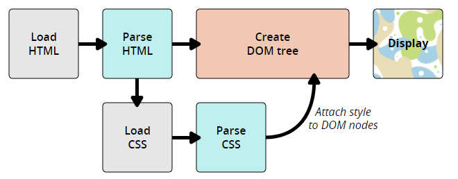

## CSS Start

### 认识CSS

`CSS`全称为“层叠样式表 (Cascading Style Sheets)”，它主要是用于定义HTML内容在浏览器内的显示样式，如文字大小、颜色、字体加粗等。

`css`样式由**选择符**和**声明**组成，而**声明**又由**属性**和**值**组成


**选择器：** 指明网页中要应用样式规则的元素，如本例中是网页中所有的标题（h1）的文字将变成红色，而其他的元素（如ol）不会受到影响。

**声明：** 在英文大括号`{}`中的的就是声明，属性和值之间用英文冒号`:`分隔。当有多条声明时，中间可以英文分号`;`分隔；


[属性](https://developer.mozilla.org/en-US/docs/Glossary/property/CSS)（property）是您希望设置的样式属性（style attribute）。每个属性有一个值。属性和值被`冒号`分开。

```
selector {property:value}
```

一个CSS快速示例：

```html
<!DOCTYPE HTML>
<html>
<head>
<meta http-equiv="Content-Type" content="text/html; charset=utf-8">
<title>认识CSS样式</title>
<style type="text/css">
p{
   font-size:20px;/*设置文字字号*/
   color:red;/*设置文字颜色*/
   font-weight:bold;/*设置字体加粗*/
}
</style>
</head>
<body>
    <p>This is my first CSS example</p>
</body>
</html>
```

> CSS注释语句：用`/*注释语句*/`来标明（Html中使用`<!--注释语句-->`)

### CSS是怎样工作的？

当浏览器显示文档时，它必须将文档的内容与其样式信息结合。它分两个阶段处理文档：

1. 浏览器将[HTML](https://developer.mozilla.org/en-US/docs/Glossary/HTML) 和[CSS](https://developer.mozilla.org/en-US/docs/Glossary/CSS) 转化成[DOM](https://developer.mozilla.org/en-US/docs/Glossary/DOM) （*文档对象模型*）。DOM在计算机内存中表示文档。它把文档内容和其样式结合在一起。
2. 浏览器显示 DOM 的内容。



在html中，引用CSS样式有3中方式：

**外部样式表：**把CSS代码写一个单独的外部文件中，这个css样式文件以“`.css`”为扩展名，在`<head>`内使用`<link>`标签将CSS样式文件链接到HTML文件内，如下面代码：

```css
<link href="base.css" rel="stylesheet" type="text/css" />
```

**内部样式表：**位于 `<head> `标签内部，把css样式代码写在`<style type="text/css"></style>`标签之间。

**内联样式：**把CSS代码直接写在现有的HTML**开始标签**中，并且CSS样式代码要写在style=""双引号中，如果有多条CSS样式代码设置可以写在一起，中间用分号隔开。，如下面代码：

```html
<p style="color:red">这里文字是红色。</p>
```

### 选择器

每一条css样式声明（定义）由两部分组成，形式如下：

```
selector {property:value}
```

在{}之前的部分就是“选择器”，“选择器”指明了{}中的“样式”的作用对象，也就是“样式”作用于网页中的哪些元素。

**标签选择器（tag selector）：** 标签选择器其实就是html代码中的标签。

**类选择器（Class selector）：** 通过设置元素的[`class`](https://developer.mozilla.org/en-US/docs/Web/HTML/Global_attributes#attr-class)属性，可以为元素指定类名。类名由开发者自己指定。 文档中的多个元素可以拥有同一个类名，在写样式表时，类选择器是以英文句号（.）开头的。具体语法如下：

```
.类选器名称{css样式代码;}
```

**ID选择器（ID selector）：** 通过设置元素的[`id`](https://developer.mozilla.org/en-US/docs/Web/HTML/Global_attributes#id)属性为该元素制定ID。ID名由开发者指定。每个ID在文档中必须是唯一的。在写样式表时，ID选择器是以#开头的。