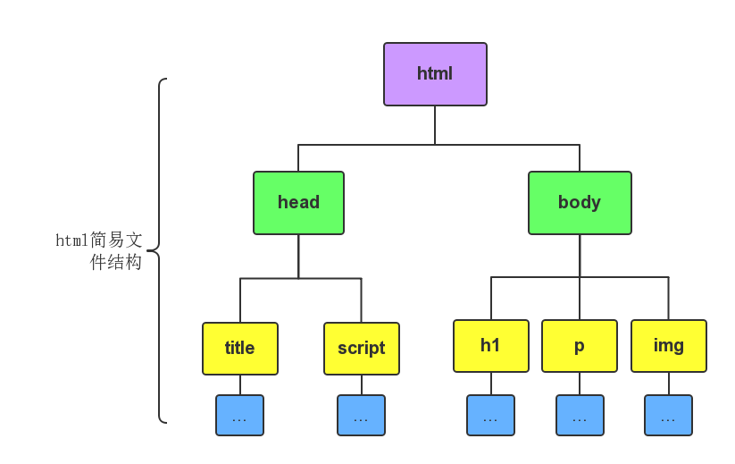
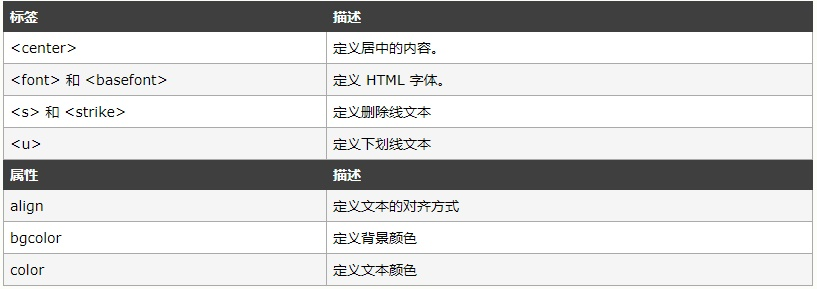
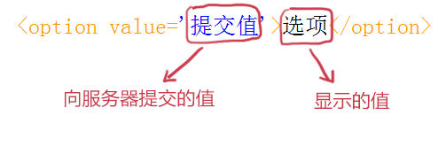

## HTML_Start

HTML(Hyper Text Markup Language)：超文本标记语言

- 结构层(HTML)，html 是咖啡店里的服务员妹子
- 表现层(CSS)，css 是她身上的衣服
- 行为层(JavaScript)，js 是她的员工手册

### HTML标签

- HTML标签是由英文尖括号`<`和`>`包围的关键词，比如`<h1>`
- HTML标签通常是**成对出现**的，比如`<b>`和`</b>`
- 标签对中的第一个标签是**开始标签**，第二个标签是**结束标签**，结束标签比开始标签多了一个`/`
- 标签与标签之间是可以嵌套的，但先后顺序必须保持一致，如`<div>`里嵌套`<p>`，那么`</p>`必须放在`</div>`的前面。
- HTML标签不区分大小写，`<h1>`和`<H1>`是一样的，但建议小写。

### HTML元素

元素：HTML 元素指的是从开始标签（start tag）到结束标签（end tag）的所有代码。

- 元素的内容是开始标签与结束标签之间的内容
- 某些 HTML 元素具有空内容（empty content）
- 空元素在开始标签中进行关闭（以开始标签的结束而结束），比如说换行符`<br/>`
- 大多数 HTML 元素可拥有属性


### HTML基本结构

一个HTML网页有自己固有的结构，具体如下：

```html
<!DOCTYPE HTML>
<html>
	<head>
		<meta http-equiv="Content-Type" content="text/html; charset=utf-8">
		<title>认识html文件基本结构</title>
	</head>
	<body></body>
</html>
```



说明：

1. `<html></html>`称为根标签，所有的网页标签都在`<html></html>`中。
2. ` <head></head>`标签用于定义文档的头部，它是所有头部元素的容器。头部元素有`<title>`、`<script>`、 `<style>`、`<link>`、 `<meta>`等标签
3. 在`<body>`和`</body>`标签之间的内容是网页的主要内容，如`<h1>`、`<p>`、`a`、`img`等网页内容标签，在这里的标签中的内容会在浏览器中显示出来。
4. `<!DOCTYPE HTML> `声明文档类型


### 基本的HTML标签

- HTML标题：HTML标题是通过`<h1>`～`<h6>`等标签进行定义的。
- HTML段落：HTML段落是通过`<p>`标签进行定义的。(`<p>`是块级元素)
- HTML链接：HTML链接是通过`<a>`标签进行定义的。(在href属性中指定链接的地址)
- HTML图像：HTML图像是通过``标签进行定义的。(在src属性中指定图片的路径)

> HTML注释：注释标签`<!--`与`-->`用于在HTM插入注释。
>
> 换行:`<br />`，`<br />` 元素是一个空的 HTML 元素。由于关闭标签没有任何意义，因此它没有结束标签。

**应该避免使用下面这些标签和属性：**


对于以上这些标签和属性应使用**样式**代替！

### HTML属性

- 属性总是以名称/值对的形式出现，比如：**name="value"**
- 属性总是在HTML元素的**开始标签**中规定。
- 属性值应该始终被包括在引号内。
- 属性和属性值对大小写不敏感，推荐使用小写的属性/属性值。


### HTML文本格式化

一般我们在网页中能看见各种各样的字体、文本样式，这就是文本格式化标签的功劳，具体可查看[w3school的介绍](http://www.w3school.com.cn/html/html_formatting.asp)。

> 1. `<em>`和`<strong>`标签是为了**强调**一段话中的关键字时使用，它们的语义是**强调。**`<em>`表示强调，`<strong>`表示更强烈的强调。并且在浏览器中`<em>`默认用**斜体**表示，`<strong>`用**粗体**表示。
> 2. `<span>`标签是没有语义的，它的作用就是为了设置单独的样式用的。

### 超链接`<a>`

通过使用`<a>`标签在HTML中创建链接，有两种使用`<a>`标签的方式：

- 通过使用href属性——创建指向另一个文档的链接
- 通过使用name属性——创建文档内的书签
- 通过使用title属性——提示文字

注意：`<a>` 标签内必须提供 href 或 name 属性。

target属性：使用target属性，可以定义被链接的文档在何处显示。`_self`（覆盖当前页面，默认）、`_blank`（创建新窗口打开新页面）

name属性：使用name属性创建HTML页面中的书签。（也可以使用id属性来代替name属性）。具体用法如下：

1. 首先我们在HTML文档中对锚进行命名（创建一个书签）：`<a name="tips">书签</a>`
2. 然后我们在同一个文档创建指向该锚的链接：`<a href="#tips">跳转至书签</a>`
3. 当然我们也可以在其他页面创建指向该锚的链接：`<a href="http://flwcy.coding.me/html/html_links.html#tips">跳转至博客书签</a>`

### 图片标签``

在HTML中，图像由``标签定义，``是空标签（它只包含属性，并且没有闭合标签）。

1. `src`标识图像的位置；
2. `alt`指定图像的描述性文本，当图像不可见时（下载不成功时），可看到该属性指定的文本；
3. `title`提供在图像可见时对图像的描述(鼠标滑过图片时显示的文本)；
4. 图像可以是GIF，PNG，JPEG格式的图像文件。

### HTML表格

表格由`<table>`标签来定义。行由`<tr>`标签定义，列由`<td>`标签定义。表格的表头使用`<th>`标签进行定义（表头通常用于列名字），表格的边框属性`border="1"`。

`<tbody>…</tbody>`：当表格内容非常多时，表格会下载一点显示一点，但如果加上`<tbody>`标签后，这个表格就要等表格内容全部下载完才会显示。

在一些浏览器中，没有内容的表格单元显示得不太好。如果某个单元格是空的（没有内容），浏览器可能无法显示出这个单元格的边框。为了避免这种情况，在空单元格中添加一个空格占位符`&nbsp;`，就可以将边框显示出来。

用`colspan`跨行，例如：

```html
<table border="1">
	<tr>
		<th>姓名</th>
		<th colspan="2">电话</th>		
	</tr>
	<tr>
		<td>Bill Gates</td>
		<td>555 77 854</td>
		<td>555 77 855</td>
	</tr>
</table>
```

用`rowspan`跨列，例如：

```html
<table border="1">
	<tr>
		<th>姓名</th>
		<td>Bill Gates</td>
	</tr>
	<tr>
		<th rowspan="2">电话</th>
		<td>555 77 854</td>
	</tr>
	<tr>
		<td>555 77 855</td>
	</tr>
</table>
```

注意：table标签是可以嵌套的，也就是说在tr或者td标签中加入table标签即可创建表格中的表格。

> - 标签`<th>`：设置表头
> - 标签`<caption>`：设置表的标题
> - 属性`cellpadding="..."`设置单元格边距
> - 属性`bgcolor="..."`设置表格背景颜色
> - 属性`background="..." `以某张图片作为表格背景

### HTML列表

在HTML中的列表有三种类型：无序列表、有序列表、定义列表。

**无序列表**是指没有顺序的列表项目，此列项目使用粗体圆点进行标记。无序列表始于`<ul>`标签，每个列表项始于`<li>`。

```html
<ul>
	<li>DOTA2</li>
	<li>LOL</li>
</ul>
```

**有序列表**也是一列项目，列表项目使用数字进行标记。有序列表始于`<ol>`标签。每个列表项始于`<li>`标签。

```HTML
<ol>
	<li>NBA</li>
	<li>FIFA</li>
</ol>
```

**自定义列表**：自定义列表以`<dl>`标签开始。每个自定义列表项以`<dt>`开始。每个自定义列表项的定义以`<dt>`开始。

```html
<dl>
	<dt>Coffee</dt>
	<dd>Black hot drink</dd>
	<dt>Milk</dt>
	<dd>White cold drink</dd>
</dl>
```

### HTML表单

网站怎样与用户进行交互？答案是使用HTML表单(form)。表单是可以把浏览者输入的数据传送到服务器端，这样服务器端程序就可以处理表单传过来的数据。

```html
<form method="请求方式" action="服务器文件">
```

**讲解：**

1. `<form>`标签是成对出现的，以`<form>`开始，以`</form>`结束。
2. `action`浏览者输入的数据被传送到的地方,比如一个PHP页面(save.php)。
3. `method`数据传送的方式（get/post）。

> 所有表单控件（文本框、文本域、按钮、单选框、复选框等）都必须放在`<form></form>`标签之间（否则用户输入的信息可提交不到服务器上哦！）。

#### 表单控件——文本输入

当用户要在表单中键入字母、数字等内容时，就会用到**文本输入框**。文本框也可以转化为**密码输入框**。

**语法**：

```html
<form>
   <input type="text/password" name="名称" value="文本" />
</form>
```

1、`type`属性

+ 当`type="text"`时，输入框为**文本输入框;**
+ 当`type="password"`时,输入框为**密码输入框。**

2、`name`为文本框命名，以备后台程序ASP 、PHP使用。

3、`value`为文本输入框设置默认值。(一般起到提示作用)

**示例：**

```html
<form>
  <label>姓名：</label>
  <input type="text" name="userName">
  <br/>
  <label>密码：</label>
  <input type="password" name="pass">
</form>
```

#### 表单控件——文本域

当用户需要在表单中输入大段文字时，需要用到文本输入域。

**语法**：

```html
<textarea name="名称" rows="行数" cols="列数">文本</textarea>
```

1、`<textarea>`标签是成对出现的，以`<textarea>`开始，以`</textarea>`结束。

2、`cols`多行输入域的**列数**。

3、`rows`多行输入域的**行数**。

4、在`<textarea></textarea>`标签之间可以输入**默认值**。

**示例：**

```html
<form  method="post" action="save.php">
        <label>联系我们</label>
        <textarea cols="50" rows="10" >在这里输入内容...</textarea>
</form>
```

#### 表单控件——单选框/复选框

在使用表单设计调查表时，为了减少用户的操作，使用选择框是一个好主意，html中有两种选择框，即**单选框**和**复选框**，两者的区别是**单选框**中的选项用户只能选择一项，而**复选框**中用户可以任意选择多项，甚至全选。

**语法：**

```html
<input type="radio/checkbox" value="值" name="名称" checked="checked"/>
```

1、`type`属性

   当 `type="radio" `时，控件为**单选框**

   当 `type="checkbox"` 时，控件为**复选框**

2、`value`提交数据到服务器的值（后台程序PHP使用）

3、`name`为控件命名，以备后台程序 ASP、PHP 使用

4、`checked`当设置`checked="checked"`时，该选项被默认选中
**示例：**
```html
            <form method="post" action="#">
                <label>男</label>
                <input type="radio" name="sex" value="male" checked="checked" />
                <label>女</label>
                <input type="radio" name="sex" value="female">
                <label>游戏</label><input type="checkbox" name="hobbies" value="game" />
                <label>音乐</label><input type="checkbox" name="hobbies" value="music" />
                <label>编程</label><input type="checkbox" name="hobbies" value="coding" />
            </form>
```

> 注意: **同一组**的单选按钮，name 取值一定要一致，比如上面例子为同一个名称“sex”，这样同一组的单选按钮才可以起到单选的作用。

#### 表单控件——下拉框

`<select>`元素定义下拉列表

**语法：**

```html
<select name="名称">
	<option value="提交值">选项</option>
</select>
```

**说明：**



1. `<option>`元素定义待选择的选项。
2. 在`<select>`标签中设置`selected="selected"`属性，则该选项就被默认选中。

#### 表单控件——提交/重置

在表单中有两种按钮可以使用，分别为：提交按钮、重置。

- 当用户需要提交表单信息到服务器时，需要用到**提交按钮**。
- 当用户需要重置表单信息到初始时的状态时，比如用户输入“用户名”后，发现书写有误，可以使用`重置按钮`使输入框恢复到初始状态。只需要把type设置为"reset"就可以。

**语法**：

```html
<input type="submit/reset" value="提交/重置">
```

`type`属性

- 只有当`type`值设置为`submit`时，按钮才有**提交**作用
- 只有当`type`值设置为`reset`时，按钮才有**重置**作用

`value`：按钮上显示的文字

**示例：**

```html
            <form method="post" action="#">
                <label>用户名：</label><input type="text" name="userName" />
                <br/>
                <label>密码：</label><input type="password" name="password" />
                <input type="submit" value="提交" />
                <input type="reset" value="重置" />
            </form>
```

#### 表单控件——label标签

label标签不会向用户呈现任何特殊效果，它的作用是为鼠标用户改进了可用性。如果你在 label 标签内点击文本，就会触发此控件。就是说，当用户单击选中该label标签时，浏览器就会自动将焦点转到和标签相关的表单控件上（就自动选中和该label标签相关连的表单控件上）。

**语法：**

```html
<label for="控件id名称">
```

> 注意：标签的 for 属性中的值应当与相关控件的 id 属性值一定要相同。

**例子：**

```html
<form>
  <label for="male">男</label>
  <input type="radio" name="gender" id="male" />
  <br />
  <label for="female">女</label>
  <input type="radio" name="gender" id="female" />
  <label for="email">输入你的邮箱地址</label>
  <input type="email" id="email" placeholder="Enter email">
</form>
```

### HTML块

大多数HTML元素被定义为块级元素或内联元素。

-  **块级元素(block)特性：** 总是独占一行，表现为另起一行开始，而且其后的元素也必须另起一行显示；宽度(width)、高度(height)、内边距(padding)和外边距(margin)都可控制；例如：`<h1>`, `<p>`,` <ul>`, `<table>`,`<div>`,`<form>`
-  **内联元素(inline)特性：** 和相邻的内联元素在同一行；宽度(width)、高度(height)、内边距的top/bottom(padding-top/padding-bottom)和外边距的top/bottom(margin-top/margin-bottom)都不可变 **（水平方向有效，竖直方向无效）**，就是里面的文字和图片的大小；例如：`<br>`, `<span>`, `<a>`, ``,`<input>`


对HTML进行分类，使我们能够为定义的元素的类**定义CSS样式**。

- 分类块级元素：`<div>`
- 分类行内元素：`<span>`


