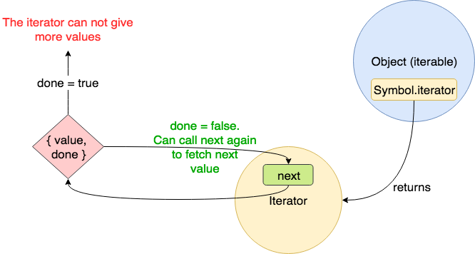
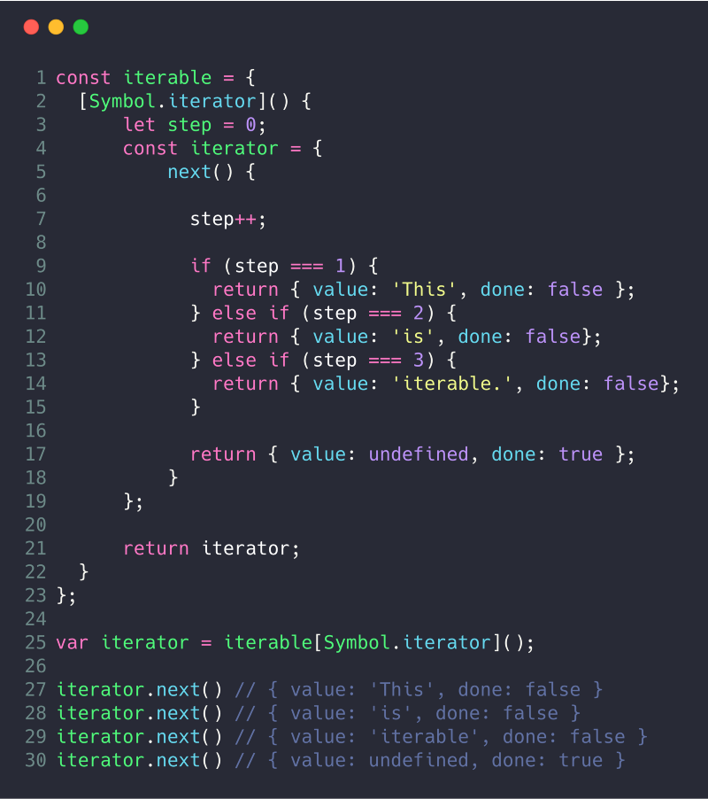

### [译]JavaScript中ES6迭代器的简单指南和示例

> [A Simple Guide to ES6 Iterators in JavaScript with Examples](https://codeburst.io/a-simple-guide-to-es6-iterators-in-javascript-with-examples-189d052c3d8e)

我们将在本文中分析迭代器。**迭代器是循环JavaScript中任何集合的一种新方法**。它们是在ES6中引入的，由于广泛的用途和在不同的地方使用而变得非常流行。

我们准备通过例子来从概念上理解迭代器是什么以及在哪里使用它们。我们还将在JavaScript中看到它的一些实现。

#### 介绍

想象你需要这样一个数组——

```javascript
const myFavouriteAuthors = [
  'Neal Stephenson',
  'Arthur Clarke',
  'Isaac Asimov', 
  'Robert Heinlein'
];
```

在某些时候，你需要返回数组中所有单个值，以便在屏幕中打印它们、操纵它们，或者对它们执行一些操作。如果我问你，你会怎么做？你也许会说——这很简单。我会使用`for`，`while`，`for-of`或者[其中](https://developer.mozilla.org/en-US/docs/Web/JavaScript/Guide/Loops_and_iteration)一种循环方法来循环它们。就像下面的例子所实现的那样——

```javascript
// For loop
for (let index = 0; index < myFavouriteAuthors.length; index++) {
  console.log(myfavouriteAuthors[index]);
}

// while loop
let index = 0;
while (index < myFavouriteAutors.length) {
  console.log(myFavouriteAuthors[index]);
  index++;
}

// for-of loop
for(const value of myFavouriteAuthors) {
  console.log(value);
}
```

现在，想象一下，你有一个自定义数据结构来代替前面的数组，用于保存所有作者。就像这样——

```javascript
const myFavouriteAuthors = {
  allAuthors: {
    fiction: [
      'Agatha Christie',
      'J. K. Rowlling',
      'Dr. Seuss'
    ],
    scienceFiction: [
      'Neal Stephenson',
      'Arthur Clarke',
      'Isaac Asimov',
      'Robert Heinlein'
    ],
    fantasy: [
      'J. R. R. Tolkien',
      'J. K. Rowling',
      'Terry Pratchett'
    ],
  },
}
```

现在，`myFavouriteAuthors`是一个包含另一个对象`allAuthors`的对象。`allAuthors`对象包含三个key值为`fiction`，`scienceFiction`和`fantasy`的数组。**现在，如果我要求你循环`myFavouriteAuthors`来获取所有作者，你的方法是什么**？你可以继续尝试一些循环的组合来获取所有的数据。

然而，如果你像这样做的话——

```javascript
for (let author of myFavouriteAuthors) { 
  console.log(author)
}
// TypeError: {} is not iterable
```

你会得到一个`TypeError`说这个对象是不可迭代的。**让我们看看什么是迭代，以及如何使对象可迭代**。在这篇文章的结尾，你将了解怎么在自定义对象上使用`for-of`循环，在本例中，在`myFavouriteAuthors`上。

#### 迭代和迭代器

你在上一节中看到了问题。没有简单的方法可以从我们自定义对象中获取所有作者。我们需要某种方法，通过它我们可以顺序地公开所有内部数据。

让我们在`myFavouriteAuthors`中添加一个返回所有作者的方法`getAllAuthors`，就像这样——

```javascript
const myFavouriteAuthors = {
    allAuthors: {
        ...
    },
    getAllAuthors() {
        const authors = [];
        for (const author : of this.allAuthors.fiction) {
            authors.push(author);
        }
        
        for (const author of this.allAuthors.scienceFiction) {
            authors.push(author);
        }
        
        for(const author : of this.allAuthors.fantasy) {
            authors.push(author);
        }
    },
};
```

这是一个简单的方法。它完成了我们当前获取所有作者的任务。但是，这种实现可能会出现一些问题。有些是——

+ `getAllAuthors`这个名字非常具体。如果其他人想要创建自己的`myFavouriteAuthors`，他们可能将其命名为`retrieveAllAuthors`。
+ 作为开发人员，我们总是需要知道返回所有数据的特定方法。在本例中，它名为`getAllAuthors`。
+ `getAllAuthors`返回一个所有作者的字符串数组。如果其他开发人员想返回一个像如下格式的对象数组，该怎么办——

```
[ {name: 'Agatha Christie'}, {name: 'J. K. Rowling'}, ... ]
```

开发人员需要知道返回所有数据的方法的**确切名称和返回类型。**

如果我们制定一个**规则**，方法的**名称**和**返回类型**都是**固定的和不可改变的**。该怎么办？

让我们将这个方法命名为——**iteratorMethod**。

[ECMA](https://en.wikipedia.org/wiki/Ecma_International)采用类似的步骤来标准化循环自定义对象的过程。但是，ECMA没有使用`iteratorMethod`这个名字，而是使用`Symbol.iterator`这个名字。[Symbols](https://developer.mozilla.org/en/docs/Web/JavaScript/Reference/Global_Objects/Symbol)提供唯一且不与其他属性名称冲突的名称。当然，`Symbol.iterator`将会**返回一个叫做`iterator`的对象**。这个`iterator`将会拥有一个名为`next`的方法，它将返回一个键为`value`和`done`的对象。

`value`键包含当前的值。它可以是任意类型。`done`的类型是boolean，它表示是否已获取所有值。

一张图也许便于帮助我们建立**iterables**，**iterators**和**next**之间的关系。**这种关系称为迭代协议。**



根据[Axel Rauschmayer](https://medium.com/@rauschma)的书[Exploring JS](http://exploringjs.com/es6/ch_iteration.html)——

+ **迭代**是一种数据结构，它希望公众可以访问其元素。它通过实现一个键为`Symbol.iterator`的方法来实现。该方法是**迭代器**的工厂，也就是说，它将创建**迭代器。**
+ **迭代器**是用于遍历数据结构元素的指针。

#### 创建迭代对象

正如我们上一节所学习到的，我们需要实现一个名为`Symbol.iterator`的方法。我们将使用[计算属性语法](http://es6-features.org/#ComputedPropertyNames)来设置该键。一个简短的例子——



在第4行，我们创建了一个迭代器。它是一个默认带有`next`方法的对象。`next`方法通过变量`step`来返回值。在第25行，我们检索迭代器。第27行，我们调用`next`方法。我们一直调用`next`方法直到`done`为`true`为止。

这正是`for-of`循环中发生的事情。`for-of`循环接受一个**迭代（iterable）**，并创建它的**迭代器（iterator）**。它一直调用`next`方法直到`done`为`true`为止。

#### JavaScript中的迭代

在JavaScript中很多东西是迭代，它可能不会立即可见，但如果你仔细检查，迭代将开始显现。

**这些都是迭代——**

+ **Arrays和[TypedArrays](https://developer.mozilla.org/en-US/docs/Web/JavaScript/Reference/Global_Objects/TypedArray)**
+ **Strings**——迭代每个字符或者 [Unicode](https://developer.mozilla.org/en-US/docs/Glossary/Unicode)代码点。
+ **Maps**——迭代每个键值对
+ **Sets**——迭代他们的元素
+ `arguments`——函数中类似数组的特殊变量
+ DOM元素（正在进行中）

**JS中使用迭代的其他一些结构——**

+ `for-of`循环——`for-of`循环要求必须可迭代，否则它将会抛出一个`TypeError`

```javascript
for (const value of iterable) { ... }
```

+ **数组的解构**——因为迭代而发生解构。

让我们来看看如何实现的？

代码如下

```javascript
const array = ['a', 'b', 'c', 'd', 'e'];
const [first, ,third, ,last] = array;
```

等价于

```javascript
const array = ['a', 'b', 'c', 'd', 'e'];
const iterator = array[Symbol.iterator]();
const first = iterator.next().value
iterator.next().value // Since it was skipped, so it's not assigned
const third = iterator.next().value
iterator.next().value // Since it was skipped, so it's not assigned
const last = iterator.next().value
```

+ **扩展运算符（...）**

代码如下

```javascript
const array = ['a', 'b', 'c', 'd', 'e'];
const newArray = [1, ...array, 2, 3];
```

可写成

```javascript
const array = ['a', 'b', 'c', 'd', 'e'];
const iterator = array[Symbol.iterator]();
const newArray = [1];
for (let nextValue = iterator.next(); nextValue.done !== true; nextValue = iterator.next()) {
  newArray.push(nextValue.value);
}
newArray.push(2)
newArray.push(3)
```

+ `Promise.all`和`Promise.race`接受Promises上的迭代
+ **Maps和Sets**

Map的构造函数将可迭代的[key,value]对转换成Map，Set构造函数将可迭代的元素转换成Set——

```javascript
const map = new Map([[1, 'one'], [2, 'two']]);
map.get(1) 
// one
const set = new Set(['a', 'b', 'c']);
set.has('c');
// true
```

+ 迭代器也是理解生成器函数的先驱。

#### 使MyFavouriteAuthors可迭代

这是一个使`myFavouriteAuthors`可迭代的实现。

```javascript

const myFavouriteAuthors = {
  allAuthors: {
    fiction: [
      'Agatha Christie', 
      'J. K. Rowling',
      'Dr. Seuss'
    ],
    scienceFiction: [
      'Neal Stephenson',
      'Arthur Clarke',
      'Isaac Asimov', 
      'Robert Heinlein'
    ],
    fantasy: [
      'J. R. R. Tolkien',
      'J. K. Rowling',
      'Terry Pratchett'
    ],
  },
  [Symbol.iterator]() {
    // Get all the authors in an array
    const genres = Object.values(this.allAuthors);
    
    // Store the current genre and author index
    let currentAuthorIndex = 0;
    let currentGenreIndex = 0;
    
    return {
      // Implementation of next()
      next() {
        // authors according to current genre index
        const authors = genres[currentGenreIndex];
        
        // doNotHaveMoreAuthors is true when the authors array is exhausted.
        // That is, all items are consumed.
        const doNothaveMoreAuthors = !(currentAuthorIndex < authors.length);
        if (doNothaveMoreAuthors) {
          // When that happens, we move the genre index to the next genre
          currentGenreIndex++;
          // and reset the author index to 0 again to get new set of authors
          currentAuthorIndex = 0;
        }
        
        // if all genres are over, then we need tell the iterator that we 
        // can not give more values.
        const doNotHaveMoreGenres = !(currentGenreIndex < genres.length);
        if (doNotHaveMoreGenres) {
          // Hence, we return done as true.
          return {
            value: undefined,
            done: true
          };
        }
        
        // if everything is correct, return the author from the 
        // current genre and incerement the currentAuthorindex
        // so next time, the next author can be returned.
        return {
          value: genres[currentGenreIndex][currentAuthorIndex++],
          done: false
        }
      }
    };
  }
};

for (const author of myFavouriteAuthors) {
  console.log(author);
}

console.log(...myFavouriteAuthors)
```

借助从文章中获得的知识，你可以轻松的了解迭代器的工作原理。这个逻辑可能有点难以理解。因此，我用代码写了注释。但是，消化和理解概念的最佳方式是在浏览器或者node中使用代码。

如果你还有任何问题，只需要回复这篇文章！参考文献：

- [*ExploringJS*](http://exploringjs.com/es6/ch_iteration.html#sec_iterable-data-sources) *by Dr Axel Rauschmayer.*
- [*MDN on Iterator Protocol*](https://developer.mozilla.org/en-US/docs/Web/JavaScript/Reference/Iteration_protocols#The_iterator_protocol)

> 我希望你喜欢这篇帖子！本文由Arfat Salmon专门为[CodeBurst.io](https://codeburst.io/)编写
