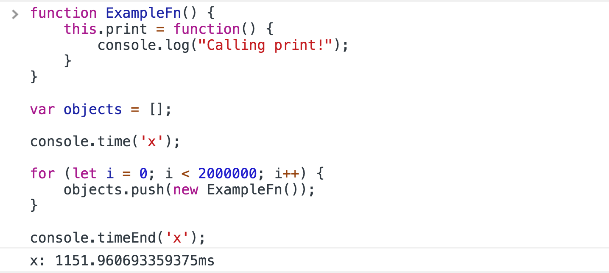
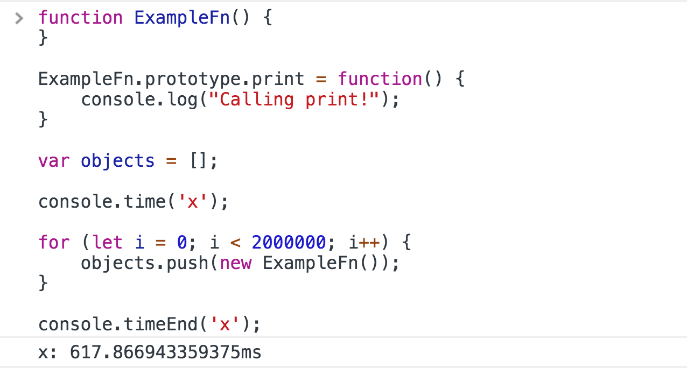

### [译]掌握JavaScript原型和继承

> [Master JavaScript Prototypes & Inheritance](https://codeburst.io/master-javascript-prototypes-inheritance-d0a9a5a75c4e)

#### 继承

继承指的是对象从另一个对象访问方法和其他属性的能力。对象能够从其他对象中继承东西。JavaScript中的继承是通过一种叫做原型的东西来工作的，这种继承形式通常称为原型继承。

在这篇文章中，我们将介绍许多看似无关的主题，并在最后将它们联系在一起。最后还有一个太长(若)不看(请看这里)，给那些想要简短版本的人。

#### 对象，数组和函数

JavaScript给我们提供了三个全局函数：`Object`，`Array`和`Function`。是的，它们都是函数。

```javascript
console.log(Object); // -> ƒ Object() { [native code] }
console.log(Array); // -> ƒ Array() { [native code] }
console.log(Function); // -> ƒ Function() { [native code] }
```

您不知道它，但每次创建对象字面量时，JavaScript引擎就会有效地调用`new Object()`。一个对象字面量是一个通过编写`{}`创建的对象，如`var obj = {};`。因此，对象字面量是对`Object`的隐式调用。

数组和函数也是如此。我们可以认为数组来自`Array`构造函数，而函数来自`Function`构造函数。

#### 对象原型

##### `__proto__`

所有的JavaScript对象都有一个原型。浏览器通过`__proto__`属性实现原型，这就是我们引用它的方式。这通常被成为`dunder proto`，双下划线原型的简写。永远不要重新分配这个属性或直接使用它。`__proto__`的[MDN页面](https://developer.mozilla.org/zh-CN/docs/Web/JavaScript/Reference/Global_Objects/Object/proto)用红色的大方块警告我们永远不要这样做。

##### `prototype`

函数还有一个`prototype`属性。这不同于它们的`__proto__`属性。这使得讨论相当混乱，因此我将阐明我将使用的语法。当我提到`prototype`并且`prototype`这个词没有突出显示为灰色时，我指的是`__proto__`属性。当我使用灰色的`prototype`时，我指的是函数的`prototype`属性。

如果我们在Chrome中记录对象的原型，这就是我们所看到的。

```javascript
var obj = {};
console.log(obj.__proto__);
// -> {constructor: ƒ, __defineGetter__: ƒ, …}
```

`__proto__`属性是对另一个具有多个属性的对象的[引用](https://codeburst.io/explaining-value-vs-reference-in-javascript-647a975e12a0)。我们创建的每个对象字面量都有`__proto__`属性指向同一个对象。一个对象字面量是一个通过编写`{}`创建的对象，如`var obj = {};`。

有几点很重要：

+ 对象字面量的`__proto__`等于`Object.prototype`
+ `Object.prototype`的`__proto__`是`null`

我们很快就会解释原因。

#### 原型链

要理解对象原型，我们需要讨论对象的查找行为。当我们寻找对象的属性时，JavaScript引擎首先检查对象本身是否存在属性。如果没找到，它将转到对象的原型并检查该对象。如果找到，它将使用该属性。

如果没有找到，它将转到原型的原型，直到找到一个`__proto__`属性等于`null`的对象。因此，如果我们试图从上面的obj对象上查找属性`someProperty`，引擎将首先检查对象本身。

它找不到它，然后转到它的`__proto__`对象，它等于`Object.prototype`。它也不会在那里找到它，当看到下一个`__proto__`是`null`时，它将返回`undefined`。

这被称为原型链，它通常被描述为一个向下的链条，在顶部是`null`，在底部是我们使用的对象。

执行查找时，引擎将遍历链查找属性并返回它找到的第一个属性，如果原型链中没有，则为`undefined`。

```javascript
__proto__ === null
|
|
__proto__ === Object.prototype
|
|
{ object literal }
```

这可以证明。在这里，我们将直接使用`__proto__`进行演示。再说一次，永远不要这样做。

```javascript
var obj = {};
obj.__proto__.testValue = 'Hello!';
console.log(obj); // -> {}
console.log(obj.testValue); // -> Hello!
```

该原型链如下所示。

```javascript
__proto__ === null
|
|
__proto__ === Object.prototype -> testValue: 'Hello!'
|
|
obj
```

当我们打印`obj`时，我们得到一个空对象，因为`testValue`没有直接显示在对象上。然而，打印`obj.testValue`会触发查找。引擎沿着原型链向上，在对象的原型上找到`testValue`，然后我们看到这个值打印出来。

#### hasOwnProperty

在对象上有一个方法叫做`hasOwnProperty`。它将根据对象本身是否包含被测试的属性返回`true`或`false`。但是，测试`__proto__`将始终返回`false`。

```javascript
var obj = {};
obj.__proto__.testValue = 'Hello!';
console.log(obj.hasOwnProperty('testValue'));
// -> false
console.log(obj.__proto__.hasOwnProperty('testValue'));
// -> true
```

#### 函数的prototype

如上所述，函数都有一个与`__proto__`属性不同的`prototype`属性。它是一个对象。一个函数的`prototype`的`__proto__`属性等于`Object.prototype`。换一种说法：

```javascript
function fn() {}
console.log(fn.prototype.__proto__ === Object.prototype);
// -> true
```

##### 函数的prototype和'new'

函数的`prototype`属性显示了它在面向对象编程中的用处。当我们用[new调用函数](https://codeburst.io/javascripts-new-keyword-explained-as-simply-as-possible-fec0d87b2741)时，在构造函数中绑定到`this`的对象是特殊的。`new`关键字将对象的`__proto__`设置为构造函数的`prototype`属性。

**当我们使用`new`调用函数时，它将返回对象的`__proto__`属性设置为等于函数的`prototype`属性**。这是继承的关键。

到目前为止，我们总结了一些点：

+ 通过`new`调用函数创建的对象的`__proto__`等于该函数的`prototype`
+ 函数的`prototype`的`__proto__`等于`Object.prototype`
+ `Object.prototype`的`__proto__`为`null`

这让我们可以组装以下的原型链。

```javascript
function Fn() {}
var obj = new Fn();
console.log(obj.__proto__ === Fn.prototype);
// -> true
console.log(obj.__proto__.__proto__=== Object.prototype);
// -> true
console.log(obj.__proto__.__proto__.__proto__ === null);
// -> true
```

视觉绘制：

```javascript
__proto__ === null
|
|             
__proto__ === Object.prototype
|
|
__proto__ === Fn.prototype
|
|
obj
```

#### 实现继承

我们可以直接安全地使用函数的`prototype`属性。通过在函数的`prototype`上放置方法和其他属性，我们可以使该函数创建的所有对象（使用`new`）通过继承访问这些属性。

```javascript
function Fn() {}
Fn.prototype.print = function() {
    console.log("Calling Fn.prototype's print method");
};
var obj = new Fn();
obj.print(); // -> Calling Fn.prototype's print method
```

你可能想知道这是什么意思。我们可以在构造函数本身中附加此方法，就像这样。

```javascript
function Fn() {
    this.print = function() {
        console.log("Calling the object's print method");
    };
}
var obj = new Fn();
obj.print(); // -> Calling the object's print method
```

你是对的，这行得通。这种方式的不同是，通过调用`new Fn()`创建的每个对象都将直接在对象上放置自己的`print`版本。它们在内存中是不同的函数。问题在于性能和内存使用。

##### 性能

有时您可能需要通过构造函数创建数千个新对象。使用第二种方式附加`print`，我们现在有数千个`print`的副本，每个副本都附加到其中一个对象上。

使用原型链，无论我们使用`Fn`创建多少个对象，我们都有一个`print`位于`Fn.prototype`上。

一个方法没什么大不了的。然而大型程序通常有几十个对象需要的方法。如果一个对象需要访问20个方法，并且我们创建了100,000对象，JavaScript引擎创建了2,000,000个新方法。

如果这需要多次执行，这将导致明显的速度和内存问题。比较一下，总共有20个函数，每个对象都可以通过原型链使用相同的函数，更具扩展性。

使用`console.time`和`console.timeEnd`，我们可以直接显示它需要多长时间的差异。这是创建200万个直接带有函数的对象与附加在原型上的时间差。



正如我们所看到的，将`print`方法放到原型上仅花费了一半时间。

#### 字面量的`__proto__`

如上所述，一个对象的`__proto__`等于创建对象的函数的`prototype`。这个规则也适用于字面量。记住对象字面量来自`Object`，数组来自`Array`，函数来自`Function`。

```javascript
var obj = {};
var arr = [];
function fn() {}
console.log(obj.__proto__ === Object.prototype); // -> true
console.log(arr.__proto__ === Array.prototype); // -> true
console.log(fn.__proto__ === Function.prototype); // -> true
```

我们现在可以解释为什么我们能够在数组和对象上调用方法。如果我们有一个数组`arr`，我们能够调用`arr.map()`是因为在`Array.prototype`上存在`map`方法。我们能够调用`obj.hasOwnProperty()`是因为在`Object.prototype`上存在`hasOwnProperty`。我们一直在使用继承，甚至都不知道它。

`Array`和`Function`的`__proto__`链的末尾等于`Object.prototype`。它们都来自同一个东西。这就是为什么数组，函数和对象都被认为是JavaScript中的第一类对象。

#### 构造函数

我们已经多次使用了构造函数这个词。让我们来解释一下它是什么。每个函数的`prototype`都有一个指向函数本身的`constructor`属性。这是引擎为每个函数所做的事情。

```javascript
function Fn() {}
console.log(Fn.prototype.constructor === Fn);
// -> true
```

通过运行`new Fn()`创建的对象将使其`__proto__`等于`Fn.prototype`。因此如果我们尝试打印该对象的`constructor`属性，引擎将通过其查找过程向我们提供`Fn`。

```javascript
function Fn() {}
var obj = new Fn();
console.log(obj.constructor); // -> ƒ Fn(){}
```

##### 为什么它有用

对象上的`constructor`属性很有用，因为它可以告诉我们对象是如何创建的。打印直接在对象上的`constructor`属性将告诉我们创建对象的确切函数。

```javascript
function Fn() {};
var normalObj = {};
var fnObj = new Fn();
console.log(normalObj.constructor);
// -> ƒ Object() { [native code] }
console.log(fnObj.constructor);
// -> ƒ Fn() {}
```

#### Object.create

有一种方法可以手动设置对象的原型。`Object.create`。这个函数将会接受一个对象作为参数。它将返回一个全新的对象，其`__proto__`属性等于传入的对象。

```javascript
var prototypeObj = {
    testValue: 'Hello!'
};
var obj = Object.create(prototypeObj);
console.log(obj); // -> {}
console.log(obj.__proto__ === prototypeObj); // -> true
console.log(obj.testValue); // -> 'Hello!'
```

这为我们提供另一个扩展原型链的简便方法。我们能够使对象继承自我们喜欢的任何对象，而不仅仅是一个函数的`prototype`。

如果你想了解更多信息和示例，`Object.create`的[MDN页面](https://developer.mozilla.org/zh-CN/docs/Web/JavaScript/Reference/Global_Objects/Object/create)是一个很好的资源。

##### 唷

我知道已经介绍的太多了。然而，您现在对JavaScript中的继承有了深刻的理解。

#### 原型的总结

简而言之，JavaScript中的继承是通过原型链实现的。通常每个创建的对象、数组和函数都有一个`__proto__`属性的原型链，其顶部以`Object.prototype`结尾。这就是为什么它们都被认为是JavaScript中的第一类对象。

除`__proto__`属性外，函数还具有`prototype`属性。当用`new`使用构造函数时，最好将方法放在函数的`prototype`而不是对象本身上。返回的对象的`__proto__`将等于函数的`prototype`，因此它将继承函数`prototype`上的所有方法。这可以防止不必要的内存使用并提高速度。

我们可以使用`hasOwnProperty`方法检查一个对象是否有自己的属性。我们可以使用`Object.create`手动设置继承。

**仅此而已，如果觉得这篇文章有帮助，请点击左边的❤，这样这篇文章就会传递给更多人。也可以随时查看我的其他工作。 **

#### 我的工作

我已经创建了一个[在线课程](https://www.educative.io/collection/5679346740101120/5707702298738688?authorName=Arnav%20Aggarwal)，涵盖了JavaScript的中级主题，例如作用域，闭包，OOP，`this`，`new`，`apply/call/bind`，异步代码，数组，对象的操作和ES2015+。

[Step Up Your JS: A Comprehensive Guide to Intermediate JavaScript](https://www.educative.io/collection/5679346740101120/5707702298738688?authorName=Arnav%20Aggarwal)

#### 近期文章

[Explaining Value vs. Reference in Javascript](https://codeburst.io/explaining-value-vs-reference-in-javascript-647a975e12a0)

[React Ecosystem Setup — Step-By-Step Walkthrough](https://codeburst.io/react-ecosystem-setup-step-by-step-walkthrough-721ff45a7fc1)

