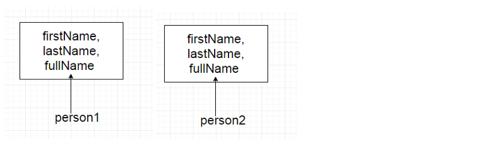
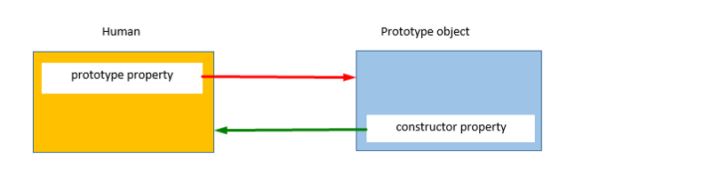
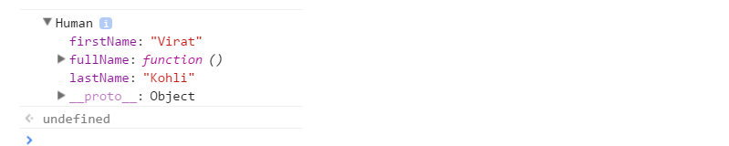
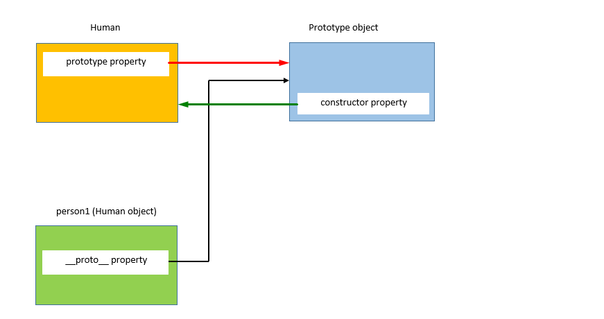
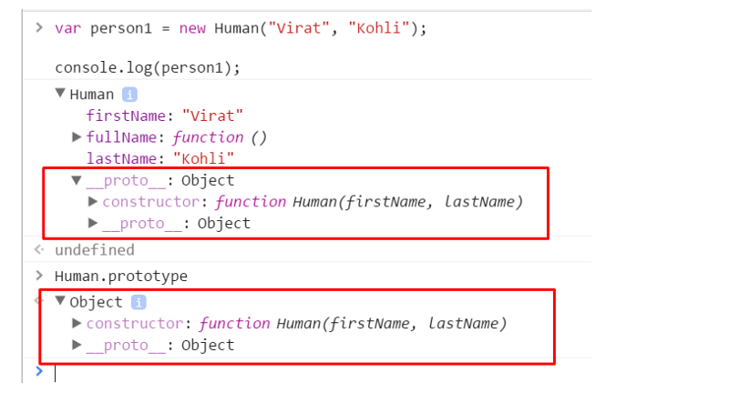
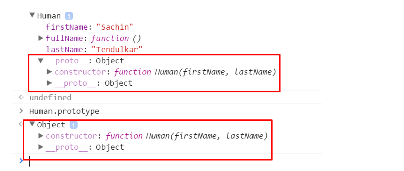
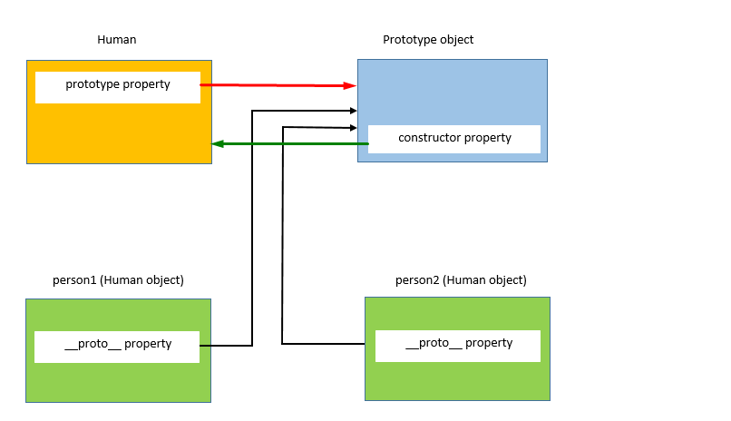
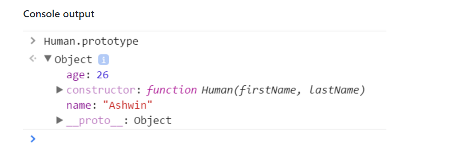
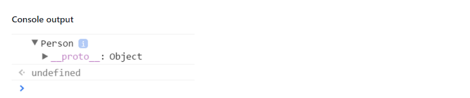
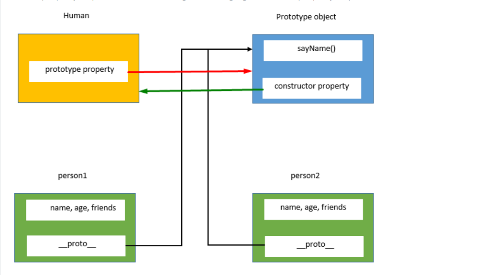

### [译]JavaScript中的原型

> [Prototypes in JavaScript](https://hackernoon.com/prototypes-in-javascript-5bba2990e04b)

[在github上阅读](https://github.com/happymishra/JavaScriptTutorials/blob/master/Part2/Prototypes.md)

使用构造函数语法创建对象的问题？

在前一篇[文章](https://medium.com/@happymishra66/create-objects-in-javascript-10924cfa9fc7)中，我们讨论了在JavaScript中创建对象的各种方式。其中一种就是在JavaScript中使用构造函数创建对象。研究下面的构造函数：

```javascript
function Human(firstName, lastName) {
	this.firstName = firstName,
	this.lastName = lastName,
	this.fullName = function() {
		return this.firstName + " " + this.lastName;
	}
}
```

让我们使用`Human`构造函数创建两个对象_person1_和_person2_。

```javascript
var person1 = new Human("Virat", "Kohli");
var person2 = new Human("Sachin", "Tendulkar");
```

在执行上面的代码时，JavaScript引擎将为`person1`和`person2`创建两个构造函数的副本。



也就是说，使用构造函数创建的每个对象都将拥有自己的属性和方法副本。有函数`fullName`的两个实例做同样的事情是没有意义的。为每个对象存储单独的函数实例会导致内存浪费。我们将看到我们如何解决这个问题。

#### 原型

在JavaScript中创建一个函数时，JavaScript引擎将会在函数中添加一个`prototype`属性。这个`prototype`属性是一个默认有`constructor`属性的对象（叫做原型对象）。`constructor`属性指向原型对象是属性的函数。我们通过语法`functionName.prototype`能够访问函数的`prototype`属性。



正如上面图片所示，`Human`构造函数有一个指向原型对象的属性`prototype`。这个原型对象有一个指向`Human`构造函数的属性`constructor`。让我们看看下面的例子：

```javascript
function Human(firstName, lastName) {
	this.firstName = firstName,
	this.lastName = lastName,
	this.fullName = function() {
		return this.firstName + " " + this.lastName;
	}
}
```

```javascript
console.log(Human);
```



使用如下语法访问`Human`构造函数的prototype属性

```javascript
console.log(Human.prototype)
```


正如上面图片所看到的，函数的`prototype`属性是一个拥有两个属性的对象（原型对象）：

1. 指向`Human`函数自身的`constructor`属性
2. `__proto__`属性——我们将在解释JavaScript中的继承时讨论这个问题

#### 通过构造函数创建对象

当一个对象在JavaScript中创建时，JavaScript引擎将`__proto__`属性添加到新创建的对象中，该对象称为 *dunder proto*。` dunder proto`或`__proto__`指向构造函数的原型对象。



正如上面图片展示的一样，通过`Human`构造函数创建的对象`person1`拥有一个`dunder proto`或`__proto__`属性，该属性指向构造函数的原型对象。

```javascript
//Create an object person1 using the Human constructor function
var person1 = new Human("Virat", "Kohli");
```



正如上面图片所展示的一样，`person1`的`dunder proto`或`__proto__`属性和`Human.prototype`属性相等，让我们使用`===`操作符检查它们是否指向某个位置

```javascript
Human.prototype === person1.__proto__ //true
```

这表明`person1`的`dunder proto`或`__proto__`属性和`Human.prototype`指向同一个对象。

现在，让我们使用`Human`构造函数创建另一个对象`person2`

```javascript
var person2 = new Human("Sachin", "Tendulkar");
console.log(person2);
```



上面的控制台输出结果表明`person2`的`dunder proto`属性和`Human.prototype`属性相同，并且它们指向同一个对象。

```javascript
Human.prototype === person2.__proto__ //true
person1.__proto__ === person2.__proto__ //true
```

上面的代码块表明`person1`和`person2`的`dunder proto`属性都指向`Human`构造函数的原型对象。



**构造函数的原型对象被所有通过构造函数创建的对象所共享。**

#### 原型对象

原型对象是一个对象，我们可以将属性和方法附加到原型对象。因此所用通过构造函数创建的对象共享这些属性和方法。

可以使用`.`符号或者`[]`符号将新属性添加到构造函数的`prototype`属性中，如下所示：

```javascript
//Dot notation
Human.prototype.name = "Ashwin";
console.log(Human.prototype.name)//Output: Ashwin
//Square bracket notation
Human.prototype["age"] = 26;
console.log(Human.prototype["age"]); //Output: 26
console.log(Human.prototype);
```



`name`和`age`属性已添加到`Human prototype`中。

#### 例子

```javascript
//Create an empty constructor function
function Person(){

}
//Add property name, age to the prototype property of the Person constructor function
Person.prototype.name = "Ashwin" ;
Person.prototype.age = 26;
Person.prototype.sayName = function(){
	console.log(this.name);
}
//Create an object using the Person constructor function
var person1 = new Person();
//Access the name property using the person object
console.log(person1.name)// Output" Ashwin
```

让我们分析下当我们使用`console.log(person.name)`时发生了什么？让我们检查下`person1`对象是否有`name`属性

```javascript
console.log(person1)
```



正如我们所看到的，`person1`对象是空的，除了它的`dunder proto`属性之外它没有任何属性。那么**console.log(person1.name)** 是怎么输出`Ashwin`的呢？

当我们试图访问对象的一个属性时，JavaScript引擎首先尝试在对象上查找属性；如果属性存在则输出它的值。但是，如果这个属性在对象上不存在，引擎将尝试查找对象的原型对象对象或者`dunder proto`上的属性。如果找到该属性就将它的值返回，否则JavaScript引擎将会尝试在对象的`dunder proto`的`dunder proto`上查找该属性。该链将一直持续到`dunder proto`属性为null为止。这种情况下，输出将是`undefined`。

因此，当`person1.name`被调用时，JavaScript引擎检查`person1`对象上是否存在该属性。当前情况下，`name`属性并不在`person`对象上。因此，现在JavaScript引擎将检查`person`对象的`dunder proto`或者`prototype`上是否存在`name`属性。当前情况下，`name`属性在`person`对象的`dunder proto`或`prototype`上。于是，输出返回`Ashwin`。

让我们使用`Person`构造函数创建另一个对象`person2`。

```javascript
var person2 = new Person();
//Access the name property using the person2 object
console.log(person2.name)// Output: Ashwin
```

现在，让我们在对象`person1`上定义一个`name`属性

```javascript
person1.name = "Anil"
console.log(person1.name)//Output: Anil
console.log(person2.name)//Output: Ashwin
```

这里的`person1.name`输出“Anil”，因为就像之前所提到的那样，JavaScript引擎首先尝试在对象本身上查找属性，在当前情况下，该属性在`person1`中存在，JavaScript引擎输出`person1`的`name`属性的值。

对于`person2`来讲，`name`属性在对象中并不存在，于是，它输出`person2`的`prototype`属性`name`

#### 原型问题

由于原型对象在使用构造函数创建的所有对象之间共享，因此它的属性和方法也在所有对象之间共享。如果一个对象`A`修改了`prototype`的属性的原始值，其他对象将不会受此影响，因为`A`将在其对象上创建属性，如下所示。

```javascript
console.log(person1.name);//Output: Ashwin
console.log(person2.name);//Output: Ashwin

person1.name = "Ganguly"

console.log(perosn1.name);//Output: Ganguly
console.log(person2.name);//Output: Ashwin
```

> 这里（第1和第二行），`person1`和`person2`都没有`name`属性，于是他们访问原型（peototype）中的name属性，因此两者的输出相同。

 当`person1`想要为`name`属性设置不同的值时，它会在其对象上创建一个`name`属性。

**考虑另一个示例，当原型对象包含引用类型的属性时，使用`prototypes`显示问题。**

```javascript

//Create an empty constructor function
function Person(){
}
//Add property name, age to the prototype property of the Person constructor function
Person.prototype.name = "Ashwin" ;
Person.prototype.age = 26;
Person.prototype.friends = ['Jadeja', 'Vijay'],//Arrays are of reference type in JavaScript
Person.prototype.sayName = function(){
	console.log(this.name);
}

//Create objects using the Person constructor function
var person1= new Person();
var person2 = new Person();

//Add a new element to the friends array
person1.friends.push("Amit");

console.log(person1.friends);// Output: "Jadeja, Vijay, Amit"
console.log(person2.friends);// Output: "Jadeja, Vijay, Amit"
```

在上面的例子中，`person1`和`person2`都指向原型对象中的`friends`数组。`person1`通过在数组中添加另一个字符串来修改`friends`属性。

因为`Person.prototype`上存在`friends`数组，而不是在`person1`上，`person1`对象在`friends`属性中所做的修改也会反映到`person2.friends`（指向同一个数组）上。

如果目的是让所有实例共享一个数组，那么这个结果是可以的。但事实并非如此。

#### 结合构造函数/原型

为了解决原型问题和构造函数的问题，我们可以将构造函数和函数结合起来。

1. 构造函数的问题：每个对象都有自己的函数实例。
2. 原型问题：使用一个对象修改属性也会反映到另一个对象上。

为了解决上述问题，我们可以在构造函数内定义所有对象特定的属性，在原型内定义所有共享属性和方法，如下所示：

```javascript
//Define the object specific properties inside the constructor
function Human(name, age){
	this.name = name,
	this.age = age,
	this.friends = ["Jadeja", "Vijay"]
}
//Define the shared properties and methods using the prototype
Human.prototype.sayName = function(){
	console.log(this.name);
}
//Create two objects using the Human constructor function
var person1 = new Human("Virat", "Kohli");
var person2 = new Human("Sachin", "Tendulkar");

//Lets check if person1 and person2 have points to the same instance of the sayName function
console.log(person1.sayName === person2.sayName) // true

//Let's modify friends property and check
person1.friends.push("Amit");

console.log(person1.friends)// Output: "Jadeja, Vijay, Amit"
console.log(person2.frinds)//Output: "Jadeja, Vijay"
```

在上面的例子中，`person2`的`friends`属性并没有伴随着`person1`的`friends`属性的改变而改变。



