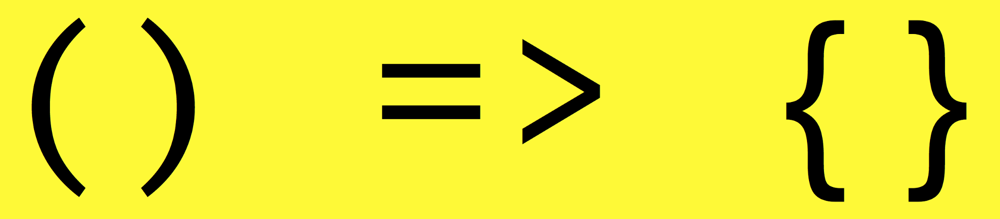

### [译]JavaScript中"this"的简单规则

> [The Simple Rules to ‘this’ in Javascript](https://codeburst.io/the-simple-rules-to-this-in-javascript-35d97f31bde3)

*一些规则确定JavaScript中的“this“”关键字是什么*

确定`this`是什么实际上相当简单。最重要的规则是，`this`在调用函数时通过检查调用它的调用位置来确定的。它遵循这些规则，按优先顺序排列。

#### 规则

1. 如果在调用函数时使用`new`关键字，函数内部的`this`将是一个全新对象。

```javascript
function ConstructorExample() {
    console.log(this);
    this.value = 10;
    console.log(this);
}
new ConstructorExample();
// -> {}
// -> { value: 10 }
```

想了解更多关于`new`的信息，可以阅读我的另一篇文章。

[Javascript’s “new” Keyword Explained as Simply as Possible](https://codeburst.io/javascripts-new-keyword-explained-as-simply-as-possible-fec0d87b2741)

2. 如果使用`apply`，`call`，或者`bind`调用方法，函数内部的`this`是作为参数传入的对象。

```javascript
function fn() {
    console.log(this);
}
var obj = {
    value: 5
};
var boundFn = fn.bind(obj);
boundFn();     // -> { value: 5 }
fn.call(obj);  // -> { value: 5 }
fn.apply(obj); // -> { value: 5 }
```

3. 如果函数作为方法调用——也就是说，如果使用点符号来调用函数——`this`就是函数是这个对象的属性的对象。换句话说，当一个点位于函数调用的左侧时，`this`就是点右侧的对象。（f表示代码块中的功能）

```javascript
var obj = {
    value: 5,
    printThis: function() {
        console.log(this);
    }
};
obj.printThis(); // -> { value: 5, printThis: ƒ }
```

4. 如果函数作为自由函数调用被调用，则意味着在没有上述任何条件的情况下调用它，`this`就是全局对象。在浏览器中，它就是`window`。

   ```javascript
   function fn() {
       console.log(this);
   }
   // If called in browser:
   fn(); // -> Window {stop: ƒ, open: ƒ, alert: ƒ, ...}
   ```

   *请注意，此规则与规则3相同——不同之处在于未声明为方法的函数会自动成为全局对象`window`的属性。因此这是一个隐式方法调用。当我们调用`fn()`时，它被解析为`window.fn()`，因此`this`就是`window`。

   ```javascript
   console.log(fn === window.fn); // -> true
   ```

   5. 如果满足上述多个规则，优先级更高的规则获胜并将设置`this`的值。
   6. 如果函数是一个ES2015的箭头函数。它忽略上面的所有规则，并在**它创建时**接受其周围范围的this的值。要确定`this`，请在创建箭头函数的上方一行，看看`this`的值是什么。它与箭头函数中是相同的。

   

   ```javascript
   const obj = {
       value: 'abc',
       createArrowFn: function() {
           return () => console.log(this);
       }
   };
   const arrowFn = obj.createArrowFn();
   arrowFn(); // -> { value: 'abc', createArrowFn: ƒ }
   ```

   回到第三个规则，当我们调用`obj.createArrowFn()`，`createArrowFn`内的`this`将会是`obj`，因为我们用点表示法调用它。因此`arrowFn`中的`this`被绑定为`obj`，如果我们要在全局作用域中创建一个箭头函数，`this`将会是`window`。

   #### 应用规则

   让我们通过一段代码示例来应用我们的规则。尝试确定两个不同的函数调用中的`this`是什么。

   #### 决定哪个规则适用

   ```javascript
   var obj = {
       value: 'hi',
       printThis: function() {
           console.log(this);
       }
   };
   var print = obj.printThis;
   obj.printThis(); // -> {value: "hi", printThis: ƒ}
   print(); // -> Window {stop: ƒ, open: ƒ, alert: ƒ, ...}
   ```

   `obj.printThis()`属于规则3——通过点符号调用。另一方面，`print()`属于规则4，作为自由函数调用。对于`print()`，我们在调用它的时候没有使用`new`，`bind/call/apply`或点表示法，因此我们转到规则4，`this`就是全局对象`window`。

   ##### 当应用多个规则时

   当应用多个规则时，列表中较高的规则获胜。

   ```javascript
   var obj1 = {
       value: 'hi',
       print: function() {
           console.log(this);
       },
   };
   var obj2 = { value: 17 };
   ```

   如果规则2和规则3都适用，规则2优先。

   ```javascript
   obj1.print.call(obj2); // -> { value: 17 }
   ```

   如果规则1和规则3都适用，规则1优先。

   ```javascript
   new obj1.print(); // -> {}
   ```

   #### 库

   库有时会有意地将`this`的值绑定到它们的函数中。`this`是绑定到函数中使用的最有用的值。例如，jQuery将`this`绑定到DOM元素，从而在回调中触发该事件。如果一个库有一个出乎意料的`this`值，这个值似乎不遵循规则，那么检查其文档。它可能是用`bind`绑定。

   **如果这（没有一语双关）有帮助，请点击❤ ，并随时订阅和查看我的其他一些工作。**

   #### 我的工作

   ##### 在线课程

   我已经在[educative.io](https://www.educative.io/)上创建了一个在线课程，涵盖了JavaScript的中级主题，例如作用域，闭包，OOP，`this`，`new`，`apply/call/bind`，异步代码，数组，对象的操作和ES2015+。

   [Step Up Your JS: A Comprehensive Guide to Intermediate JavaScript](https://www.educative.io/collection/5679346740101120/5707702298738688?authorName=Arnav%20Aggarwal)

   #### 其他文章

   [Javascript’s “new” Keyword Explained as Simply as Possible](https://codeburst.io/javascripts-new-keyword-explained-as-simply-as-possible-fec0d87b2741)

   [Master Map & Filter, Javascript’s Most Powerful Array Functions](https://codeburst.io/array-functions-map-filter-18a6e5f75da1)

   **就是这样，去写一些代码吧。**

   ​

