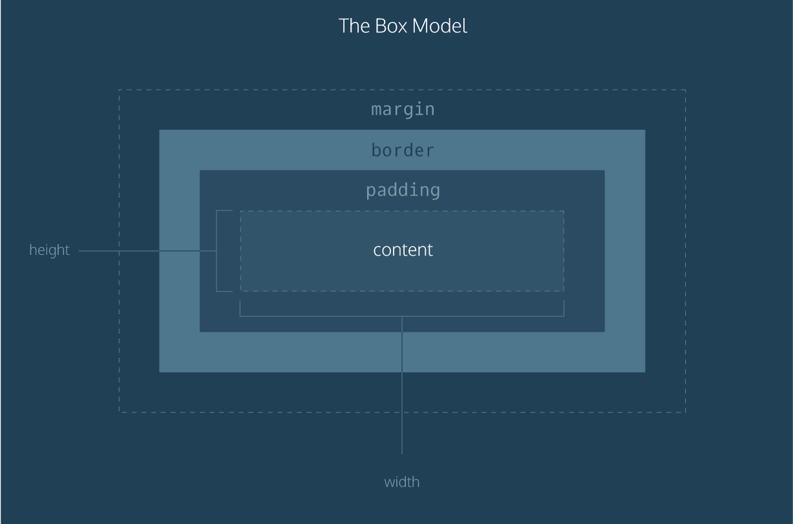

## Box Model

### 元素分类

在CSS中，html中的标签元素大体被分为三种不同的类型：**块状元素**、**内联元素(又叫行内元素)**和**内联块状元素**。

常用的块状元素有：

```
<div>、<p>、<h1>...<h6>、<ol>、<ul>、<dl>、<table>、<address>、<blockquote> 、<form>
```

常用的内联元素有：

```
<a>、<span>、<br>、<i>、<em>、<strong>、<label>、<q>、<var>、<cite>、<code>
```

常用的内联块状元素有：

```
、<input>
```

#### 块级元素

设置`display:block`就是将元素显示为块级元素。如下代码就是将内联元素a转换为块状元素，从而使a元素具有块状元素特点。

```css
a{display:block;}
```

**块级元素特点：**

1、每个块级元素都从新的一行开始，并且其后的元素也另起一行。

2、元素的宽度(width)、高度(height)、内边距(padding)和外边距(margin)都可设置。

3、元素宽度在不设置的情况下，是它本身父容器的100%（和父元素的宽度一致），除非设定一个宽度。

#### 内联元素

**块状元素**也可以通过代码`display:inline`将元素设置为**内联元素**。如下代码就是将块状元素div转换为内联元素，从而使 div 元素具有内联元素特点。

```css
 div{display:inline;}
```

**内联元素特点：**

1、 和相邻的内联元素在同一行；

2、元素的宽度(width)、高度(height)、内边距的top/bottom(padding-top/padding-bottom)和外边距的top/bottom(margin-top/margin-bottom)都不可变 **（水平方向有效，竖直方向无效）**；

3、内联元素的宽度则是根据其自身的内容或子元素来决定其宽度，不可改变。

#### 内联块状元素

**内联块状元素（inline-block）**就是同时具备内联元素、块状元素的特点，代码`display:inline-block`就是将元素设置为内联块状元素。(css2.1新增)，、<input>标签就是这种内联块状标签。

**inline-block元素特点：**

1、元素对外呈内联元素，可以和其他元素共处与一行内；

2、对内则让元素呈块级元素，可改变其宽高。

### 盒模型

盒模型(box model)是CSS中的一个重要概念，它是元素大小的呈现方式。需要记住的是："every element in web design is a rectangular box"。



 盒模型包含了内容区域的大小（`width`以及`height`）和元素的内边距`padding`，边框`border`和外边距`margin`。

> 1. Width and height — specifies the width and height of the content area.
> 2. Padding — specifies the amount of space between the content area and the border.
> 3. Border — specifies the thickness and style of the border surrounding the content area and padding.
> 4. Margin — specifies the amount of space between the border and the outside edge of the element.

#### 边框border

盒子模型的边框围绕元素内容以及内边距的一条或多条线，可以设置边框的`width`，`style`和`color`。如下面代码为div来设置边框粗细为 2px、样式为实心的、颜色为红色的边框：

```css
div{
    border:2px  solid  red;
}
```

上面是`border`代码的缩写形式，可以分开写：

```css
div{
    border-width:2px;
    border-style:solid;
    border-color:red;
}
```

**注意：**

1、`border-style`（边框样式）常见样式有：

dashed（虚线）| dotted（点线）| solid（实线）。

2、`border-color`（边框颜色）中的颜色可设置为十六进制颜色，如:

```css
border-color:#888;//前面的井号不要忘掉。
```

3、`border-width`（边框宽度）中的宽度也可以设置为：

thin | medium | thick（但不是很常用），最常还是用象素（px）。

#### width and height

在 CSS 中定义的宽（width）和高（height），其实都是内容区域的宽和高。padding，border 和 margin 被排除在盒子尺寸之外。

```css
p{
  width:30px;
  height:30px;
}
```

所以对于一个定义了宽度的盒子来说，其尺寸的计算方式：

```
实际宽度 = margin(left+right) + border(left+right) + padding(left+right) + width(定义的值)

实际高度 = margin(top+bottom) + border(top+bottom) + padding(top+bottom) + height(定义的值)
```

#### 内边距padding

内边距并不影响元素间的距离，它只定义元素的内容与元素边框之间的距离。一个元素有上（`top`）、右（`right`）、下（`bottom`）、左（`left`）四个边，因此与边框、 内边距和外边距相关的属性也各有 4 个，分别是上（`top`）、右（`right`）、下（`bottom`）、 左（`left`）。

+ `padding-top`
+ `padding-right`
+ `padding-bottom`
+ `padding-left`

CSS 为边框、内边距和外边距分别规定了简写属性，让你通过一条声明就可以完成设定。在每个简写声明中，属性值的顺序都是上、右、下、左，想象一下**顺时针旋转**。使用简写属性，则可以简写为这样：

```css
div{padding:20px 10px 15px 30px;}
```

顺序一定不要搞混。可以分开写上面代码：

```css
div{
   padding-top:20px;
   padding-right:10px;
   padding-bottom:15px;
   padding-left:30px;
}
```

如果上、右、下、左的填充都为10px;可以这么写：

```css
div{padding:10px;}
```

如果上下填充一样为10px，左右一样为20px，可以这么写：

```css
div{padding:10px 20px;}
```

#### 外边距margin

外边距（`margin`）表示从一个元素的边到相邻元素(或者文档边界)之间的距离。

+ `margin-top`
+ `margin-right`
+ `margin-bottom`
+ `margin-left`

外边距`margin`也是可分为上、右、下、左。如下代码：

```css
div{margin:20px 10px 15px 30px;}
```

也可以分开写：

```css
div{
   margin-top:20px;
   margin-right:10px;
   margin-bottom:15px;
   margin-left:30px;
}
```

如果上右下左的边界都为10px;可以这么写：

```css
div{ margin:10px;}
```

如果上下边界一样为10px，左右一样为20px，可以这么写：

```css
div{ margin:10px 20px;}
```

总结一下：`padding`和`margin`的区别，`padding`在边框内，`margin`在边框外。