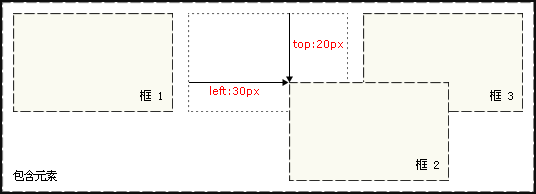

## Box Model

### 元素分类

在CSS中，html中的标签元素大体被分为三种不同的类型：**块状元素**、**内联元素(又叫行内元素)**和**内联块状元素**。

常用的块状元素有：

```
<div>、<p>、<h1>...<h6>、<ol>、<ul>、<dl>、<table>、<address>、<blockquote> 、<form>
```

常用的内联元素有：

```
<a>、<span>、<br>、<i>、<em>、<strong>、<label>、<q>、<var>、<cite>、<code>
```

常用的内联块状元素有：

```
、<input>
```

#### 块级元素

设置`display:block`就是将元素显示为块级元素。如下代码就是将内联元素a转换为块状元素，从而使a元素具有块状元素特点。

```css
a{display:block;}
```

**块级元素特点：**

1、每个块级元素都从新的一行开始，并且其后的元素也另起一行。

2、元素的宽度(width)、高度(height)、内边距(padding)和外边距(margin)都可设置。

3、元素宽度在不设置的情况下，是它本身父容器的100%（和父元素的宽度一致），除非设定一个宽度。

#### 内联元素

**块状元素**也可以通过代码`display:inline`将元素设置为**内联元素**。如下代码就是将块状元素div转换为内联元素，从而使 div 元素具有内联元素特点。

```css
 div{display:inline;}
```

**内联元素特点：**

1、 和相邻的内联元素在同一行；

2、元素的宽度(width)、高度(height)、内边距的top/bottom(padding-top/padding-bottom)和外边距的top/bottom(margin-top/margin-bottom)都不可变 **（水平方向有效，竖直方向无效）**；

3、内联元素的宽度则是根据其自身的内容或子元素来决定其宽度，不可改变。

#### 内联块状元素

**内联块状元素（inline-block）**就是同时具备内联元素、块状元素的特点，代码`display:inline-block`就是将元素设置为内联块状元素。(css2.1新增)，、<input>标签就是这种内联块状标签。

```html
<!DOCTYPE HTML>
<html>
<head>
<meta http-equiv="Content-Type" content="text/html; charset=gb2312" />
<title>内联块状元素</title>
<style type="text/css">
a{
    display:inline-block;
	width:20px;/*在默认情况下宽度不起作用*/
	height:20px;/*在默认情况下高度不起作用*/
	background:pink;/*设置背景颜色为粉色*/
	text-align:center; /*设置文本居中显示*/
}
</style>
</head>
<body>
<a>1</a>
<a>2</a>
<a>3</a>
<a>4</a>
</body>
</html>
```


**inline-block元素特点：**

1、元素对外呈内联元素，可以和其他元素共处与一行内；

2、对内则让元素呈块级元素，可改变其宽高。

### 盒模型

盒模型(box model)是CSS中的一个重要概念，它是元素大小的呈现方式。需要记住的是："every element in web design is a rectangular box"。


 盒模型包含了内容区域的大小（`width`以及`height`）和元素的内边距`padding`，边框`border`和外边距`margin`。

> 1. Width and height — specifies the width and height of the content area.
> 2. Padding — specifies the amount of space between the content area and the border.
> 3. Border — specifies the thickness and style of the border surrounding the content area and padding.
> 4. Margin — specifies the amount of space between the border and the outside edge of the element.

#### 边框border

盒子模型的边框围绕元素内容以及内边距的一条或多条线，可以设置边框的`width`，`style`和`color`。如下面代码为div来设置边框粗细为 2px、样式为实心的、颜色为红色的边框：

```css
div{
    border:2px  solid  red;
}
```

上面是`border`代码的缩写形式，可以分开写：

```css
div{
    border-width:2px;
    border-style:solid;
    border-color:red;
}
```

**注意：**

1、`border-style`（边框样式）常见样式有：

dashed（虚线）| dotted（点线）| solid（实线）。

2、`border-color`（边框颜色）中的颜色可设置为十六进制颜色，如:

```css
border-color:#888;//前面的井号不要忘掉。
```

3、`border-width`（边框宽度）中的宽度也可以设置为：

thin | medium | thick（但不是很常用），最常还是用像素（px）。

#### width and height

在 CSS 中定义的宽（width）和高（height），其实都是内容区域的宽和高。padding，border 和 margin 被排除在盒子尺寸之外。

```css
p{
  width:30px;
  height:30px;
}
```

所以对于一个定义了宽度的盒子来说，其尺寸的计算方式：

```
实际宽度 = margin(left+right) + border(left+right) + padding(left+right) + width(定义的值)

实际高度 = margin(top+bottom) + border(top+bottom) + padding(top+bottom) + height(定义的值)
```

#### 内边距padding

内边距并不影响元素间的距离，它只定义元素的内容与元素边框之间的距离。一个元素有上（`top`）、右（`right`）、下（`bottom`）、左（`left`）四个边，因此与边框、 内边距和外边距相关的属性也各有 4 个，分别是上（`top`）、右（`right`）、下（`bottom`）、 左（`left`）。

+ `padding-top`
+ `padding-right`
+ `padding-bottom`
+ `padding-left`

CSS 为边框、内边距和外边距分别规定了简写属性，让你通过一条声明就可以完成设定。在每个简写声明中，属性值的顺序都是上、右、下、左，想象一下**顺时针旋转**。使用简写属性，则可以简写为这样：

```css
div{padding:20px 10px 15px 30px;}
```

顺序一定不要搞混。可以分开写上面代码：

```css
div{
   padding-top:20px;
   padding-right:10px;
   padding-bottom:15px;
   padding-left:30px;
}
```

如果上、右、下、左的填充都为10px;可以这么写：

```css
div{padding:10px;}
```

如果上下填充一样为10px，左右一样为20px，可以这么写：

```css
div{padding:10px 20px;}
```

#### 外边距margin

外边距（`margin`）表示从一个元素的边到相邻元素(或者文档边界)之间的距离。

+ `margin-top`
+ `margin-right`
+ `margin-bottom`
+ `margin-left`

外边距`margin`也是可分为上、右、下、左。如下代码：

```css
div{margin:20px 10px 15px 30px;}
```

也可以分开写：

```css
div{
   margin-top:20px;
   margin-right:10px;
   margin-bottom:15px;
   margin-left:30px;
}
```

如果上右下左的边界都为10px;可以这么写：

```css
div{ margin:10px;}
```

如果上下边界一样为10px，左右一样为20px，可以这么写：

```css
div{ margin:10px 20px;}
```

总结一下：`padding`和`margin`的区别，`padding`在边框内，`margin`在边框外。

**外边距合并（Margin Collapse）：**外边距合并指的是，当两个垂直外边距相遇时，它们将形成一个外边距。**合并后的外边距的高度等于两个发生合并的外边距的高度中的较大者**。


>  **注意：**叠加的只是垂直外边距，水平外边距不叠加。对于水平相邻的元素，它们的水平间距是相邻外边距之和。
>

**margin: auto;**

```css
#main {
  width: 600px;
  margin: 0 auto; 
}
```
设置块级元素的`width`可以防止它从左到右撑满整个容器。然后你就可以设置左右外边距为`auto`来使其水平居中。元素会占据你所指定的宽度，然后剩余的宽度会一分为二成为左右外边距。

> 如果不设置块级元素的 width 属性，那么这个属性的默认值是auto，结果会让元素的宽度扩展到与父元素同宽。

唯一的问题是，当浏览器窗口比元素的宽度还要窄时，浏览器会显示一个水平滚动条来容纳页面。让我们再来改进下这个方案...

**max-width**

```css
#main {
  max-width: 600px;
  margin: 0 auto; 
}
```

在这种情况下使用`max-width` 替代`width`可以使浏览器更好地处理小窗口的情况。这点在移动设备上显得尤为重要，调整下浏览器窗口大小检查下吧！

顺便提下， 所有的主流浏览器包括IE7+在内都支持 `max-width` ，所以放心大胆的用吧。

### CSS布局模型

CSS包含3种基本的布局模型，用英文概括为：Flow、Layer 和 Float。
在网页中，元素有三种布局模型：
1、流动模型（Flow）
2、浮动模型 (Float)
3、层模型（Layer）

#### 流动模型（Flow）

先来说一说**流动模型**，流动（Flow）是默认的网页布局模式。也就是说网页在默认状态下的 HTML 网页元素都是根据流动模型来分布网页内容的。

流动布局模型具有2个比较典型的特征：

+ 第一点，**块状元素**都会在所处的**包含元素内**自上而下按顺序垂直延伸分布，因为在默认状态下，块状元素的宽度都为**100%**。实际上，块状元素都会以行的形式占据位置。
+ 第二点，在流动模型下，**内联元素**都会在所处的包含元素内从左到右水平分布显示。（内联元素可不像块状元素这么霸道独占一行）

#### 浮动模型(Float）

块状元素这么霸道都是独占一行，如果现在我们想让两个块状元素并排显示，怎么办呢？不要着急，设置元素浮动就可以实现这一愿望。

任何元素在默认情况下是不能浮动的，但可以用 CSS 定义为浮动，如 div、p、table、img 等元素都可以被定义为浮动。如下代码可以实现两个 div 元素一行显示。

```css
div{
    width:200px;
    height:200px;
    border:2px red solid;
    float:left;
}
<div id="div1"></div>
<div id="div2"></div>
```


#### 层模型（Layer）

什么是层布局模型？层布局模型就像是图像软件PhotoShop中非常流行的图层编辑功能一样，每个图层能够精确定位操作，但在网页设计领域，由于网页大小的活动性，层布局没能受到热捧。但是在网页上局部使用层布局还是有其方便之处的。下面我们来学习一下html中的层布局。

如何让html元素在网页中精确定位，就像图像软件PhotoShop中的图层一样可以对每个图层能够精确定位操作。CSS定义了一组定位（positioning）属性来支持层布局模型。

层模型有三种形式：

1、**绝对定位**(position: absolute)

2、**相对定位**(position: relative)

3、**固定定位**(position: fixed)

##### 层模型——绝对定位

如果想为元素设置层模型中的绝对定位，需要设置**position:absolute**(表示绝对定位)，这条语句的作用将元素脱离文档流，然后使用left、right、top、bottom属性`相对于最近的“positioned”祖先元素`进行绝对定位。如果不存在这样的包含块，则相对于body元素，即相对于**浏览器窗口**。

> 记住一个“positioned”元素是指 position 值不是 `static` 的元素。

如下面代码可以实现div元素相对于浏览器窗口向右移动100px，向下移动50px。

```css
div{
    width:200px;
    height:200px;
    border:2px red solid;
    position:absolute;
    left:100px;
    top:50px;
}
<div id="div1"></div>
```

效果如下：


##### 层模型——相对定位

如果想为元素设置层模型中的相对定位，需要设置`position:relative`（表示相对定位），就是元素自己本身，用进行定位后，元素会相对于**以前的位置移动，**但由于`position:relative`这个属性并没有脱离文档流的，所以元素本身所占的位置会保留。

如果将 top 设置为20px，那么框将在原位置顶部下面 20px的地方。如果left设置为30px，那么会在元素左边创建30px的空间，也就是将元素向右移动。

```css
#box_relative {
  position: relative;
  left: 30px;
  top: 20px;
}
```

效果图：



> 注意，在使用相对定位时，无论是否进行移动，元素仍然占据原来的空间。因此，移动元素会导致它覆盖其它框。

##### 层模型——固定定位

`fixed`：表示固定定位，一个固定定位（position属性的值为fixed）元素会相对于视图来定位，这意味着即便页面滚动，它还是会停留在相同的位置。和 `relative` 一样， `top` 、 `right` 、 `bottom` 和 `left` 属性都可用。以下代码可以实现相对于**浏览器视图**向右移动100px，向下移动50px。并且拖动滚动条时位置固定不变。

```css
#div1{
    width:200px;
    height:200px;
    border:2px red solid;
    position:fixed;
    left:100px;
    top:50px;
}
<p>文本文本文本文本文本文本文本文本文本文本文本文本文本文本文本文本文本文本文本文本文本文本文本文本文本文本文本文本文本文本文本文本文本文本。</p>
....
```

### Read More

[学习CSS布局](http://zh.learnlayout.com/)

