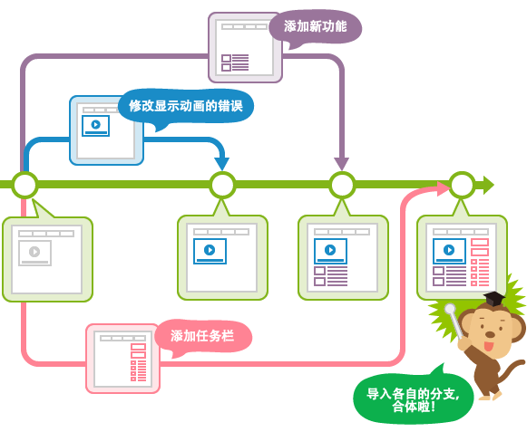

### Git

**Git**:分布式版本控制系统

**SVN**:集中式版本控制系统，版本库集中存放在中央服务器的。

#### 创建新仓库

创建新文件夹`mkdir learngit`

打开`cd learngit`

然后执行 `git init`创建新的 git 仓库：

```
mkdir learngit
cd learngit
pwd
git init
```

```
git config --global user.name "Your Name"
git config --global user.email "email@example.com"
```

`pwd`命令用于显示当前目录

`git init`初始化可管理的仓库

`git add readme.txt`把文件添加到仓库

`git commit -m "test commit"`把文件提交到仓库[-m后面输入本次提交的说明]

`git status`查看当前仓库状态

`git diff`查看difference

`git diff HEAD -- readme.txt`命令可以查看工作区和版本库里面最新版本的区别

#### 版本回退

`git log`显示从最近到最远的提交日志

在Git中，用`HEAD`表示当前版本，上一个版本就是`HEAD^`，上上一个版本就是`HEAD^^`，往上100个版本可以写成`HEAD~100`。因此我们可以使用git reset命令回退到上一个版本：`git reset --hard HEAD^`

> 用`git reflog`查看命令历史，以便确定要回到未来的哪个版本。回退到某个版本`git reset --hard commit_id`

### 工作区和暂存区

__工作区（Working Directory）:__ 我们自己建立的项目文件夹即工作区，比如之前建立的learngit文件夹就是一个工作区.

__版本库（Repository）:__ 在初始化git版本库之后会生成一个隐藏的目录.git,这个就是Git的版本库.

在.git目录里面还很多文件，其中有一个index目录，就是**暂存区(stage)**，暂存区可以理解为一个虚拟工作区，这个虚拟工作区会跟踪工作区的文件变化（增删改等操作），另外Git还为我们自动生成了一个分支master以及指向该分支的指针head。


HEAD 就是当前活跃分支的游标。形象的记忆就是：你现在在哪儿，HEAD 就指向哪儿，所以 Git 才知道你在那儿！

不过 HEAD 并非只能指向分支的最顶端（时间节点距今最近的那个），实际上它可以指向任何一个节点，它就是 Git 内部用来追踪当前位置的东东。


__说明:__ 平时我们使用的命令`git add readme.txt`实际上是把所有的修改从工作区提交到暂存区，`git commit -m "add readme"`是一次性把暂存区的所有修改提交到分支，因为我们创建Git版本库时，Git自动为我们创建了唯一一个master分支，所以commit就提交到了master上了。

### 撤销修改

__管理修改:__ Git跟踪并管理的是修改，而非文件，每次修改，如果不add到暂存区，那就不会加入到commit中。

场景1：当你改乱了工作区某个文件的内容，想直接丢弃工作区的修改时，用命令`git checkout -- file`。

场景2：当你不但改乱了工作区某个文件的内容，还添加到了暂存区时，想丢弃修改，分两 步，第一步用命令`git reset HEAD file`，就回到了场景1，第二步按场景1操作。

场景3：已经提交了不合适的修改到版本库时，想要撤销本次提交，可以使用版本回退命令`git reset --hard commit_id`，不过前提是没有推送到远程库。

### 删除文件

当我们直接将本地的文件删除了或者使用`rm`命令删除了：

`rm readme.txt`

这个时候，工作区和版本库就不一致了，`git status`命令就能查看出那些文件被删除了。

+ 假如我们确实要从版本库中删除文件，那么使用命令`git rm file`以及`commit`命令可以删除版本库中的文件。
+ 另外就是误删了工作区的文件，我们可以使用`git checkout -- file`命令将误删的文件恢复到最新版本.__（该操作将会丢失最近一次提交后你修改的内容）__


### 远程仓库

[Github](https://github.com)提供免费的Git远程仓库（在[Github](https://github.com)上免费托管的Git仓库是所有人可见，但是只有自己能修改），首先检查SSH Key是否存在

```
ls -al ~/.ssh
```

不存在则创建SSH Key:

```
ssh-keygen -t rsa -C "youemail@email.com"
```
现在你的私钥被放在了~/.ssh/id_rsa 这个文件里，而公钥被放在了 ~/.ssh/id_rsa.pub 这个文件里。

> SSH key提供了一种与GitHub通信的方式，通过这种方式，能够在不输入密码的情况下，将GitHub作为自己的remote端服务器，进行版本控制.

> git可使用rsa，rsa要解决的一个核心问题是，如何使用一对特定的数字，使其中一个数字可以用来加密，而另外一个数字可以用来解密。这两个数字就是你在使用git和github的时候所遇到的public key也就是公钥以及private key私钥。
>
> 其中，公钥就是那个用来加密的数字，这也就是为什么你在本机生成了公钥之后，要上传到github的原因。从github发回来的，用那公钥加密过的数据，可以用你本地的私钥来还原。

通过命令行将本地的仓库与远程库关联

```
git remote add origin git@github.com:flwcy/knowledge.git
```

把本地库的内容推送到远程仓库，用`git push`命令，实际上是把当前分支master推送到远程。

```
git push -u origin master
```

>由于是第一次推送master分支，加上了-u参数，Git不但会把本地的master分支内容推送到远程新的master分支，还会把本地的master分支和远程的master分支关联起来，在以后的推送或者拉取时就可以简化命令。

从现在起，只要本地作了提交，就可以通过命令` git push origin master`把本地master分支的最新修改推送到GitHub。

另外使用`git clone`克隆远程仓库到本地。

```
git clone git@github.com:flwcy/knowledge.git
```

### 分支管理

**分支**就是从主线上分离出来进行另外的操作，而又不影响主线，主线又可以继续干其他的事。



Git 中的分支，其实本质上仅仅是个指向`commit对象`的可变指针。Git 会使用`master`作为分支的默认名字。在若干次提交后，你其实已经有了一个指向最后一次提交对象的`master`分支，它在每次提交的时候都会自动向前移动。那么，Git 是如何知道你当前在哪个分支上工作的呢？其实答案也很简单，它保存着一个名为`HEAD`的特别指针。在 Git 中，它是一个指向你正在工作中的本地分支的指针（将 HEAD 想象为当前分支的别名）：


每次提交，`master`分支都会向前移动一步。当我们创建新的分支，例如`dev`时，Git新建了一个指针叫`dev`，指向`master`相同的提交，再把`HEAD`指向`dev`，就表示当前分支在`dev`上：


Git创建一个分支是很快的，因为除了增加一个`dev`指针，改变`HEAD`的指向，工作区的文件都没有任何变化！不过，从现在开始，对工作区的修改和提交就是针对`dev`分支了，比如新提交一次后，`dev`指针往前移动一步，而`master`指针不变：


假如我们在`dev`上的工作完成了，就可以把`dev`合并到`master`上。Git怎么合并呢？最简单的方法，就是直接把`master`指向`dev`的当前提交，就完成了合并：


合并完分支后，甚至可以删除`dev`分支。删除`dev`分支就是把`dev`指针给删掉，删掉后，我们就剩下了一条`master`分支：


查看分支：`git branch`

> 当前分支前面会标一个`*`号。

创建分支：`git branch <name>`

切换分支：`git checkout <name>`

创建+切换分支：`git checkout -b <name>`

合并某分支到当前分支：`git merge <name>`

删除分支：`git branch -d <name>`

#### 解决冲突

`master`分支和`feature1`分支各自都分别有新的提交，变成了这样：


这种情况下，Git无法执行“快速合并”，只能试图把各自的修改合并起来，__但这种合并就可能会有冲突，必须手动解决冲突后再提交。__`git status`也可以告诉我们冲突的文件。Git用`<<<<<<<`，`=======`，`>>>>>>>`标记出不同分支的内容。`master`分支和`feature1`分支变成了下图所示：


用`git log --graph`命令可以看到分支的合并情况。

#### 分支管理策略

- **If Master has diverged since the feature branch was created,then merging the feature branch into master will create a merge commit. This is a `typical merge`.**
- **If Master has not diverged, instead of creating a new commit, git will just point master to the latest commit of the feature branch.This is a `“fast forward.”`**


> 当你试图合并两个分支时，如果顺着一个分支走下去能够到达另一个分支，那么 Git 在合并两者的时候，只会简单的将指针向前推进（指针右移），因为这种情况下的合并操作没有需要解决的分歧（diverged）——这就叫做 “快进（fast-forward）”。不过这种情况如果删除分支，则会丢失分支信息，因为在这个过程中没有创建`commit`对象。
>
> diverged：`master`分支所在提交并不是`feature` 分支所在提交的直接祖先。

使用`--no-ff`参数将会创建一个`commit`对象来代表本次合并：

```
git merge --no-ff -m "merge with no-ff" dev
```

因为本次合并要创建一个新的`merge commit`对象，所以加上`-m`参数，把commit描述写进去。两种方式区别如下：


**分支策略**

在实际开发中，我们应该按照几个基本原则进行分支管理：

首先，`master`分支应该是非常稳定的，也就是仅用来发布新版本，平时不能在上面干活；

那在哪干活呢？干活都在`dev`分支上，也就是说，`dev`分支是不稳定的，到某个时候，比如1.0版本发布时，再把`dev`分支合并到`master`上，在`master`分支发布1.0版本；

你和你的小伙伴们每个人都在`dev`分支上干活，每个人都有自己的分支，时不时地往`dev`分支上合并就可以了。

所以，团队合作的分支看起来就像这样：


#### BUG分支

开发过程中经常遇到这种情况，在dev分支上开发新的feature的时候，测试人员提交了1个BUG，这时我们往往需要先将手头的工作停掉，先去修复BUG。

**停掉手头开发的工作**

当有Bug的时候，想创建一个分支`bug-101`来修复它，如果当前正在`dev`上进行的工作还没有完成，所以这时候不能`commit`，而且我们必须马上解决bug，这时，我们借助Git提供的`stash`功能，可以把当前工作现场“储藏”起来，等以后恢复现场后继续工作。

```
$ git stash
Saved working directory and index state WIP on master: 9c7f4dd 添加分支图示
HEAD is now at 9c7f4dd 添加分支图示
```

这个时候，用git status查看版本库状态，可以看到working directory是clean的。因此可以放心地创建分支来修复bug。

**创建bug分支**

需要在`master`分支上修复，就从`master`创建临时分支：

```
git checkout master  

git branch bug-101  

git checkout bug-101  
```

**修复bug**

现在修复bug......

**合并bug分支**

bug修复完成后，切换到master分支，合并bug-101分支：

```
git checkout master  
git merge --no-ff -m "fixed bug" bug-101
```

**返回之前的开发工作**

bug修复完成了之后，就可以回到之前的开发工作了。

```
git checkout dev  
```

查看下当前的版本库状态：

```
$ git status   
# On branch dev  
nothing to commit (working directory clean)  
```

工作区是干净的，刚才的工作现场存到哪去了？用`git stash list`命令看看：

```
stash@{0}: WIP on master: 9c7f4dd 添加分支图示
```
工作现场还在，Git把stash内容存在某个地方了，但是需要恢复一下，有两个办法：

+ 一是用`git stash apply`恢复，但是恢复后，stash内容并不删除，你需要用`git stash drop`来删除；
+ 另一种方式是用`git stash pop`，恢复的同时把stash内容也删了：

```
git stash pop
```

再用git stash list查看，就看不到任何stash内容了：

```
git stash list
```
你可以多次`stash`，恢复的时候，先用`git stash list`查看，然后恢复指定的`stash`，用命令：
```
git stash apply stash@{0}
```
**小结：**

储藏: `git stash`

查看：`git stash list`

恢复并不删除stash内容：`git stash apply`

删除stash内容：`git stash drop`

恢复并删除：`git stash pop`

修复bug时，我们会通过创建新的bug分支进行修复，然后合并，最后删除；

当手头工作没有完成时，先把工作现场`git stash`一下，然后去修复bug，修复后，再`git stash pop`，回到工作现场。

#### Feature分支

- 从哪个分支分离开来：develop
- 必须要合并到哪个分支上：develop
- 分支的命名规范：除了 master，develop，*release-*，或者*hotfix-*以外的名字都可以

如果要改的一个东西会有比较多的修改，或者改的东西影响会比较大，请从 develop 分支开出一个 feature 分支，开发完成后合并回 develop 分支并且删除这个 feature 分支。
**创建 Feature 分支**
想要开发一个新功能，可以从 develop 分支上创建一个 Feature 分支。
```
git checkout -b feature_x develop
```
**完成 Feature 分支**
完成的功能可以合并到 develop 分支上，添加到下一个发行上：
```
# 写代码，提交，写代码，提交。。。
# feature_x 开发完成，合并回 develop
git checkout develop
# 务必加上 --no-ff，以保持分支的合并历史
git merge --no-ff  -m "merge feature_x" feature_x
git branch -d feature_x
git push origin develop
```
Feature 分支一般只在开发者的 repo 里，而不是在 origin 上。

如果要丢弃一个没有被合并过的分支，可以通过`git branch -D <name>`强行删除。

### Read More

[Git简明指南(中文版)](http://rogerdudler.github.io/git-guide/index.zh.html)

[图解Git](http://marklodato.github.io/visual-git-guide/index-zh-cn.html)

[Git完整命令地址](https://git-scm.com/book/zh)

[Git教程](http://www.liaoxuefeng.com/wiki/0013739516305929606dd18361248578c67b8067c8c017b000)

[开发使用的 Git 分支](https://talk.ninghao.net/t/kai-fa-shi-yong-de-git-fen-zhi/473)

[Whatʼs a Fast Forward Merge?](https://sandofsky.com/images/fast_forward.pdf)