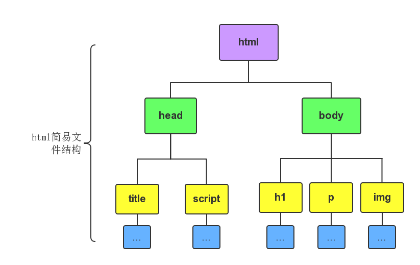

## HTML_CSS

HTML(Hyper Text Markup Language)：超文本标记语言

- 结构层(HTML)，html 是咖啡店里的服务员妹子
- 表现层(CSS)，css 是她身上的衣服
- 行为层(JavaScript)，js 是她的员工手册

### HTML标签

- HTML标签是由英文尖括号`<`和`>`包围的关键词，比如`<h1>`
- HTML标签通常是**成对出现**的，比如`<b>`和`</b>`
- 标签对中的第一个标签是**开始标签**，第二个标签是**结束标签**，结束标签比开始标签多了一个`/`
- 标签与标签之间是可以嵌套的，但先后顺序必须保持一致，如`<div>`里嵌套`<p>`，那么`</p>`必须放在`</div>`的前面。
- HTML标签不区分大小写，`<h1>`和`<H1>`是一样的，但建议小写。

### HTML元素

元素：HTML 元素指的是从开始标签（start tag）到结束标签（end tag）的所有代码。

- 元素的内容是开始标签与结束标签之间的内容
- 某些 HTML 元素具有空内容（empty content）
- 空元素在开始标签中进行关闭（以开始标签的结束而结束），比如说换行符`<br/>`
- 大多数 HTML 元素可拥有属性

### HTML基本结构

一个HTML网页有自己固有的结构，具体如下：

```html
<!DOCTYPE HTML>
<html>
	<head>
		<meta http-equiv="Content-Type" content="text/html; charset=utf-8">
		<title>认识html文件基本结构</title>
	</head>
	<body></body>
</html>
```



说明：

1. `<html></html>`称为根标签，所有的网页标签都在`<html></html>`中。
2. ` <head></head>`标签用于定义文档的头部，它是所有头部元素的容器。头部元素有`<title>`、`<script>`、 `<style>`、`<link>`、 `<meta>`等标签
3. 在`<body>`和`</body>`标签之间的内容是网页的主要内容，如`<h1>`、`<p>`、`a`、`img`等网页内容标签，在这里的标签中的内容会在浏览器中显示出来。
4. `<!DOCTYPE HTML> `声明文档类型


### 基本的HTML标签

- HTML标题：HTML标题是通过`<h1>`～`<h6>`等标签进行定义的。
- HTML段落：HTML段落是通过`<p>`标签进行定义的。(`<p>`是块级元素)
- HTML链接：HTML链接是通过`<a>`标签进行定义的。(在href属性中指定链接的地址)
- HTML图像：HTML图像是通过``标签进行定义的。(在src属性中指定图片的路径)

> HTML注释：注释标签`<!--`与`-->`用于在HTM插入注释。
>
> 换行:`<br />`，`<br />` 元素是一个空的 HTML 元素。由于关闭标签没有任何意义，因此它没有结束标签。

### HTML属性

- 属性总是以名称/值对的形式出现，比如：**name="value"**
- 属性总是在HTML元素的**开始标签**中规定。
- 属性值应该始终被包括在引号内。
- 属性和属性值对大小写不敏感，推荐使用小写的属性/属性值。


### HTML文本格式化

一般我们在网页中能看见各种各样的字体、文本样式，这就是文本格式化标签的功劳，具体可查看[w3school的介绍](http://www.w3school.com.cn/html/html_formatting.asp)。

> 1. `<em>`和`<strong>`标签是为了**强调**一段话中的关键字时使用，它们的语义是**强调。**`<em>`表示强调，`<strong>`表示更强烈的强调。并且在浏览器中`<em>`默认用**斜体**表示，`<strong>`用**粗体**表示。
> 2. `<span>`标签是没有语义的，它的作用就是为了设置单独的样式用的。

### 超链接`<a>`

通过使用`<a>`标签在HTML中创建链接，有两种使用`<a>`标签的方式：

- 通过使用href属性——创建指向另一个文档的链接
- 通过使用name属性——创建文档内的书签
- 通过使用title属性——提示文字

注意：`<a>` 标签内必须提供 href 或 name 属性。

target属性：使用Target属性，可以定义被链接的文档在何处显示。`_self`（覆盖当前页面，默认）、`_blank`（创建新窗口打开新页面）

name属性：使用name属性创建HTML页面中的书签。（也可以使用id属性来代替name属性）。具体用法如下：

1. 首先我们在HTML文档中对锚进行命名（创建一个书签）：`<a name="tips">书签</a>`
2. 然后我们在同一个文档创建指向该锚的链接：`<a href="#tips">跳转至书签</a>`
3. 当然我们也可以在其他页面创建指向该锚的链接：`<a href="http://flwcy.coding.me/html/html_links.html#tips">跳转至博客书签</a>`

### 图片标签``

在HTML中，图像由``标签定义，``是空标签（它只包含属性，并且没有闭合标签）,要在页面中显示图片，需要使用属性`src`，源属性的值是图片的URL地址。例如：``

在浏览器无法载入图片时，使用`alt`属性来为图片定义一串预备的可替换的文本。例如:``

### HTML表格

表格由`<table>`标签来定义。行由`<tr>`标签定义，列由`<td>`标签定义。表格的表头使用`<th>`标签进行定义（表头通常用于列名字），表格的边框属性`border="1"`。`<tbody>…</tbody>`：当表格内容非常多时，表格会下载一点显示一点，但如果加上`<tbody>`标签后，这个表格就要等表格内容全部下载完才会显示。

用`colspan`跨行，例如：

```html
<table border="1">
	<tr>
		<th>姓名</th>
		<th colspan="2">电话</th>		
	</tr>
	<tr>
		<td>Bill Gates</td>
		<td>555 77 854</td>
		<td>555 77 855</td>
	</tr>
</table>
```

用`rowspan`跨列，例如：

```html
<table border="1">
	<tr>
		<th>姓名</th>
		<td>Bill Gates</td>
	</tr>
	<tr>
		<th rowspan="2">电话</th>
		<td>555 77 854</td>
	</tr>
	<tr>
		<td>555 77 855</td>
	</tr>
</table>
```

注意：table标签是可以嵌套的，也就是说在tr或者td标签中加入table标签即可创建表格中的表格。

> - 标签`<th>`：设置表头
> - 标签`<caption>`：设置表的标题
> - 属性`cellpadding="..."`设置单元格边距
> - 属性`bgcolor="..."`设置表格背景颜色
> - 属性`background="..." `以某张图片作为表格背景

### HTML列表

在HTML中的列表有三种类型：无序列表、有序列表、定义列表。

**无序列表**是指没有顺序的列表项目，此列项目使用粗体圆点进行标记。无序列表始于`<ul>`标签，每个列表项始于`<li>`。

```html
<ul>
	<li>DOTA2</li>
	<li>LOL</li>
</ul>
```

**有序列表**也是一列项目，列表项目使用数字进行标记。有序列表始于`<ol>`标签。每个列表项始于`<li>`标签。

```HTML
<ol>
	<li>NBA</li>
	<li>FIFA</li>
</ol>
```

**自定义列表**：自定义列表以`<dl>`标签开始。每个自定义列表项以`<dt>`开始。每个自定义列表项的定义以`<dt>`开始。

```html
<dl>
	<dt>Coffee</dt>
	<dd>Black hot drink</dd>
	<dt>Milk</dt>
	<dd>White cold drink</dd>
</dl>
```

### HTML块

大多数HTML元素被定义为块级元素或内联元素。

-  **块级元素(block)特性：** 总是独占一行，表现为另起一行开始，而且其后的元素也必须另起一行显示；宽度(width)、高度(height)、内边距(padding)和外边距(margin)都可控制；例如：`<h1>`, `<p>`,` <ul>`, `<table>`,`<div>`,`<form>`
-  **内联元素(inline)特性：** 和相邻的内联元素在同一行；宽度(width)、高度(height)、内边距的top/bottom(padding-top/padding-bottom)和外边距的top/bottom(margin-top/margin-bottom)都不可变 **（水平方向有效，竖直方向无效）**，就是里面的文字和图片的大小；例如：`<br>`, `<span>`, `<a>`, ``,`<input>`


对HTML进行分类，使我们能够为定义的元素的类**定义CSS样式**。

- 分类块级元素：`<div>`
- 分类行内元素：`<span>`


